# Distributed Virtual File System — Complete Flow Reference

> Deep-analysed from full source.  
> Module: `github.com/umangshikarvar/dvfs` | Language: Go 1.24 | Transport: gRPC (TLS **disabled by default** — enable with `--tls`)

---

## Table of Contents

1. [System Architecture](#1-system-architecture)
2. [Data Structures](#2-data-structures)
3. [Persistence Layer](#3-persistence-layer)
4. [MetaServer Startup & FileServer Registration](#4-metaserver-startup--fileserver-registration)
5. [Client Startup & Root Selection](#5-client-startup--root-selection)
6. [FileServer — Core File Operations](#6-fileserver--core-file-operations)
   - [6a. RegisterClient](#6a-registerclient)
   - [6b. ls — List Directory](#6b-ls--list-directory)
   - [6c. cd — Change Directory](#6c-cd--change-directory)
   - [6d. pwd — Print Working Directory](#6d-pwd--print-working-directory)
   - [6e. mkdir — Create Directory](#6e-mkdir--create-directory)
   - [6f. create — Create File](#6f-create--create-file)
   - [6g. upload — Upload File or Directory](#6g-upload--upload-file-or-directory)
   - [6h. download — Download File or Directory](#6h-download--download-file-or-directory)
   - [6i. read — Read File](#6i-read--read-file)
   - [6j. delete — Permanent Delete](#6j-delete--permanent-delete)
   - [6k. trash — Soft Delete](#6k-trash--soft-delete)
   - [6l. restore — Restore from Trash](#6l-restore--restore-from-trash)
   - [6m. show_trash / clear_trash](#6m-show_trash--clear_trash)
   - [6n. sharewith — Share Directory](#6n-sharewith--share-directory)
   - [6o. unsharewith — Unshare Directory](#6o-unsharewith--unshare-directory)
   - [6p. refresh, info, viscache, clear](#6p-refresh-info-viscache-clear)
7. [Push Notification System](#7-push-notification-system)
8. [Heartbeat Monitoring](#8-heartbeat-monitoring)
9. [Cache System](#9-cache-system)
10. [Storage Quota Enforcement](#10-storage-quota-enforcement)
11. [TLS Configuration](#11-tls-configuration)
12. [Key Design Decisions](#12-key-design-decisions)

---

## 1. System Architecture

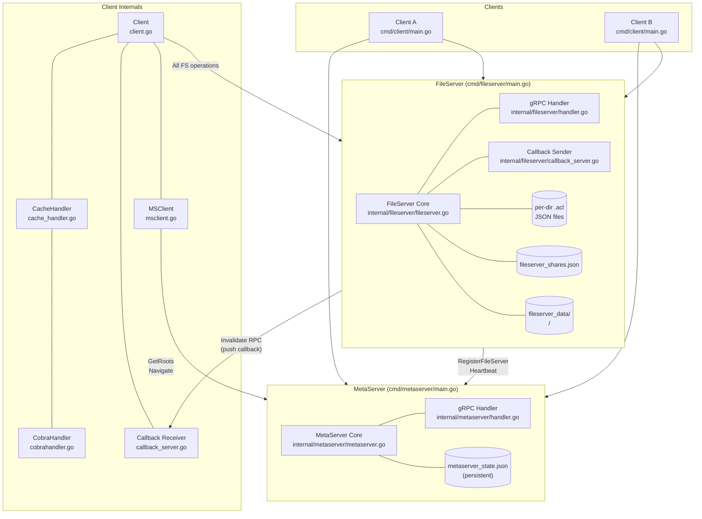
```mermaid
graph TB
    subgraph Clients
        C1["Client A\ncmd/client/main.go"]
        C2["Client B\ncmd/client/main.go"]
    end

    subgraph MetaServer["MetaServer (cmd/metaserver/main.go)"]
        MS["MetaServer Core\ninternal/metaserver/metaserver.go"]
        MSH["gRPC Handler\ninternal/metaserver/handler.go"]
        MSS[("metaserver_state.json\n(persistent)")]
        MS --- MSH
        MS --- MSS
    end

    subgraph FileServer["FileServer (cmd/fileserver/main.go)"]
        FS["FileServer Core\ninternal/fileserver/fileserver.go"]
        FSH["gRPC Handler\ninternal/fileserver/handler.go"]
        CBS["Callback Sender\ninternal/fileserver/callback_server.go"]
        ACL[("per-dir .acl\nJSON files")]
        DSH[("fileserver_shares.json")]
        DISK[("fileserver_data/\n<user>/<files>")]
        FS --- FSH
        FS --- CBS
        FS --- ACL
        FS --- DSH
        FS --- DISK
    end

    subgraph ClientInternals["Client Internals"]
        CL["Client\nclient.go"]
        CH["CacheHandler\ncache_handler.go"]
        CBR["Callback Receiver\ncallback_server.go"]
        MSC["MSClient\nmsclient.go"]
        CO["CobraHandler\ncobrahandler.go"]
        CL --- CH
        CL --- CBR
        CL --- MSC
        CH --- CO
    end

    C1 --> MetaServer
    C1 --> FileServer
    C2 --> MetaServer
    C2 --> FileServer
    FileServer -->|"RegisterFileServer\nHeartbeat"| MetaServer
    FileServer -->|"Invalidate RPC\n(push callback)"| CBR
    MSC -->|"GetRoots\nNavigate"| MetaServer
    CL -->|"All FS operations"| FileServer
```

### Component Responsibilities

| Component | Responsibility |
|---|---|
| **MetaServer** | User → FileServer routing, shared-root registry, heartbeat monitoring |
| **FileServer** | Inode management, file I/O, ACL enforcement, trash, push notifications |
| **Client** | gRPC stubs, session tracking, upload/download streaming |
| **CacheHandler** | In-memory CNode tree mirrors remote FS; avoids redundant network calls |
| **CobraHandler** | readline REPL, tab completion, command dispatch |
| **CallbackReceiver** | gRPC server on the client that receives server-push `Invalidate` requests |

---

## 2. Data Structures

### 2a. FID — File Identifier

```
FID = "<FileServerID>_<InodeID>_<GenerationNumber>"
e.g. "fs1_7_1"
```

- Globally unique across all file servers
- `InodeID` — monotonically incremented via `atomic.AddUint64`
- `GenerationNumber` — always `1` currently (reserved for future reuse detection)

### 2b. Inode (Server-side)

```go
Inode {
    FID      *FID            // global identity
    Type     InodeType       // FILE | DIRECTORY
    Name     string          // basename
    OSPath   string          // absolute path on server disk
    ACL      ACL             // owner + shared users
    Children []*FID          // for directories only
    Size     uint64          // bytes (files); sum of subtree (directories)
    Parent   *Inode          // parent pointer (root.Parent == root)
}

ACL {
    Owner  string    // username of original creator
    Shared []string  // users with read+write access
}
```

### 2c. CNode (Client-side cache)

```go
CNode {
    Name          string
    Type          InodeType
    fid           *FID
    Size          uint64
    children      map[string]*CNode
    contentCached bool      // has a local cache file for this file's content
    contentUID    string    // UUID filename in ./.cache/
    parent        *CNode
}
```

### 2d. clientSession (Server-side session tracking)

```go
clientSession {
    username            string
    callbackAddress     string     // host:port of client's callback gRPC server
    rootFID             string     // FID string of the user's selected root
    currentDirFID       string     // updated on every ChangeDir
    lastSeenAt          time.Time  // updated on RegisterClient + ChangeDir + UploadFile
    consecutiveFailures int        // prune session after 3 consecutive callback failures
}
```

**Session TTL**: 5 minutes of inactivity → not included in notification targets.

### 2e. trashEntry (In-memory, lost on restart)

```go
trashEntry {
    originalParentFID string
    originalName      string
    originalRelPath   string
    sharedSnapshots   []sharedDirSnapshot  // preserved share state for restore
}
```

### 2f. MetaServer state

```go
MetaServer {
    fileservers map[uint64]*FileServerInfo  // fsID → info
    users       map[string]uint64           // username → fsID
    shared      map[string][]SharedDirEntry // username → shared roots
    nextFsID    uint64
}

SharedDirEntry {
    Owner       string
    Path        string      // e.g. "/umang/proj"
    DisplayName string      // e.g. "proj"
}
```

---

## 3. Persistence Layer

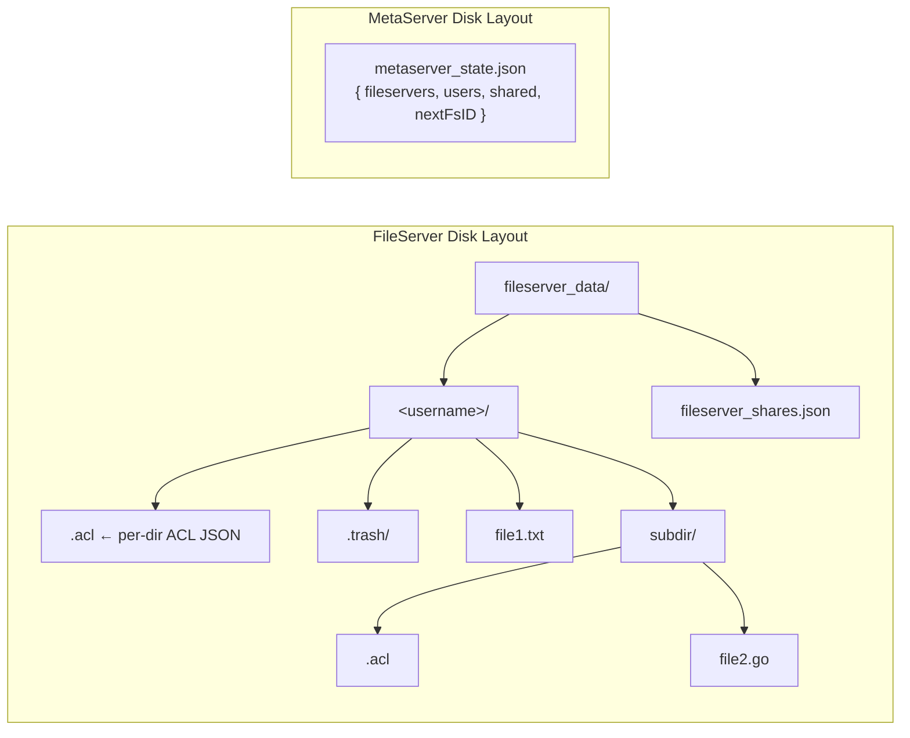
```mermaid
graph LR
    subgraph FileServer Disk Layout
        RD["fileserver_data/"]
        RD --> US["&lt;username&gt;/"]
        US --> ACL[".acl  ← per-dir ACL JSON"]
        US --> TR[".trash/"]
        US --> F1["file1.txt"]
        US --> D1["subdir/"]
        D1 --> DA[".acl"]
        D1 --> F2["file2.go"]
        RD --> SH["fileserver_shares.json"]
    end

    subgraph MetaServer Disk Layout
        MSD["metaserver_state.json\n{ fileservers, users, shared, nextFsID }"]
    end
```

| File | Format | Contents |
|---|---|---|
| `<dir>/.acl` | JSON | `{owner, shared[]}` — per-directory ACL |
| `fileserver_shares.json` | JSON | `{shares: {path → [users]}}` — explicit shares map |
| `metaserver_state.json` | JSON | Full MetaServer state; atomic write via temp-rename |

**Atomic writes**: Both ACL files and MetaServer state use write-to-temp → `os.Rename()` to prevent corruption on crash.

**FileScanner** (`filescanner.go`) walks the `rootDir` tree on FileServer startup:
- Reconstructs the inode map from the existing directory tree
- Loads `.acl` files for each directory's ACL
- Assigns FIDs sequentially, re-establishing the parent-child graph

---

## 4. MetaServer Startup & FileServer Registration

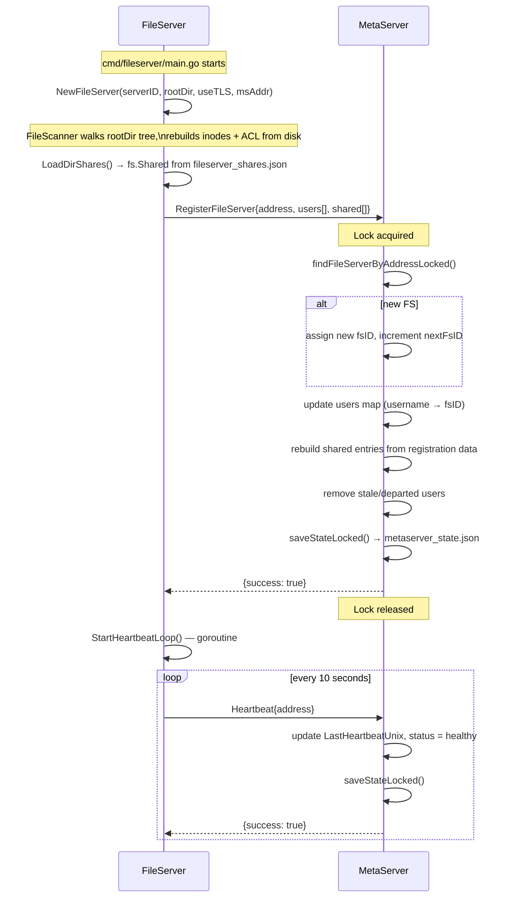
```mermaid
sequenceDiagram
    participant FS as FileServer
    participant MS as MetaServer

    Note over FS: cmd/fileserver/main.go starts
    FS->>FS: NewFileServer(serverID, rootDir, useTLS, msAddr)
    Note over FS: FileScanner walks rootDir tree,\nrebuilds inodes + ACL from disk
    FS->>FS: LoadDirShares() → fs.Shared from fileserver_shares.json
    FS->>MS: RegisterFileServer{address, users[], shared[]}
    Note over MS: Lock acquired
    MS->>MS: findFileServerByAddressLocked()
    alt new FS
        MS->>MS: assign new fsID, increment nextFsID
    end
    MS->>MS: update users map (username → fsID)
    MS->>MS: rebuild shared entries from registration data
    MS->>MS: remove stale/departed users
    MS->>MS: saveStateLocked() → metaserver_state.json
    MS-->>FS: {success: true}
    Note over MS: Lock released
    FS->>FS: StartHeartbeatLoop() — goroutine
    loop every 10 seconds
        FS->>MS: Heartbeat{address}
        MS->>MS: update LastHeartbeatUnix, status = healthy
        MS->>MS: saveStateLocked()
        MS-->>FS: {success: true}
    end
```

**MetaServer heartbeat monitor**: Runs as a goroutine every 5 seconds. Any FileServer with `now - LastHeartbeatUnix > 30s` is marked `stale`. Stale FileServers are excluded from `Navigate` responses.

---

## 5. Client Startup & Root Selection

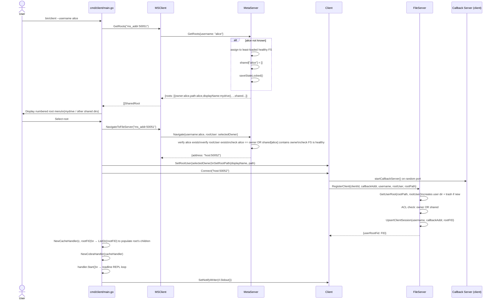
```mermaid
sequenceDiagram
    actor User
    participant CM as cmd/client/main.go
    participant MSC as MSClient
    participant MS as MetaServer
    participant CL as Client
    participant FS as FileServer
    participant CBS as Callback Server (client)

    User->>CM: bin/client --username alice
    CM->>MSC: GetRoots("ms_addr:50051")
    MSC->>MS: GetRoots{username: "alice"}
    alt alice not known
        MS->>MS: assign to least-loaded healthy FS
        MS->>MS: shared["alice"] = []
        MS->>MS: saveStateLocked()
    end
    MS-->>MSC: {roots: [{owner:alice,path:alice,displayName:mydrive}, ...shared...]}
    MSC-->>CM: []SharedRoot

    CM->>User: Display numbered root menu\n(mydrive / other shared dirs)
    User->>CM: Select root #N

    CM->>MSC: NavigateToFileServer("ms_addr:50051")
    MSC->>MS: Navigate{username:alice, rootUser: selectedOwner}
    MS->>MS: verify alice exists\nverify rootUser exists\ncheck alice == owner OR shared[alice] contains owner\ncheck FS is healthy
    MS-->>MSC: {address: "host:50052"}

    CM->>CL: SetRootUser(selectedOwner)\nSetRootPath(displayName, path)
    CM->>CL: Connect("host:50052")
    CL->>CBS: startCallbackServer() on random port
    CL->>FS: RegisterClient{clientId, callbackAddr, username, rootUser, rootPath}
    FS->>FS: GetUserRoot(rootPath, rootUser)\ncreates user dir + trash if new
    FS->>FS: ACL check: owner OR shared
    FS->>FS: UpsertClientSession(username, callbackAddr, rootFID)
    FS-->>CL: {userRootFid: FID}

    CM->>CM: NewCacheHandler(c, rootFID)\n  → ListDir(rootFID) to populate root's children
    CM->>CM: NewCobraHandler(cacheHandler)
    CM->>CM: handler.Start()\n  → readline REPL loop
    CM->>CL: SetNotifyWriter(rl.Stdout())
```

**"Return to MetaServer"**: typing `cd ..` at the root returns `RETURN_TO_METASERVER` sentinel error → `handler.Start()` returns `true` → outer loop re-runs `GetRoots` menu.

---

## 6. FileServer — Core File Operations

### 6a. RegisterClient

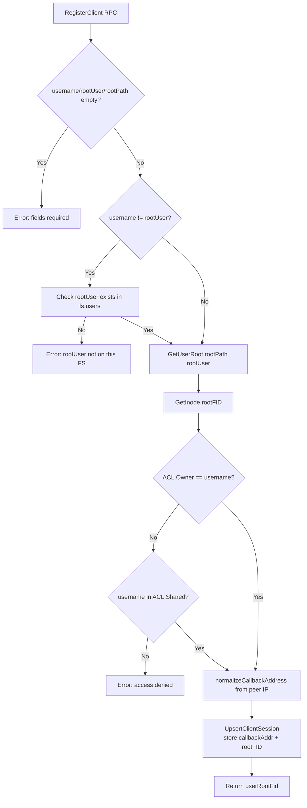
```mermaid
flowchart TD
    A[RegisterClient RPC] --> B{username/rootUser/rootPath empty?}
    B -- Yes --> ERR1[Error: fields required]
    B -- No --> C{username != rootUser?}
    C -- Yes --> D[Check rootUser exists in fs.users]
    D -- No --> ERR2[Error: rootUser not on this FS]
    D -- Yes --> E
    C -- No --> E[GetUserRoot rootPath rootUser]
    E --> F[GetInode rootFID]
    F --> G{ACL.Owner == username?}
    G -- No --> H{username in ACL.Shared?}
    H -- No --> ERR3[Error: access denied]
    H -- Yes --> I
    G -- Yes --> I[normalizeCallbackAddress from peer IP]
    I --> J[UpsertClientSession\nstore callbackAddr + rootFID]
    J --> K[Return userRootFid]
```

### 6b. ls — List Directory

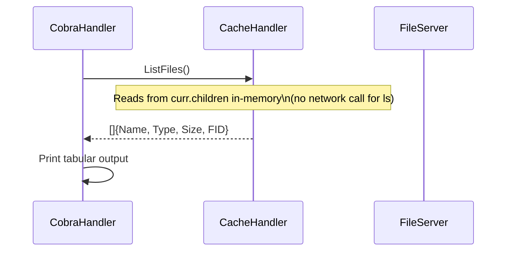
```mermaid
sequenceDiagram
    participant CO as CobraHandler
    participant CH as CacheHandler
    participant FS as FileServer

    CO->>CH: ListFiles()
    Note over CH: Reads from curr.children in-memory\n(no network call for ls)
    CH-->>CO: []{Name, Type, Size, FID}
    CO->>CO: Print tabular output
```

> `ls` is **always served from cache** — zero RPC calls. Cache is populated on `cd` and `refresh`.

### 6c. cd — Change Directory

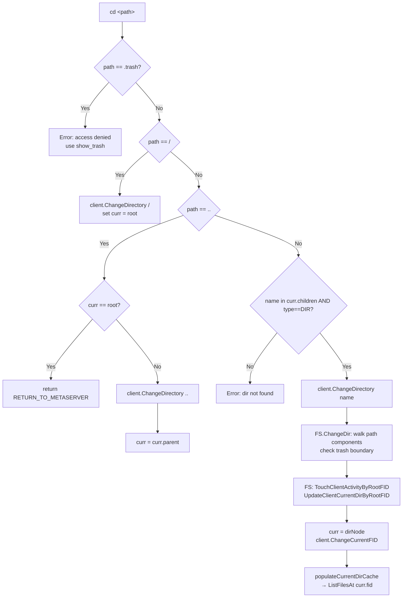
```mermaid
flowchart TD
    A["cd &lt;path&gt;"] --> B{path == .trash?}
    B -- Yes --> ERR1[Error: access denied\nuse show_trash]
    B -- No --> C{path == /}
    C -- Yes --> D[client.ChangeDirectory /\nset curr = root]
    C -- No --> E{path == ..}
    E -- Yes --> F{curr == root?}
    F -- Yes --> G[return RETURN_TO_METASERVER]
    F -- No --> H[client.ChangeDirectory ..]
    H --> I[curr = curr.parent]
    E -- No --> J{name in curr.children AND type==DIR?}
    J -- No --> ERR2[Error: dir not found]
    J -- Yes --> K[client.ChangeDirectory name]
    K --> L[FS.ChangeDir: walk path components\ncheck trash boundary]
    L --> M[FS: TouchClientActivityByRootFID\nUpdateClientCurrentDirByRootFID]
    M --> N[curr = dirNode\nclient.ChangeCurrentFID]
    N --> O[populateCurrentDirCache\n→ ListFilesAt curr.fid]
```

**Server-side path resolution** (`ChangeDir` in `fileserver.go`): Splits path by `/`, walks `..` by following `inode.Parent`, blocks navigation into `.trash`.

### 6d. pwd — Print Working Directory

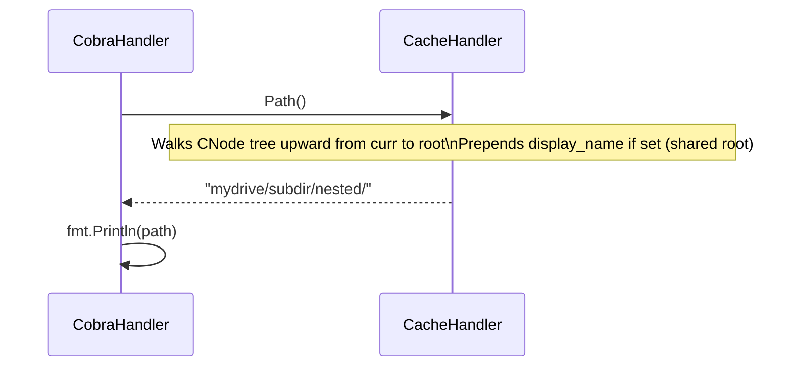
```mermaid
sequenceDiagram
    participant CO as CobraHandler
    participant CH as CacheHandler

    CO->>CH: Path()
    Note over CH: Walks CNode tree upward from curr to root\nPrepends display_name if set (shared root)
    CH-->>CO: "mydrive/subdir/nested/"
    CO->>CO: fmt.Println(path)
```

> `pwd` is **served entirely from the local CNode tree** — no RPC. Uses `display_name` (e.g. `"proj"`) for shared roots instead of the raw username path.

### 6e. mkdir — Create Directory

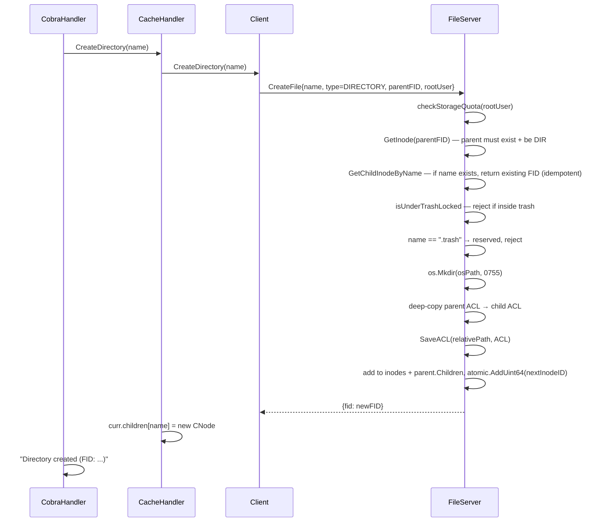
```mermaid
sequenceDiagram
    participant CO as CobraHandler
    participant CH as CacheHandler
    participant CL as Client
    participant FS as FileServer

    CO->>CH: CreateDirectory(name)
    CH->>CL: CreateDirectory(name)
    CL->>FS: CreateFile{name, type=DIRECTORY, parentFID, rootUser}
    FS->>FS: checkStorageQuota(rootUser)
    FS->>FS: GetInode(parentFID) — parent must exist + be DIR
    FS->>FS: GetChildInodeByName — if name exists, return existing FID (idempotent)
    FS->>FS: isUnderTrashLocked — reject if inside trash
    FS->>FS: name == ".trash" → reserved, reject
    FS->>FS: os.Mkdir(osPath, 0755)
    FS->>FS: deep-copy parent ACL → child ACL
    FS->>FS: SaveACL(relativePath, ACL)
    FS->>FS: add to inodes + parent.Children, atomic.AddUint64(nextInodeID)
    FS-->>CL: {fid: newFID}
    CH->>CH: curr.children[name] = new CNode
    CO->>CO: "Directory created (FID: ...)"
```

### 6f. create — Create File

Same flow as `mkdir` but `type=FILE`, calls `os.Create(osPath)` instead of `os.Mkdir`. **Does not** send `NotifyNewFileInDir` — that fires only from the upload path (when actual content is written).

### 6g. upload — Upload File or Directory

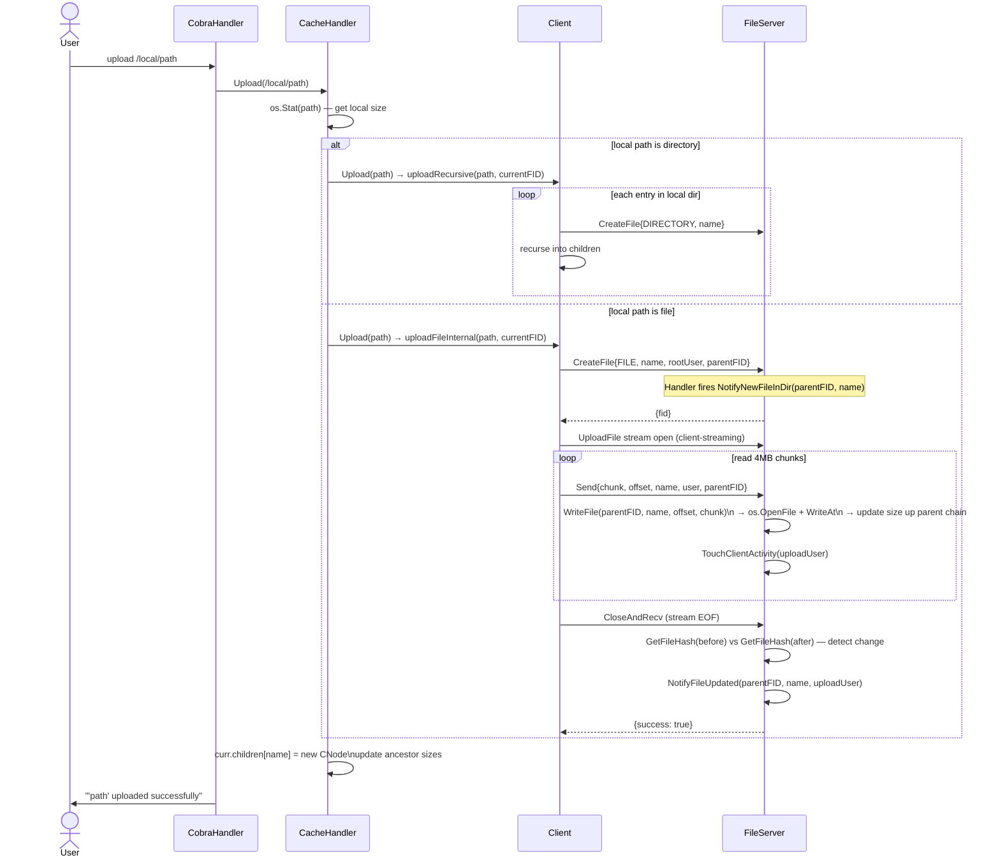
```mermaid
sequenceDiagram
    actor User
    participant CO as CobraHandler
    participant CH as CacheHandler
    participant CL as Client
    participant FS as FileServer

    User->>CO: upload /local/path
    CO->>CH: Upload(/local/path)
    CH->>CH: os.Stat(path) — get local size

    alt local path is directory
        CH->>CL: Upload(path) → uploadRecursive(path, currentFID)
        loop each entry in local dir
            CL->>FS: CreateFile{DIRECTORY, name}
            CL->>CL: recurse into children
        end
    else local path is file
        CH->>CL: Upload(path) → uploadFileInternal(path, currentFID)
        CL->>FS: CreateFile{FILE, name, rootUser, parentFID}
        Note over FS: Handler fires NotifyNewFileInDir(parentFID, name)
        FS-->>CL: {fid}
        CL->>FS: UploadFile stream open (client-streaming)
        loop read 4MB chunks
            CL->>FS: Send{chunk, offset, name, user, parentFID}
            FS->>FS: WriteFile(parentFID, name, offset, chunk)\n → os.OpenFile + WriteAt\n → update size up parent chain
            FS->>FS: TouchClientActivity(uploadUser)
        end
        CL->>FS: CloseAndRecv (stream EOF)
        FS->>FS: GetFileHash(before) vs GetFileHash(after) — detect change
        FS->>FS: NotifyFileUpdated(parentFID, name, uploadUser)
        FS-->>CL: {success: true}
    end

    CH->>CH: curr.children[name] = new CNode\nupdate ancestor sizes
    CO->>User: "'path' uploaded successfully"
```

**gRPC message size**: Client configured with `MaxCallSendMsgSize(64MB)`. Server configured with `MaxRecvMsgSize(64MB)`. Raw 4MB chunk + ~34 bytes of proto field overhead fits comfortably.

### 6h. download — Download File or Directory

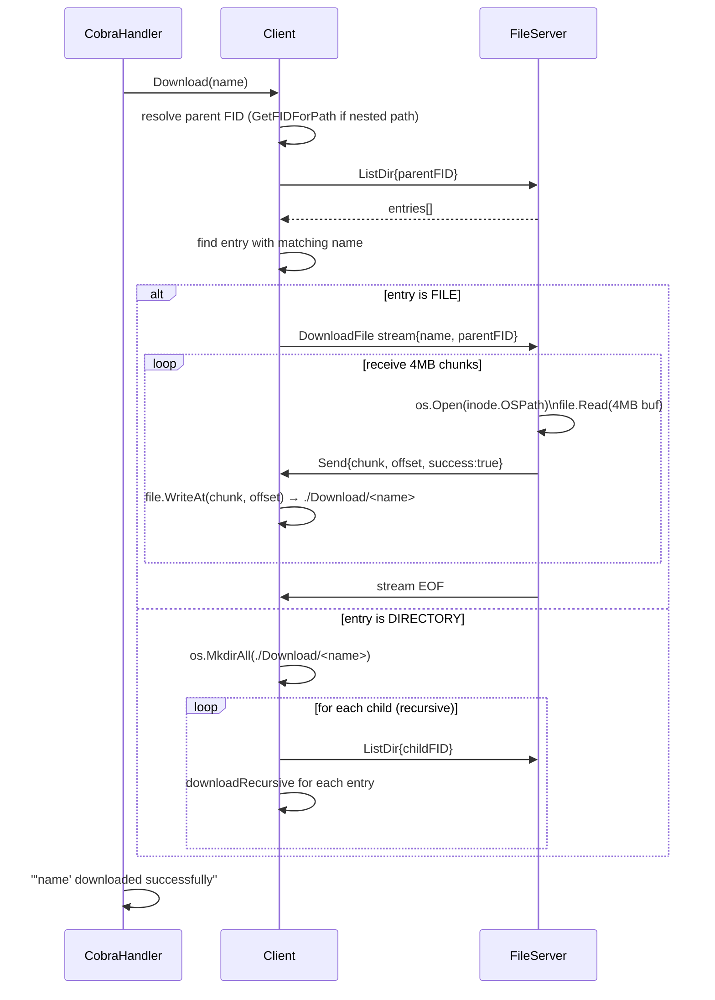
```mermaid
sequenceDiagram
    participant CO as CobraHandler
    participant CL as Client
    participant FS as FileServer

    CO->>CL: Download(name)
    CL->>CL: resolve parent FID (GetFIDForPath if nested path)
    CL->>FS: ListDir{parentFID}
    FS-->>CL: entries[]
    CL->>CL: find entry with matching name

    alt entry is FILE
        CL->>FS: DownloadFile stream{name, parentFID}
        loop receive 4MB chunks
            FS->>FS: os.Open(inode.OSPath)\nfile.Read(4MB buf)
            FS->>CL: Send{chunk, offset, success:true}
            CL->>CL: file.WriteAt(chunk, offset) → ./Download/<name>
        end
        FS->>CL: stream EOF
    else entry is DIRECTORY
        CL->>CL: os.MkdirAll(./Download/<name>)
        loop for each child (recursive)
            CL->>FS: ListDir{childFID}
            CL->>CL: downloadRecursive for each entry
        end
    end
    CO->>CO: "'name' downloaded successfully"
```

Download target: `./Download/<name>` relative to where the client binary is run.

### 6i. read — Read File

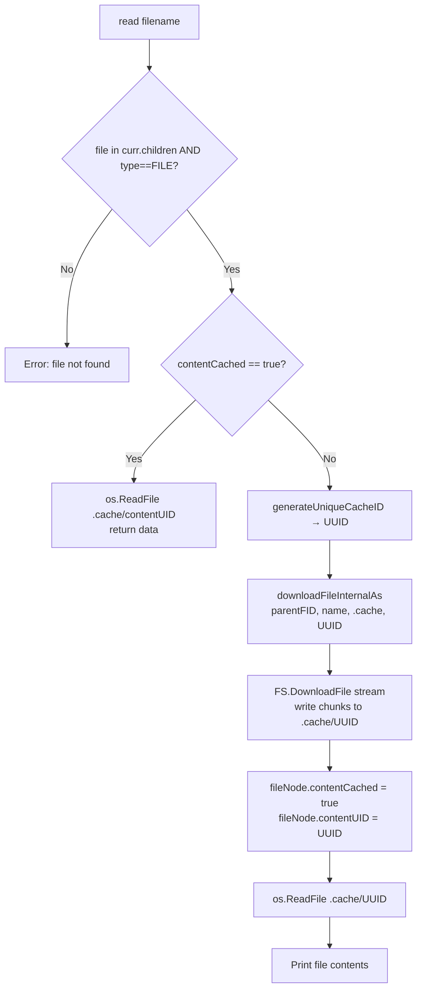
```mermaid
flowchart TD
    A["read filename"] --> B{file in curr.children AND type==FILE?}
    B -- No --> ERR[Error: file not found]
    B -- Yes --> C{contentCached == true?}
    C -- Yes --> D[os.ReadFile .cache/contentUID\nreturn data]
    C -- No --> E[generateUniqueCacheID → UUID]
    E --> F[downloadFileInternalAs\nparentFID, name, .cache, UUID]
    F --> G[FS.DownloadFile stream\nwrite chunks to .cache/UUID]
    G --> H[fileNode.contentCached = true\nfileNode.contentUID = UUID]
    H --> I[os.ReadFile .cache/UUID]
    I --> J[Print file contents]
```

Cache hit = zero RPCs. Cache miss = streaming download into `.cache/<UUID>`, then read from local disk. UUID file is deleted by `InvalidateFileByFID` when a push notification arrives.

### 6j. delete — Permanent Delete

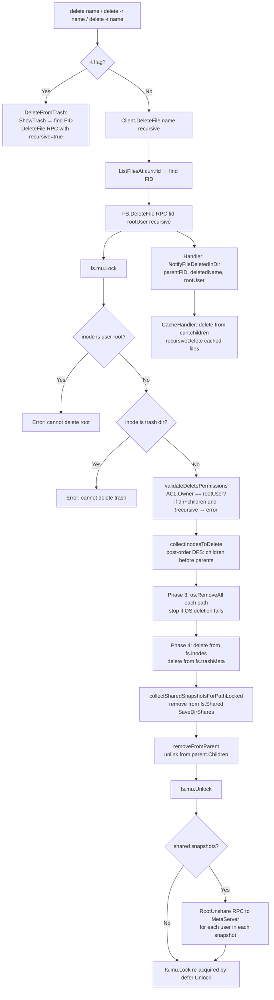
```mermaid
flowchart TD
    A["delete name / delete -r name / delete -t name"] --> B{-t flag?}
    B -- Yes --> T[DeleteFromTrash:\nShowTrash → find FID\nDeleteFile RPC with recursive=true]
    B -- No --> C[Client.DeleteFile name recursive]
    C --> D[ListFilesAt curr.fid → find FID]
    D --> E[FS.DeleteFile RPC fid rootUser recursive]

    E --> F[fs.mu.Lock]
    F --> G{inode is user root?}
    G -- Yes --> ERR1[Error: cannot delete root]
    G -- No --> H{inode is trash dir?}
    H -- Yes --> ERR2[Error: cannot delete trash]
    H -- No --> I[validateDeletePermissions\nACL.Owner == rootUser?\nif dir+children and !recursive → error]

    I --> J[collectInodesToDelete\npost-order DFS: children before parents]
    J --> K[Phase 3: os.RemoveAll each path\nstop if OS deletion fails]
    K --> L[Phase 4: delete from fs.inodes\ndelete from fs.trashMeta]
    L --> M[collectSharedSnapshotsForPathLocked\nremove from fs.Shared\nSaveDirShares]
    M --> N[removeFromParent\nunlink from parent.Children]
    N --> O[fs.mu.Unlock]
    O --> P{shared snapshots?}
    P -- Yes --> Q[RootUnshare RPC to MetaServer\nfor each user in each snapshot]
    P -- No --> R[fs.mu.Lock re-acquired by defer Unlock]
    Q --> R

    E --> S[Handler: NotifyFileDeletedInDir\nparentFID, deletedName, rootUser]
    S --> U[CacheHandler: delete from curr.children\nrecursiveDelete cached files]
```

> **Lock discipline**: `RootUnshare` network RPCs are executed **after** `fs.mu` is released to prevent deadlock. The in-memory `fs.Shared` map and `SaveDirShares()` are always done under the lock.

### 6k. trash — Soft Delete

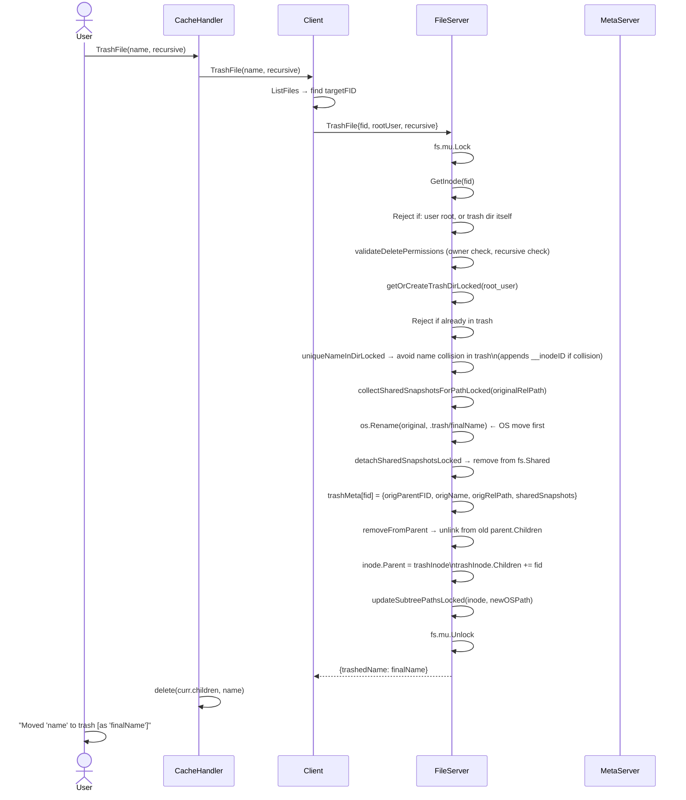
```mermaid
sequenceDiagram
    actor User
    participant CH as CacheHandler
    participant CL as Client
    participant FS as FileServer
    participant MS as MetaServer

    User->>CH: TrashFile(name, recursive)
    CH->>CL: TrashFile(name, recursive)
    CL->>CL: ListFiles → find targetFID
    CL->>FS: TrashFile{fid, rootUser, recursive}

    FS->>FS: fs.mu.Lock
    FS->>FS: GetInode(fid)
    FS->>FS: Reject if: user root, or trash dir itself
    FS->>FS: validateDeletePermissions (owner check, recursive check)
    FS->>FS: getOrCreateTrashDirLocked(root_user)
    FS->>FS: Reject if already in trash
    FS->>FS: uniqueNameInDirLocked → avoid name collision in trash\n(appends __inodeID if collision)
    FS->>FS: collectSharedSnapshotsForPathLocked(originalRelPath)
    FS->>FS: os.Rename(original, .trash/finalName)  ← OS move first
    FS->>FS: detachSharedSnapshotsLocked → remove from fs.Shared
    FS->>FS: trashMeta[fid] = {origParentFID, origName, origRelPath, sharedSnapshots}
    FS->>FS: removeFromParent → unlink from old parent.Children
    FS->>FS: inode.Parent = trashInode\ntrashInode.Children += fid
    FS->>FS: updateSubtreePathsLocked(inode, newOSPath)
    FS->>FS: fs.mu.Unlock
    FS-->>CL: {trashedName: finalName}

    CH->>CH: delete(curr.children, name)
    User->>User: "Moved 'name' to trash [as 'finalName']"
```

> **Shared dir trash**: The shared entry is removed from `fs.Shared` in-memory and called `detachSharedSnapshotsLocked`. The `RootUnshare` RPC to the MetaServer is called **outside the lock** (same safe pattern as Delete). The snapshot is saved in `trashMeta` for potential restore.

### 6l. restore — Restore from Trash

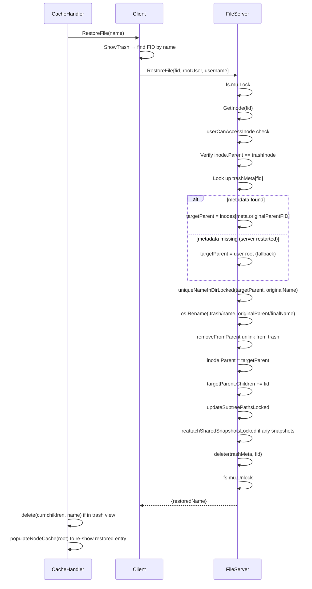
```mermaid
sequenceDiagram
    participant CH as CacheHandler
    participant CL as Client
    participant FS as FileServer

    CH->>CL: RestoreFile(name)
    CL->>CL: ShowTrash → find FID by name
    CL->>FS: RestoreFile{fid, rootUser, username}

    FS->>FS: fs.mu.Lock
    FS->>FS: GetInode(fid)
    FS->>FS: userCanAccessInode check
    FS->>FS: Verify inode.Parent == trashInode
    FS->>FS: Look up trashMeta[fid]
    alt metadata found
        FS->>FS: targetParent = inodes[meta.originalParentFID]
    else metadata missing (server restarted)
        FS->>FS: targetParent = user root (fallback)
    end
    FS->>FS: uniqueNameInDirLocked(targetParent, originalName)
    FS->>FS: os.Rename(.trash/name, originalParent/finalName)
    FS->>FS: removeFromParent unlink from trash
    FS->>FS: inode.Parent = targetParent
    FS->>FS: targetParent.Children += fid
    FS->>FS: updateSubtreePathsLocked
    FS->>FS: reattachSharedSnapshotsLocked if any snapshots
    FS->>FS: delete(trashMeta, fid)
    FS->>FS: fs.mu.Unlock
    FS-->>CL: {restoredName}

    CH->>CH: delete(curr.children, name) if in trash view
    CH->>CH: populateNodeCache(root) to re-show restored entry
```

> **Restore metadata** is in-memory only (`trashMeta`). If the FileServer restarts, `restore` falls back to placing the file at the user root and returns an error if metadata is missing.

### 6m. show_trash / clear_trash

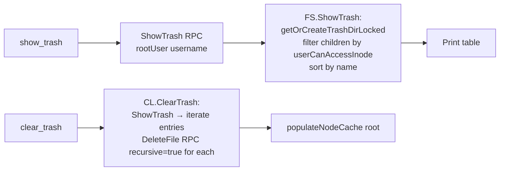
```mermaid
flowchart LR
    A["show_trash"] --> B[ShowTrash RPC\nrootUser username]
    B --> C[FS.ShowTrash:\ngetOrCreateTrashDirLocked\nfilter children by userCanAccessInode\nsort by name]
    C --> D[Print table]

    E["clear_trash"] --> F[CL.ClearTrash:\nShowTrash → iterate entries\nDeleteFile RPC recursive=true for each]
    F --> G[populateNodeCache root]
```

### 6n. sharewith — Share Directory

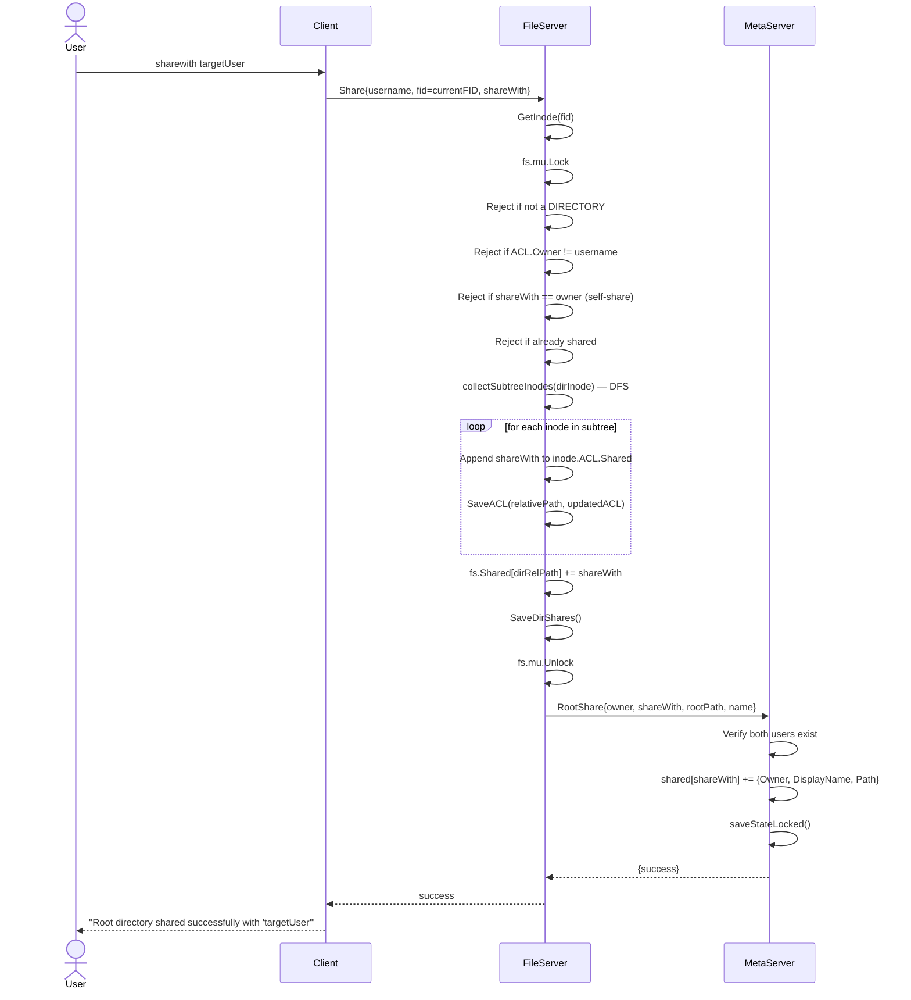
```mermaid
sequenceDiagram
    actor User
    participant CL as Client
    participant FS as FileServer
    participant MS as MetaServer

    User->>CL: sharewith targetUser
    CL->>FS: Share{username, fid=currentFID, shareWith}

    FS->>FS: GetInode(fid)
    FS->>FS: fs.mu.Lock
    FS->>FS: Reject if not a DIRECTORY
    FS->>FS: Reject if ACL.Owner != username
    FS->>FS: Reject if shareWith == owner (self-share)
    FS->>FS: Reject if already shared
    FS->>FS: collectSubtreeInodes(dirInode) — DFS
    loop for each inode in subtree
        FS->>FS: Append shareWith to inode.ACL.Shared
        FS->>FS: SaveACL(relativePath, updatedACL)
    end
    FS->>FS: fs.Shared[dirRelPath] += shareWith
    FS->>FS: SaveDirShares()
    FS->>FS: fs.mu.Unlock
    FS->>MS: RootShare{owner, shareWith, rootPath, name}
    MS->>MS: Verify both users exist
    MS->>MS: shared[shareWith] += {Owner, DisplayName, Path}
    MS->>MS: saveStateLocked()
    MS-->>FS: {success}
    FS-->>CL: success
    CL-->>User: "Root directory shared successfully with 'targetUser'"
```

> **ACL propagation**: `Share` performs a full DFS of the subtree and updates every inode's `ACL.Shared`, persisting each `.acl` file atomically. New items created later in the directory inherit the parent's ACL via deep-copy in `CreateFile`.

### 6o. unsharewith — Unshare Directory

Same shape as `sharewith` but reversed. Calls `RootUnshare` on the MetaServer so the shared root disappears from the target user's menu.

### 6p. refresh, info, viscache, clear

| Command | What it does |
|---|---|
| `refresh` | `populateCurrentDirCache()` → `ListFilesAt(curr.fid)` to re-sync the CNode tree for current dir |
| `info` | `GetAttr{currentFID}` → print Name, Type, Size, FID |
| `viscache` | Walk in-memory CNode tree from `curr` and print indented tree with cache status |
| `clear` | ANSI escape `\033[H\033[2J` to clear terminal |

---

## 7. Push Notification System

Three event types, all delivered server → client via gRPC `Invalidate` RPC:

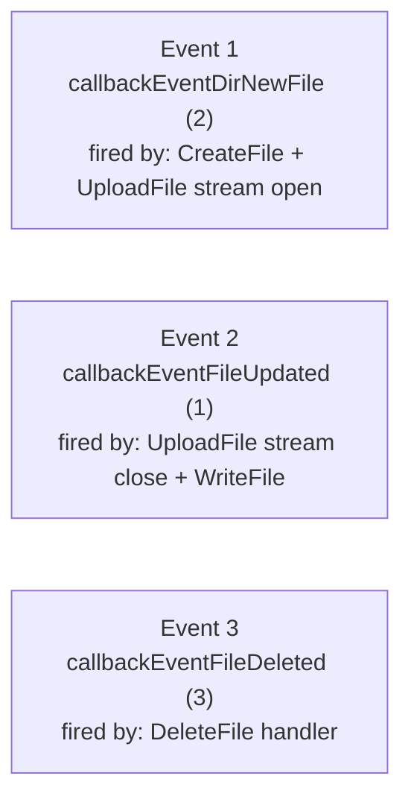
```mermaid
graph LR
    EV1["Event 1\ncallbackEventDirNewFile (2)\nfired by: CreateFile + UploadFile stream open"]
    EV2["Event 2\ncallbackEventFileUpdated (1)\nfired by: UploadFile stream close + WriteFile"]
    EV3["Event 3\ncallbackEventFileDeleted (3)\nfired by: DeleteFile handler"]
```

### 7a. Notification Routing

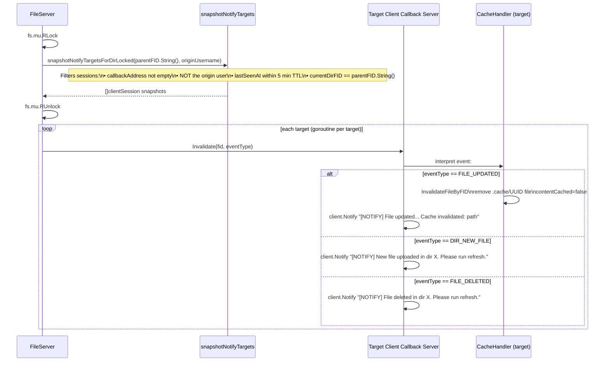
```mermaid
sequenceDiagram
    participant FS as FileServer
    participant SS as snapshotNotifyTargets
    participant CBT as Target Client Callback Server
    participant CHA as CacheHandler (target)

    FS->>FS: fs.mu.RLock
    FS->>SS: snapshotNotifyTargetsForDirLocked(parentFID.String(), originUsername)
    Note over SS: Filters sessions:\n• callbackAddress not empty\n• NOT the origin user\n• lastSeenAt within 5 min TTL\n• currentDirFID == parentFID.String()
    SS-->>FS: []clientSession snapshots
    FS->>FS: fs.mu.RUnlock

    loop each target (goroutine per target)
        FS->>CBT: Invalidate{fid, eventType}
        CBT->>CHA: interpret event:
        alt eventType == FILE_UPDATED
            CHA->>CHA: InvalidateFileByFID\nremove .cache/UUID file\ncontentCached=false
            CBT->>CBT: client.Notify "[NOTIFY] File updated... Cache invalidated: path"
        else eventType == DIR_NEW_FILE
            CBT->>CBT: client.Notify "[NOTIFY] New file uploaded in dir X. Please run refresh."
        else eventType == FILE_DELETED
            CBT->>CBT: client.Notify "[NOTIFY] File deleted in dir X. Please run refresh."
        end
    end
```

### 7b. Callback Reliability

| Constant | Value | Meaning |
|---|---|---|
| `activeSessionTTL` | 5 min | Sessions older than this are skipped for notifications |
| `callbackTimeout` | 3 s | Per-callback gRPC dial+RPC timeout |
| `maxCallbackFailures` | 3 | Session pruned after 3 consecutive failures |

### 7c. Notification Display (readline-safe)

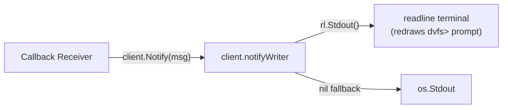
```mermaid
flowchart LR
    CBS["Callback Receiver"] -->|"client.Notify(msg)"| NW["client.notifyWriter"]
    NW -->|"rl.Stdout()"| RL["readline terminal\n(redraws dvfs> prompt)"]
    NW -->|"nil fallback"| OS["os.Stdout"]
```

`SetNotifyWriter(rl.Stdout())` is called when the REPL starts and deferred-reset to `nil` when it exits, ensuring the `dvfs>` prompt is correctly redrawn after every background notification.

---

## 8. Heartbeat Monitoring

```mermaid
sequenceDiagram
    participant FS as FileServer (background goroutine)
    participant MS as MetaServer

    loop every 10 seconds
        FS->>MS: Heartbeat{address}
        MS->>MS: findFileServerByAddressLocked
        MS->>MS: update LastHeartbeatUnix = now\nstatus = healthy
        MS->>MS: saveStateLocked()
        MS-->>FS: {success: true}
    end

    Note over MS: Separate monitor goroutine runs every 5s
    loop every 5 seconds (MetaServer monitor)
        MS->>MS: markStaleFileServersLocked(now)
        Note over MS: FS with now - LastHeartbeatUnix > 30s → status = stale
        MS->>MS: saveStateLocked() if any changed
    end

    Note over MS: On Navigate request:
    MS->>MS: markStaleFileServersLocked(now)
    MS->>MS: Skip stale FSes in routing
```

---

## 9. Cache System

```mermaid
stateDiagram-v2
    [*] --> populated: NewCacheHandler → ListDir(rootFID)
    populated --> stale: Push Invalidate received
    populated --> populated: cd → populateCurrentDirCache
    populated --> populated: refresh → populateCurrentDirCache
    stale --> populated: User runs refresh
    populated --> extended: upload/mkdir/create
    extended --> shrunk: delete/trash
```

### CNode Lifecycle

```mermaid
graph TD
    ROOT["root CNode (mydrive)"]
    ROOT --> A["dir CNode"]
    ROOT --> B["file CNode\ncontentCached=false"]
    B -->|"read cache miss"| C["file CNode\ncontentCached=true\ncontentUID=UUID"]
    C -->|"Invalidate callback"| D["file CNode\ncontentCached=false\ncontentUID=''"]
    D -->|"next read"| C
    ROOT --> E["file CNode\n(uploaded)"]
```

### populateCurrentDirCache Merge Strategy

When refreshing a directory, old CNodes whose names still appear in the server listing are **updated in-place** (preserving cached content state). Only new entries from the server create fresh CNodes, and removed entries are dropped. This ensures cached file content is not unnecessarily invalidated by a `refresh`.

---

## 10. Storage Quota Enforcement

```mermaid
flowchart LR
    QC["checkStorageQuota(rootUser)"] --> RCHECK{rootInode.Size > 1GB?}
    RCHECK -- Yes --> ERR["Error: storage quota exceeded"]
    RCHECK -- No --> ALLOW["Allow CreateFile / proceed with upload"]
    WF["WriteFile\nupdate inode.Size + propagate up parent chain"] --> ROOTCHECK{rootInode.Size > 1GB?}
    ROOTCHECK -- Yes --> WERR["Return quota-exceeded error\n(write already committed — best-effort)"]
```

- **Quota**: 1 GB per user root (constant `storageQuota`)
- `CreateFile` calls `checkStorageQuota` before allowing any new file or directory creation
- `WriteFile` propagates size changes up the parent chain and returns an error if quota is exceeded (does not roll back the last write — best-effort)

---

## 11. TLS Configuration

TLS is **disabled by default** (`--tls=false`). When enabled, the same embedded CA certificate (`internal/certs/certs.go`) is used for all three connection types:

| Connection | Direction |
|---|---|
| Client → FileServer | mTLS via `credentials.NewClientTLSFromCert` |
| Client → MetaServer | mTLS via `credentials.NewClientTLSFromCert` |
| FileServer → Client callback | mTLS via `credentials.NewClientTLSFromCert` |

Callback address normalization: if the client reports `localhost` or a loopback as its callback address, the server replaces the host with the actual peer IP extracted from the gRPC context, enabling cross-machine notifications.

---

## 12. Key Design Decisions

| Concern | Decision |
|---|---|
| **FID identity** | `serverID_inodeID_generationNumber` — globally unique; `inodeID` is a process-lifetime monotonic counter |
| **In-memory inode map** | All inodes held in `map[string]*Inode`; reconstructed from disk on startup by FileScanner |
| **ACL per directory** | Each directory has a `.acl` JSON file on disk; new files deep-copy parent ACL at creation |
| **ACL propagation** | `Share`/`Unshare` performs a full DFS of the subtree and updates every inode + persists every `.acl` |
| **Concurrency** | Single `sync.RWMutex` on FileServer protects all inode state; reads use `RLock`, writes use `Lock` |
| **Network calls outside lock** | `RootShare`/`RootUnshare` MetaServer RPCs are always called **after** `fs.mu` is released to prevent deadlocks |
| **Streams** | Upload uses gRPC client-streaming; Download uses gRPC server-streaming; both use 4 MB chunks |
| **gRPC message size** | Max 64 MB on both client send and server receive (proto overhead on a 4 MB chunk slightly exceeds 4 MB default) |
| **Trash model** | Soft delete via `os.Rename` into `.trash/`; restore metadata (original parent + shared snapshots) stored in-memory only — lost on server restart |
| **Shared dir delete/trash** | Owner can trash or permanently delete a shared directory; ACL state cleaned under lock; MetaServer RootUnshare called after lock release |
| **Notification targeting** | Only users whose `currentDirFID` matches the event's directory AND have been active within 5 min receive callbacks — granular push to reduce noise |
| **Cache invalidation** | File content cache entry (UUID file in `.cache/`) is deleted immediately on receiving a push callback; directory listings are not auto-refreshed (user must `refresh`) |
| **Client session pruning** | Session deleted from `fs.sessions` after 3 consecutive callback failures |
| **Persistence atomicity** | All JSON state files written via write-to-temp + `os.Rename` to prevent half-written corruption |
| **TLS** | Disabled by default (`--tls=false`); when enabled, same embedded CA cert used for all gRPC connections |
| **Path resolution (client)** | `pwd` and `cd` are resolved locally via CNode tree traversal; actual FID change is confirmed by FS via `ChangeDir` RPC |
| **Quota** | 1 GB per user root; checked before `CreateFile`; best-effort on writes (does not rollback) |
| **Tab completion** | CobraCompleter lists current directory's CNode children for `cd`, `read`, `download`, `delete`, `trash`; lists trash for `restore` |
