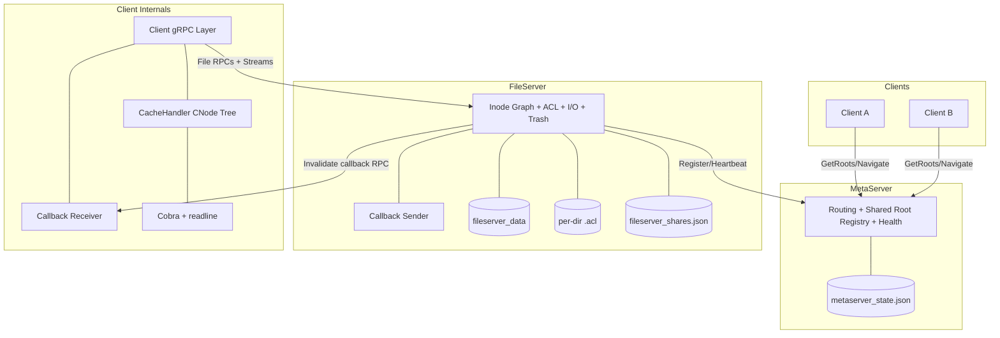
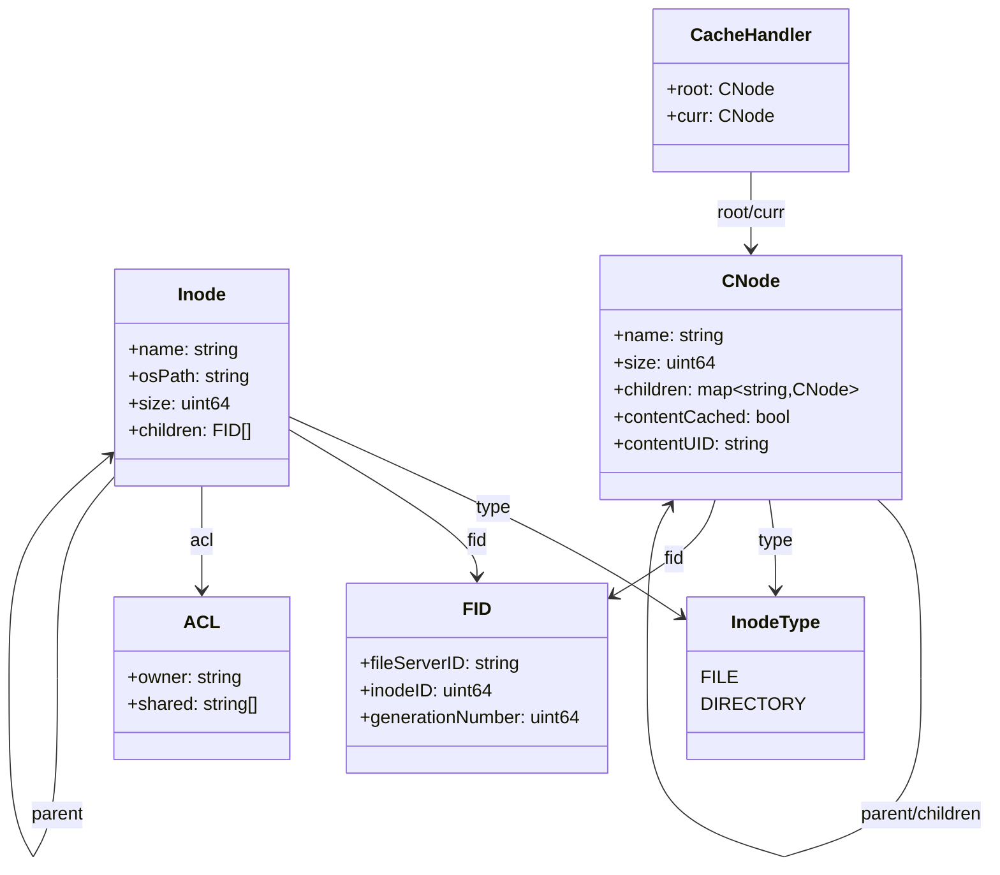
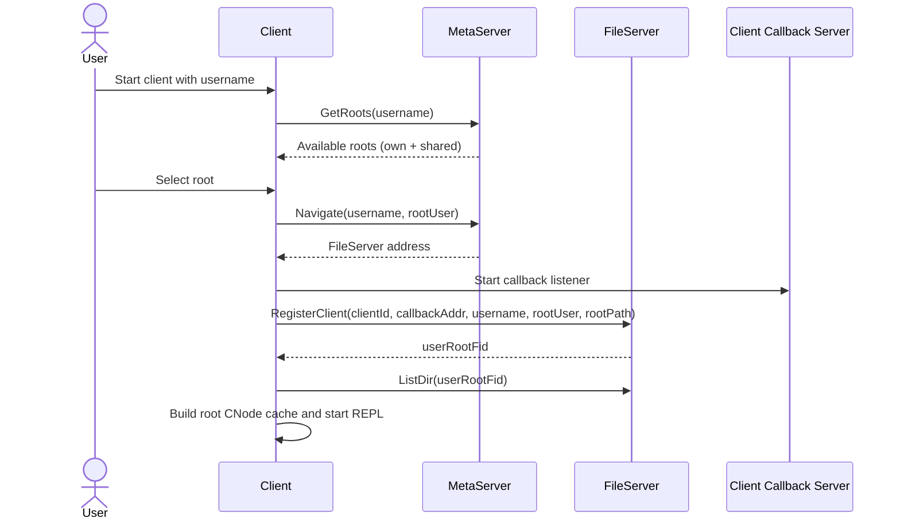
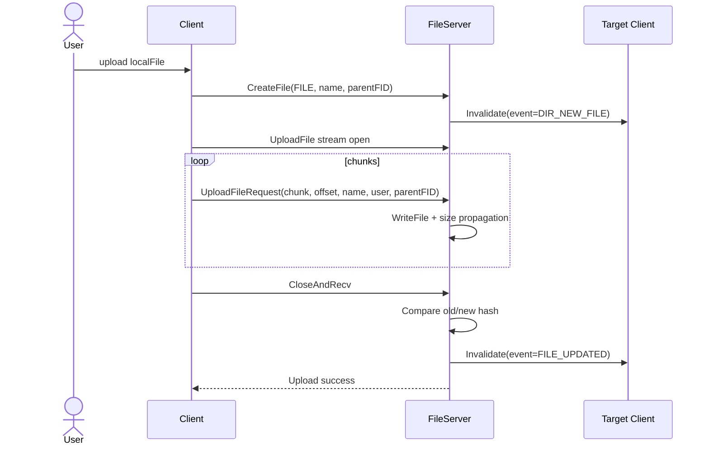
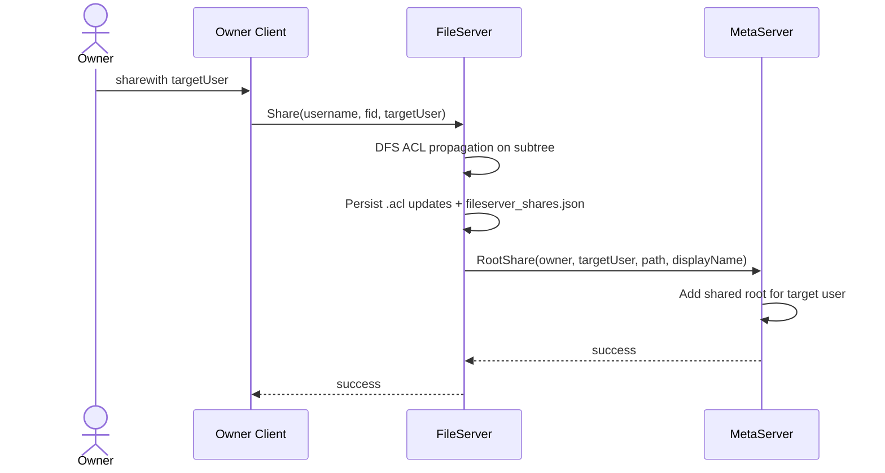
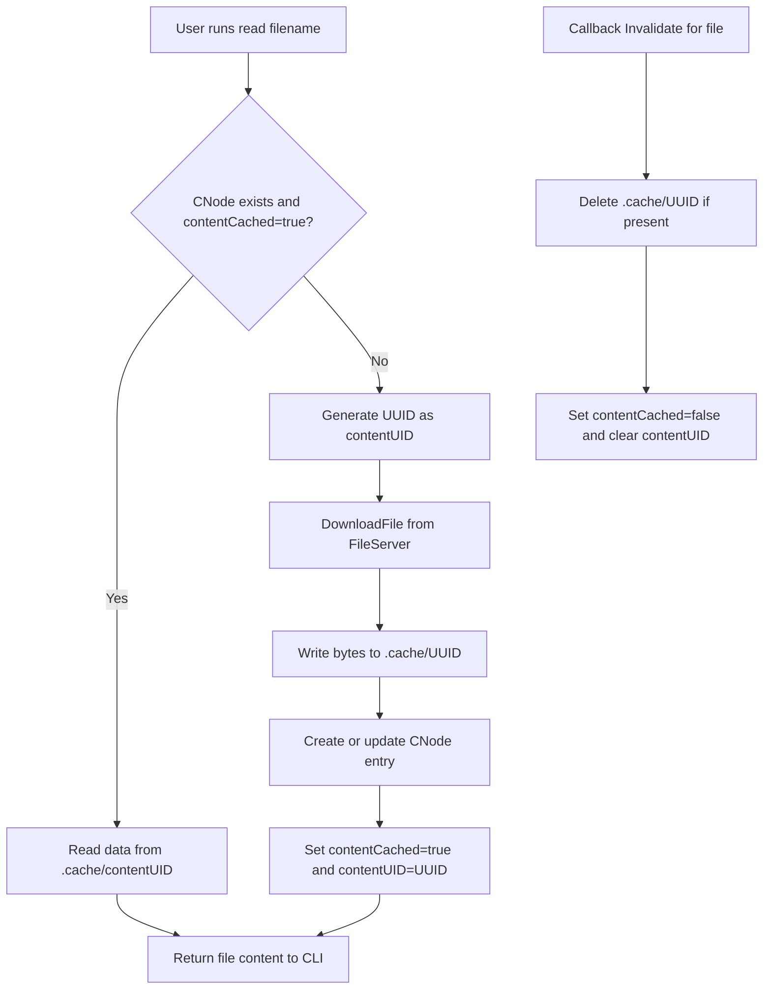

# Building DVFS, a Distributed 'Cloud' for our Campus

**Architecture, Protocol Design, Caching, and Multi-User Consistency over gRPC**

Authors: Romit Mohane, Umang Shikarvar  
Guide: Prof. Abhishek Bichhawat  
Institute: IIT Gandhinagar

---

## 1. Abstract

DVFS is a campus-scale multi-user file system built over gRPC with a dedicated MetaServer for routing and FileServers for data and metadata operations. The system combines server-side inode/ACL metadata with client-side cache trees and callback-based invalidation to provide responsive interactive commands (`ls`, `cd`, `read`, `upload`, `download`, `sharewith`, etc.) while preserving correctness under sharing and concurrent updates. The design emphasizes explicit protocol contracts, persistence with atomic updates, and practical consistency through push notifications plus user-controlled refresh.

---

## 2. Problem Statement and Goals

### Problem

Campus teams need a shared storage system that feels as simple as local CLI file operations, while still handling multi-user collaboration, access control, and concurrent updates across labs and personal machines.

### Goals

- Build a campus-wide distributed cloud storage layer with intuitive shell-like commands.
- Support secure multi-user sharing with ACL-based control.
- Minimize latency via client-side metadata/content cache.
- Preserve cross-client consistency using server push invalidation callbacks.
- Keep metadata durable across restarts using atomic persistence.

---

## 3. System Architecture (Use in "basic archi diag" block)

### Architecture Highlights

- Control plane: MetaServer handles user-to-fileserver routing and health.
- Data plane: FileServer performs file metadata and content operations.
- Consistency plane: callbacks invalidate stale cache entries for active users in the same directory.

---

## 4. Data Structures (Use in "cache structure" block)

### UML: Unified Data Structures

    INode (server-side inode) is the authoritative metadata object for each file/directory, including identity, ACL, hierarchy, and storage path.
    CNode (client-side cache node) is the lightweight local mirror used by the CLI for fast navigation/read decisions and callback-driven cache invalidation.

### Identity format

`FID = <FileServerID>_<InodeID>_<GenerationNumber>` (example: `fs1_7_1`)

---

## 5. Session Initiation and Root Selection (Use in "initiation diagram" block)

### Design Notes

- Root selection allows entering own root or shared roots from other owners.
- Registration enforces owner/shared ACL validation before granting root FID.
- Callback endpoint is normalized for remote-machine compatibility.

---

## 6. Protocol and Interaction Flows (Use in "sharing photo" + main body)

### Upload and Update Flow (streaming + callback)

### Share / Unshare Flow

### Simple Caching Flow (Read Path)

### Notification Targeting Rules

- Notify only active sessions (`lastSeenAt <= 5 min`).
- Notify only clients whose `currentDirFID` equals event directory.
- Exclude origin user where applicable.
- Prune callback session after 3 consecutive callback failures.

---

## 7. Command Coverage (Use in "commands table" block)

| CLI Command                                                    | Primary RPC(s)                                        | Main Data Structures                    | Consistency / Side Effect                      |
| -------------------------------------------------------------- | ----------------------------------------------------- | --------------------------------------- | ---------------------------------------------- |
| `ls`, `pwd`, `viscache`                                        | none (cache/local path)                               | `CNode` tree                            | local-only inspection                          |
| `cd <path>`, `refresh`                                         | `ChangeDir`, `ListDir`                                | `currentFID`, `currentDirFID`, `CNode`  | updates session state and syncs directory view |
| `info`                                                         | `GetAttr`                                             | inode metadata                          | read-only metadata fetch                       |
| `read <name>`                                                  | cache hit or `DownloadFile`                           | `.cache/<UUID>`, `contentCached`        | cache fill on miss; invalidated by callback    |
| `create`, `mkdir`, `upload`                                    | `CreateFile`, `UploadFile` (stream)                   | inode tree, ACL inheritance, cache node | triggers new/update notification events        |
| `download <name>`                                              | `ListDir`, `DownloadFile` (stream)                    | local `./Download`                      | server-to-client file transfer                 |
| `rm`, `rm -r`, `trash`, `restore`, `show_trash`, `clear_trash` | `DeleteFile`, `TrashFile`, `RestoreFile`, `ShowTrash` | inode graph, `.trash`, `trashMeta`      | deletion lifecycle (soft + hard)               |
| `sharewith`, `unsharewith`                                     | `Share`, `Unshare`, `RootShare`, `RootUnshare`        | ACL subtree + shared-root index         | controls cross-user access and discovery       |
| `clear`                                                        | none                                                  | terminal                                | UI-only command                                |

---

## 8. Persistence, Reliability, and Security

### Persistence

- Directory ACL stored per-directory in `.acl` JSON.
- Share index stored in `fileserver_shares.json`.
- MetaServer state stored in `metaserver_state.json`.
- Atomic persistence through temp-write + rename.

### Reliability

- Heartbeat from FileServer to MetaServer.
- Stale FileServers excluded from navigation.
- Callback timeout and failure-based pruning.

### Security

- ACL owner/shared checks enforced server-side on operations.
- TLS can be enabled for all gRPC channels (client-meta, client-file, file-callback).

---

## 9. Key Design Decisions

- Separate control plane (MetaServer) and data plane (FileServer).
- Explicit global IDs (`FID`) for stable references across protocol boundaries.
- Cache coherence via callbacks + user-triggered refresh for list synchronization.
- Lock discipline: perform external network RPCs outside FileServer lock to avoid deadlocks.
- Soft delete (`trash`) with metadata-assisted restore for usability.

---

## 10. Results and Takeaways

### What Works Well

- Command-driven UX with low-latency directory navigation through cache.
- Accurate multi-user sharing semantics with ACL propagation.
- Practical push-based stale-cache prevention for file-content updates.

### Current Limitations

- Restore metadata (`trashMeta`) is in-memory and not durable across FileServer restart.
- Directory listings are not auto-refreshed on callback (manual `refresh` required).

### Future Work

- Persist trash restore metadata on disk.
- Add version vectors or stronger consistency policies for conflict-aware editing.
- Add automated callback integration benchmarks and failure injection tests.

---

## 11. Suggested Visual Placement for A1

- Top-left: Abstract + Problem + Contributions
- Top-center: System Architecture
- Top-right: Share/Unshare + TLS mini-block
- Middle-left: Initiation Sequence
- Middle-center: Cache Structure and Invalidation Lifecycle
- Middle-right: Upload/Update Protocol Flow
- Bottom-wide: Command Coverage Table
- Footer: Reliability, Limitations, Future Work, QR to repository/demo
