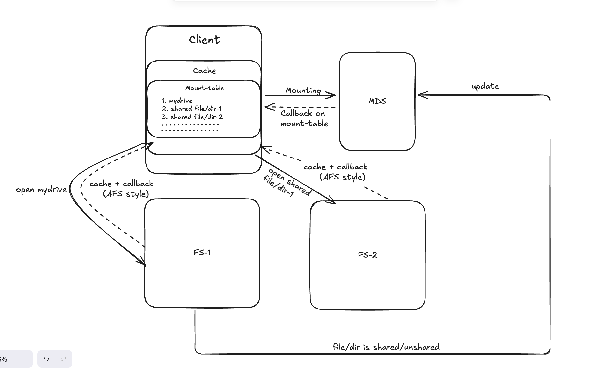

# Distributed Virtual File System

## 1. System Overview

This document describes the final design of a **distributed virtual file system (VFS)** inspired by AFS and implemented **in userspace on top of the host OS filesystem**.

The system consists of:
- **File Servers (FS)** – store file data and enforce access control
- **Metadata Server (MDS)** – stores indexing metadata for fast shared-file discovery
- **Clients** – expose a virtual namespace and interact with FS and MDS

### Design Goals
- Correct filesystem semantics (`open`, `read`, `write`, `rename`, `ls`)
- Each user sees exactly **two namespaces**:
  - **`mydrive`** (private)
  - **`shared`** (shared with the user)
- Fast common case (`ls shared`)
- Clear separation between authority and indexing

---

## 2. Terminology

### 2.1 Logical Inode
A **logical inode** is an internal representation of a file or directory.  
It is **not** an OS inode.

Each logical inode has:
- a stable identity
- metadata (name, ACL)
- a cached OS path

---

### 2.2 File Identifier (FID)

A **FID** uniquely identifies a file or directory globally.

```
FID = <file_server_id, inode_id, generation_number>
```

- `file_server_id` – which file server owns the file
- `inode_id` – unique logical inode number on that server
- `generation_number` – increments on delete + recreate

**FID is the only identity in the system.**

---

### 2.3 Access Control List (ACL)

An **ACL** defines which users may access a file or directory.

```
ACL {
  read   → users allowed to read file
  write  → users allowed to modify file
  lookup → users allowed to traverse directory
}
```

Rules:
- ACLs are stored and enforced only on file servers
- Metadata server never enforces permissions

---

### 2.4 Private vs Shared Files
- **Private file** – accessible only to the owner
- **Shared file** – ACL allows additional users

---

### 2.5 Shared Index
A **shared index** is denormalized metadata on the metadata server used only for:

```
ls shared
```

---

## 3. High-Level Architecture



---

## 4. File Server Design (Authoritative)

Each file server stores actual data on the OS filesystem and maintains one authoritative database.

### 4.1 Unified File Server Database

```
InodeDB {
  fid                PRIMARY KEY
  type               ENUM {file, directory}
  name               STRING
  os_path            STRING
  child_fids[]       ARRAY<FID>
  acl                ACL
}
```

**Invariants**
- FID is identity
- `os_path` is cached, derived state
- ACLs are enforced before OS access
- One inode maps to one OS path

---

### 4.2 Shared ACL Table (FS-local)

```
SharedACLTable {
  fid → users[]
}
```

Used to:
- track shared inodes
- notify metadata server
- rebuild shared state after crashes

---

## 5. Metadata Server Design

The metadata server stores no file data and no ACLs.

### 5.1 Metadata Server Database

```
SharedIndex {
  fid           PRIMARY KEY
  cached_name
  users[]
}
```

- `users[]` represents visibility only
- access is always validated by file servers

---

## 6. Client Namespace (User View)

Each user sees **exactly two directories**:

```
mydrive/
shared/
```

### Semantics
- **`mydrive`**
  - User’s private files
  - Backed by the user’s root directory on a file server
- **`shared`**
  - Virtual directory
  - Contains files and directories shared *with* the user
  - Backed by metadata server + FIDs

---

## 7. Private File Operations (`mydrive`)

### Create Private File

```
touch mydrive/fileA
```

File server:
1. Allocate new FID
2. Create OS file
3. Insert entry into `InodeDB`
4. ACL allows only owner

---

### Open Private File

```
open("mydrive/fileA")
```

File server:
1. Resolve path → FID
2. Check ACL
3. Use `os_path`
4. Call OS `open()`

---

## 8. Sharing Operations

### Share a File

```
setacl mydrive/fileA alice read
```

File server:
1. Update `InodeDB[fid].acl`
2. Update `SharedACLTable`
3. Notify metadata server

Metadata server updates `SharedIndex`.

---

## 9. Shared File Discovery (`shared`)

### List Shared Files

```
ls shared
```

Client queries metadata server:

```
SELECT * FROM SharedIndex
WHERE user ∈ users[]
```

Result:
- List of `(fid, cached_name, fs_id)`
- No file-server RPCs required

---

## 10. Open Shared File

```
open("shared/fileA")
```

Client:
- Resolves name → FID using metadata server

File server:
1. Validate generation number
2. Check ACL
3. Use cached `os_path`
4. Call OS `open()`

Client never sees real OS paths.

---

## 11. Rename and Move

### Rename File (Private or Shared)

```
mv mydrive/fileA mydrive/fileX
```

File server:
- updates `name`
- updates `os_path`
- FID unchanged
- metadata server notified if shared

---

### Move Directory (Rare, Expensive)

```
mv mydrive/project mydrive/archive/project
```

File server:
- updates directory `os_path`
- recursively updates children `os_path`
- notifies metadata server for shared FIDs only

---

## 12. Delete / Unshare with Cascade

```
rm -r mydrive/project
```

File server:
1. DFS using `child_fids`
2. Remove each FID from `SharedACLTable`
3. Notify metadata server
4. Delete OS files and DB entries

Guarantee:
- No ghost shared entries
- No stale visibility

---

## 13. Failure Handling

### Metadata Server Failure
- File servers continue enforcing ACLs
- `ls shared` may be stale
- Access remains correct

### File Server Failure
On restart:
1. Scan OS filesystem
2. Rebuild `InodeDB`
3. Rebuild `SharedACLTable`
4. Re-register shared FIDs

---

## 14. Design Invariants

1. FID is the only identity
2. ACLs enforced only on file servers
3. Metadata server is advisory
4. `os_path` must match OS filesystem
5. Rename/move updates `os_path`
6. Shared index staleness is safe

---

## 15. Security (TLS)

The system uses gRPC over TLS for secure communication between clients and servers. By default, TLS is disabled (`--tls=false`) for easy local testing.

### 15.1 Managing Certificates
We use standard filesystem-based certificates. The system looks for certificates in a root `certs/` directory.

- **File Server & Meta Server**: Require `--tls_cert` (default: `./certs/server.crt`) and `--tls_key` (default: `./certs/server.key`).
- **Client**: Requires `--ca_cert` (default: `./certs/ca.crt`) to verify the server's identity.

To enable TLS, pass the `--tls=true` flag when running the servers and the client.

### 15.2 Generating Certificates
You can generate or regenerate local certificates using the provided script:
```bash
make certs
```
This will run the generation script and output the files (`ca.crt`, `ca.key`, `server.crt`, `server.key`) directly into the `certs/` directory. 

*Note: If you run a client on a different laptop with TLS enabled, you **must** copy the `ca.crt` file to that laptop so it can trust the server.*

---

## 16. Summary

Each user interacts with exactly two namespaces—`mydrive` for private data and `shared` for shared data. File servers maintain authoritative metadata and enforce ACLs, while the metadata server maintains a denormalized shared index to optimize listing without participating in access control.
# Commands To Run the Whole Setup

### For Fileserver (from project root)

```
go run .\cmd\fileserver\main.go --meta_addr <full ip + port of mds> --own_ip=<this fileservers ip to send to mds>
```

Other flags and defaults:

- port = 50052
- id = fs1
- data = fileserver_data
- tls = false

### For Metadata Server (from project root)

```
go run .\cmd\metaserver\main.go
```

Other flags and defaults:

- port = 50051
- tls = false

### For Client (from root)

```
go run .\cmd\client\main.go --username <username> --ip_addr <mds/fs ip address>
```

Other flags and defaults

- port = 50051
- tls = false
- meta = true (whether to go to mds or not)

### For Admin Console (from project root)

The admin console provides a centralized web dashboard to monitor fileserver nodes (storage, CPU temperature, RAM, uptime, per-user usage), active users, and system health in real-time.

#### 1. Building the Frontend (one-time setup)
The React SPA source is in `cmd/admin/ui`. Build the static assets into `cmd/admin/static`:

```bash
cd cmd/admin/ui
npm install
npm run build
cd ../../..
```

*(For live UI development with hot-reload against a running backend, run `npm run dev` inside `cmd/admin/ui`)*

#### 2. Starting the Admin Server

```bash
go run .\cmd\admin\main.go --state_file=./metaserver_state.json --port=8080
```

Or with `make`:
```bash
make run-admin
```

Other flags and defaults:
- `port = 8080` (HTTP port for the web dashboard and REST API)
- `state_file = ./metaserver_state.json` (metaserver state file used for dynamic node discovery)
- `static = ./cmd/admin/static` (path to frontend build directory)

Open your browser at `http://localhost:8080` to view the dashboard.

#### 3. How Telemetry Scrapes Work
- Each fileserver automatically starts a lightweight `/metrics` HTTP sidecar on port `port - 41000` (e.g., gRPC port `50052` → metrics HTTP `9052`).
- The admin backend reads `metaserver_state.json`, discovers active fileserver addresses, scrapes their `/metrics` endpoints every 5 seconds, maintains a 60-minute in-memory ring buffer for historical graphs, and serves the UI.

#### 4. Running Admin Console Tests
```bash
make test-admin
# or
go test ./internal/admin -v
```

