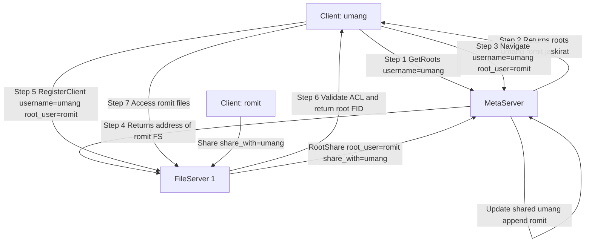
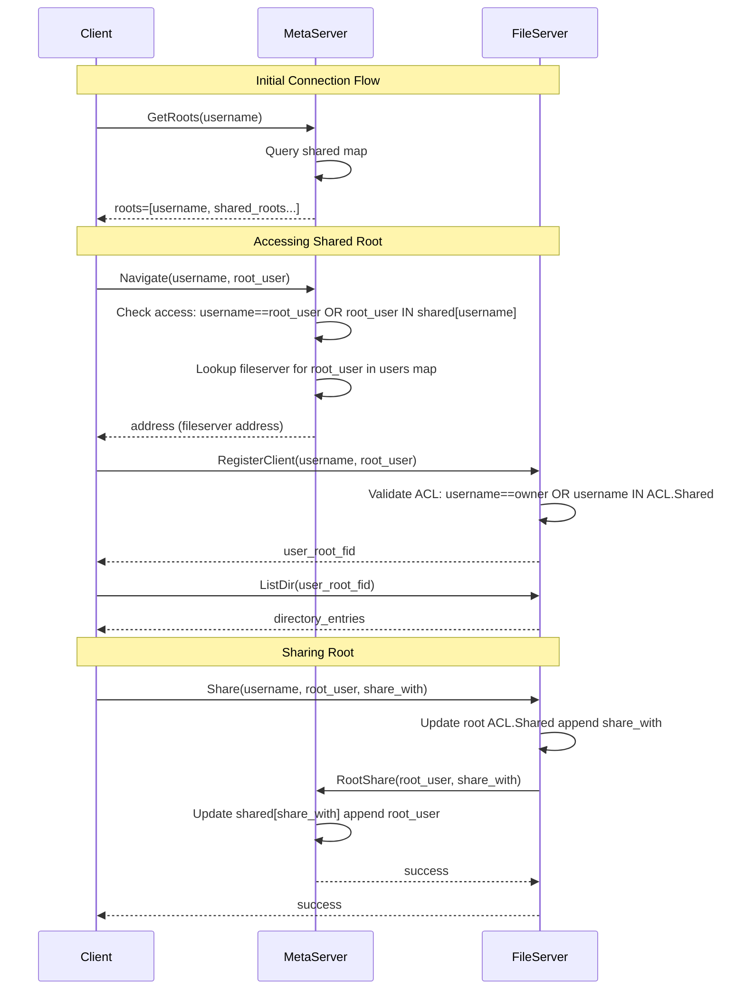
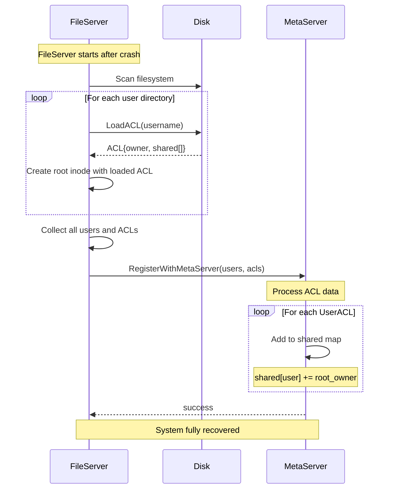

# Design Document: Multi-User Root Sharing Visibility

## Overview

This design extends the distributed VFS to enable multi-user root visibility through the metaserver. Currently, users only see two namespaces: "mydrive" (private) and "shared" (shared files). With this feature, when a user connects to the metaserver, they will see their own root ("mydrive") plus all user roots that have been shared with them (e.g., "romit", "jaskirat"). This enables direct navigation to other users' file systems while maintaining proper access control and routing to the correct fileserver.

The metaserver will track root-level sharing relationships and provide a list of accessible roots when clients connect. The client will be able to navigate to different user roots, and the system will automatically route connections to the appropriate fileserver for each root.

## Architecture



## Main Workflow



## Components and Interfaces

### Component 1: MetaServer - Root Sharing Index

**Purpose**: Track which users have shared their roots with which other users, and provide a list of accessible roots for each user.

**Interface**:
```go
// New RPC methods added to MetaServer service
service MetaServer {
  rpc GetRoots(GetRootsRequest) returns (GetRootsResponse);
  rpc RootShare(RootShareRequest) returns (RootShareResponse);
  rpc RootUnshare(RootUnshareRequest) returns (RootUnshareResponse);
  
  // Existing methods (modified)
  rpc RegisterFileServer(RegisterFileServerRequest) returns (RegisterFileServerResponse);
  rpc Navigate(NavigateRequest) returns (NavigateResponse);
}
```

**Responsibilities**:
- Maintain SharedRootsIndex mapping users to accessible roots (stored in `shared` map)
- Respond to GetRoots queries from clients (returns user's own root + shared roots)
- Process sharing notifications from fileservers via RootShare/RootUnshare
- Route clients to correct fileserver for each root via Navigate
- Validate access permissions before routing (checks if root is shared or owned)

### Component 2: FileServer - Root Sharing Enforcement

**Purpose**: Enforce root-level ACLs and notify metaserver of sharing changes.

**Interface**:
```go
// Existing Share/Unshare methods remain, with updated behavior:
// - They now notify the metaserver after successful ACL updates
// - RegisterClient already validates ACL for root access

// Internal interface for metaserver communication (implemented in msclient.go)
func (fs *FileServer) RootShare(root_user, share_with string) error
func (fs *FileServer) RootUnshare(root_user, unshare_with string) error
func (fs *FileServer) RegisterWithMetaServer(selfAddr string) error
```

**Responsibilities**:
- Validate root ACL during RegisterClient (checks if user is owner or in shared list)
- Update root ACL during Share/Unshare operations
- Notify metaserver of sharing changes via RootShare/RootUnshare RPCs
- Provide root FID to authorized users
- Store metaserver address (msAddr) for notifications

### Component 3: Client - Multi-Root Navigation

**Purpose**: Display available roots and enable navigation between different user roots.

**Interface**:
```go
type Client struct {
  username   string
  root_user  string  // Currently active root
  rootFID    *domain.FID
  currentFID *domain.FID
  serverConn pb.FileServerClient
  useTLS     bool
}

// New methods (implemented in msclient.go)
func (c *Client) GetRoots(msAddr string) ([]string, error)
func (c *Client) NavigateToFileServer(msAddr string) (string, error)
func (c *Client) SetRootUser(root_user string)
```

**Responsibilities**:
- Query metaserver for available roots via GetRoots
- Display available roots to user (prompts user to select which root to access)
- Navigate to appropriate fileserver for selected root via NavigateToFileServer
- Switch between different user roots by updating root_user field
- Maintain connection to appropriate fileserver for current root

## Data Models

### Model 1: SharedRootsIndex (MetaServer)

```go
type MetaServer struct {
  fileservers map[uint64]*domain.FileServerInfo // fs_id -> fs
  users       map[string]uint64                  // username -> fs_id
  shared      map[string][]string                // username -> list of root owners who shared with this user
  nextFsID    uint64
  mu          sync.RWMutex
}
```

**Validation Rules**:
- User cannot share with themselves
- Duplicate sharing entries are prevented (idempotent operations)
- Unsharing removes entry only if it exists
- Both root_user and share_with must exist in the users map

### Model 2: RootInfo (MetaServer)

```go
type RootInfo struct {
  Owner          string  // Root owner username
  FileServerID   uint64  // Which fileserver hosts this root
  FileServerAddr string  // Address of the fileserver
}
```

**Validation Rules**:
- Owner must be registered on a fileserver
- FileServerID must exist in fileservers map


## Algorithmic Pseudocode

### Algorithm 1: Get Available Roots (GetRoots)

```go
ALGORITHM GetRoots(username)
INPUT: username of type string
OUTPUT: list of accessible root names

BEGIN
  ASSERT username is non-empty
  
  // Step 1: Lock for reading
  LOCK metaserver.mu FOR READ
  
  // Step 2: Check if user exists, if not assign to least loaded FS
  IF username NOT IN metaserver.users THEN
    // Find least loaded file server
    min_fs ← 0
    min_users ← metaserver.fileservers[0].UserCount
    FOR each fs_no, fsInfo IN metaserver.fileservers DO
      IF fsInfo.UserCount < min_users THEN
        min_fs ← fs_no
        min_users ← fsInfo.UserCount
      END IF
    END FOR
    
    // Assign user to least loaded FS
    metaserver.users[username] ← min_fs
    metaserver.fileservers[min_fs].UserCount++
    metaserver.shared[username] ← []  // Initialize empty shared list
  END IF
  
  // Step 3: Build roots list (own root + shared roots)
  roots ← [username]  // User's own root
  sharedRoots ← metaserver.shared[username]
  roots ← append(roots, sharedRoots...)
  
  UNLOCK metaserver.mu
  
  ASSERT roots contains at least username
  
  RETURN roots
END
```

**Preconditions:**
- username is non-empty string
- metaserver data structures are initialized
- Lock is available

**Postconditions:**
- Returns list containing at least the user's own root (username)
- All shared roots are included in result
- If user didn't exist, they are assigned to a fileserver
- No modifications to sharing state (only user assignment if new)
- Lock is properly released

**Loop Invariants:**
- When finding least loaded FS: min_fs and min_users correctly track the minimum

### Algorithm 2: Root Share Notification

```go
ALGORITHM RootShare(rootUser, shareWith)
INPUT: rootUser, shareWith of type string
OUTPUT: success boolean

BEGIN
  ASSERT rootUser is non-empty
  ASSERT shareWith is non-empty
  
  // Step 1: Lock for writing
  LOCK metaserver.mu FOR WRITE
  
  // Step 2: Validate root user exists
  IF rootUser NOT IN metaserver.users THEN
    UNLOCK metaserver.mu
    RETURN error("root user does not exist")
  END IF
  
  // Step 3: Validate share_with user exists
  IF shareWith NOT IN metaserver.users THEN
    UNLOCK metaserver.mu
    RETURN error("target user does not exist")
  END IF
  
  // Step 4: Check if already shared (idempotent operation)
  currentShared ← metaserver.shared[shareWith]
  FOR each owner IN currentShared DO
    IF owner = rootUser THEN
      UNLOCK metaserver.mu
      RETURN true  // Already shared, success
    END IF
  END FOR
  
  // Step 5: Add new sharing relationship
  metaserver.shared[shareWith] ← append(currentShared, rootUser)
  
  UNLOCK metaserver.mu
  
  ASSERT rootUser IN metaserver.shared[shareWith]
  
  RETURN true
END
```

**Preconditions:**
- rootUser and shareWith are non-empty strings
- metaserver data structures are initialized
- Lock is available

**Postconditions:**
- rootUser is added to shareWith's accessible roots list
- Operation is idempotent (no error if already shared)
- Returns true on success, error otherwise
- Lock is properly released
- No other state modifications

**Loop Invariants:**
- When checking for duplicates: all previously checked entries are not equal to rootUser

### Algorithm 3: Navigate to Root

```go
ALGORITHM Navigate(username, rootUser)
INPUT: username, rootUser of type string
OUTPUT: fileserver address of type string

BEGIN
  ASSERT username is non-empty
  ASSERT rootUser is non-empty
  
  // Step 1: Lock for reading
  LOCK metaserver.mu FOR READ
  
  // Step 2: Validate username exists
  IF username NOT IN metaserver.users THEN
    UNLOCK metaserver.mu
    RETURN error("username does not exist")
  END IF
  
  // Step 3: Validate root_user exists
  fsID ← metaserver.users[rootUser]
  IF fsID is null THEN
    UNLOCK metaserver.mu
    RETURN error("root user does not exist")
  END IF
  
  // Step 4: Check if user has access to target root
  allowed ← false
  IF username = rootUser THEN
    // Accessing own root - always allowed
    allowed ← true
  ELSE
    // Check if root is shared with user
    sharedRoots ← metaserver.shared[username]
    FOR each owner IN sharedRoots DO
      IF owner = rootUser THEN
        allowed ← true
        BREAK
      END IF
    END FOR
  END IF
  
  IF NOT allowed THEN
    UNLOCK metaserver.mu
    RETURN error("user does not have access to root")
  END IF
  
  // Step 5: Get fileserver address
  fsInfo ← metaserver.fileservers[fsID]
  address ← fsInfo.Address
  
  UNLOCK metaserver.mu
  
  ASSERT address is non-empty
  
  RETURN address
END
```

**Preconditions:**
- username and rootUser are non-empty strings
- metaserver data structures are initialized
- Lock is available

**Postconditions:**
- Returns valid fileserver address if access is granted
- Returns error if access is denied or root not found
- No modifications to metaserver state
- Lock is released

**Loop Invariants:**
- All checked owners are valid usernames
- allowed flag correctly reflects access status for checked owners


### Algorithm 4: Client Root Selection and Connection

```go
ALGORITHM ClientRootSelection(client, msAddr)
INPUT: client object, msAddr (metaserver address) of type string
OUTPUT: connected to selected root

BEGIN
  ASSERT client.username is non-empty
  ASSERT msAddr is non-empty
  
  // Step 1: Query metaserver for available roots
  roots ← client.GetRoots(msAddr)
  IF roots is error THEN
    RETURN error
  END IF
  
  // Step 2: Display available roots to user
  PRINT "Available roots:"
  FOR each root IN roots DO
    PRINT root
  END FOR
  
  // Step 3: Prompt user to select a root
  PRINT "Enter the root you want to access:"
  selectedRoot ← READ_USER_INPUT()
  
  // Step 4: Update client's root_user
  client.SetRootUser(selectedRoot)
  
  // Step 5: Navigate to appropriate fileserver
  fsAddress ← client.NavigateToFileServer(msAddr)
  IF fsAddress is error THEN
    RETURN error
  END IF
  
  // Step 6: Connect to fileserver
  rootFID ← client.Connect(fsAddress)
  IF rootFID is error THEN
    RETURN error
  END IF
  
  ASSERT client.rootFID is not null
  ASSERT client.currentFID = client.rootFID
  
  RETURN success
END
```

**Preconditions:**
- client.username is non-empty
- msAddr is non-empty and reachable
- metaserver is running and accessible

**Postconditions:**
- client.root_user is set to selected root
- client.rootFID points to selected root
- client.currentFID is reset to root
- client.serverConn is connected to correct fileserver

**Loop Invariants:** N/A (no loops in main logic)

## Key Functions with Formal Specifications

### Function 1: MetaServer.GetRoots()

```go
func (h *GRPCHandler) GetRoots(ctx context.Context, req *pb.GetRootsRequest) (*pb.GetRootsResponse, error)
```

**Preconditions:**
- req.Username is non-empty string
- h.MetaServer.shared is initialized
- h.MetaServer.mu lock is available

**Postconditions:**
- Returns list containing at least the user's own root (username)
- All shared roots are included in result
- If user doesn't exist, assigns them to least loaded fileserver
- No modifications to sharing state
- Lock is properly released

**Loop Invariants:** When finding least loaded FS, min_fs and min_users correctly track minimum

### Function 2: MetaServer.RootShare()

```go
func (h *GRPCHandler) RootShare(ctx context.Context, req *pb.RootShareRequest) (*pb.RootShareResponse, error)
```

**Preconditions:**
- req.RootUser is non-empty string
- req.ShareWith is non-empty string
- h.MetaServer.shared is initialized
- h.MetaServer.mu lock is available

**Postconditions:**
- req.RootUser is added to req.ShareWith's accessible roots list
- Operation is idempotent (no error if already shared)
- Returns success response on success, error response otherwise
- Lock is properly released
- No other state modifications

**Loop Invariants:**
- When checking for duplicates: all previously checked entries are not equal to req.RootUser

### Function 3: FileServer.Share()

```go
func (fs *FileServer) Share(username, root_user, share_with string) error
```

**Preconditions:**
- username is non-empty (current user)
- root_user is non-empty (root owner)
- share_with is non-empty (target user)
- Root inode exists for root_user
- fs.mu lock is available

**Postconditions:**
- If username = root_user (owner): ACL is updated, metaserver is notified via RootShare
- If username ≠ root_user: returns permission error, no changes
- share_with is added to root ACL.Shared list
- Metaserver's shared map is updated via RootShare RPC
- Returns nil on success, error otherwise
- Lock is properly released

**Loop Invariants:**
- When checking ACL.Shared: all previously checked users are not equal to share_with

### Function 4: FileServer.RegisterClient()

```go
func (fs *FileServer) RegisterClient(username, root_user string) (*domain.FID, error)
```

**Preconditions:**
- username is non-empty (requesting user)
- root_user is non-empty (target root owner)
- fs.mu lock is available

**Postconditions:**
- If username = root_user: returns root FID (owner access)
- If username ≠ root_user AND username IN root ACL.Shared: returns root FID (shared access)
- If username ≠ root_user AND username NOT IN root ACL.Shared: returns error
- Root inode exists after call (created if necessary)
- Returns valid FID on success, error otherwise
- Lock is properly released

**Loop Invariants:**
- When checking ACL.Shared: all previously checked users are valid usernames


## Protocol Changes (Protobuf Messages)

### MetaServer Protocol Extensions

```protobuf
// New messages for metaserver.proto

message GetRootsRequest {
  string username = 1;
}

message GetRootsResponse {
  bool success = 1;
  string error = 2;
  repeated string roots = 3;  // List of accessible root names (includes own root + shared roots)
}

message RootShareRequest {
  string root_user = 1;      // Root owner username
  string share_with = 2;     // Username to share with
}

message RootShareResponse {
  bool success = 1;
  string error = 2;
}

message RootUnshareRequest {
  string root_user = 1;      // Root owner username
  string unshare_with = 2;   // Username to unshare with
}

message RootUnshareResponse {
  bool success = 1;
  string error = 2;
}

// Modified Navigate message to support target root
message NavigateRequest {
  string username = 1;       // Requesting user
  string root_user = 2;      // Target root owner (which root to access)
}

message NavigateResponse {
  bool success = 1;
  string error = 2;
  string address = 3;        // Address of the file server hosting the target root
}
```

### FileServer Protocol Extensions

No new messages needed - existing Share/Unshare and RegisterClient messages already support the required functionality. The implementation now notifies the metaserver via RootShare/RootUnshare RPCs.

## Example Usage

### Example 1: User Queries Available Roots

```go
// Client code (cmd/client/main.go)
client := client.NewClient("umang", "umang", true)

// Get list of available roots from metaserver
roots, err := client.GetRoots("127.0.0.1:50051")
if err != nil {
  log.Fatal(err)
}

// Output: ["umang", "romit", "jaskirat"]
fmt.Println("Available roots:")
for _, root := range roots {
  fmt.Println(root)
}

// Prompt user to select a root
fmt.Print("Enter the root you want to access: ")
var selectedRoot string
fmt.Scanln(&selectedRoot)
client.SetRootUser(selectedRoot)
```

### Example 2: User Navigates to Shared Root

```go
// Client code
client := client.NewClient("umang", "romit", true)

// Navigate to fileserver hosting romit's root
fsAddress, err := client.NavigateToFileServer("127.0.0.1:50051")
if err != nil {
  log.Fatal(err)
}

// Connect to fileserver
rootFID, err := client.Connect(fsAddress)
if err != nil {
  log.Fatal(err)
}

// Now accessing romit's files
files, err := client.ListFiles()  // Lists romit's root directory
```

### Example 3: User Shares Root

```go
// Client code (romit sharing with umang)
client := client.NewClient("romit", "romit", true)
fsAddress, _ := client.NavigateToFileServer("127.0.0.1:50051")
client.Connect(fsAddress)

// Share root with umang
err := client.Share("umang")
if err != nil {
  log.Fatal(err)
}

// Behind the scenes:
// 1. FileServer updates root ACL (adds umang to Shared list)
// 2. FileServer calls metaserver.RootShare("romit", "umang")
// 3. MetaServer updates shared["umang"] to include "romit"
// 4. Now umang can see "romit" in GetRoots()
```

### Example 4: Complete Workflow

```bash
# Terminal 1: Romit shares root with Umang
$ bin/client --username romit --root_user romit --meta
Available roots:
romit

Enter the root you want to access: romit
Connected successfully!
dvfs> share umang
Root directory shared successfully with 'umang'

# Terminal 2: Umang queries available roots and accesses romit's root
$ bin/client --username umang --root_user umang --meta
Available roots:
umang
romit

Enter the root you want to access: romit
Connected successfully!
dvfs> ls
Name                 Type             Size
----                 ----             ----
.trash               dir                 0
hello.txt            file                0
hi                   dir                 0

# Terminal 1: Romit unshares root
dvfs> unshare umang
Root directory unshared successfully with 'umang'

# Terminal 2: Umang can no longer access romit's root
$ bin/client --username umang --root_user romit --meta
Available roots:
umang

Enter the root you want to access: romit
Failed to connect: registration failed: user umang is not allowed to access root romit
```

## Correctness Properties

### Property 1: Root Visibility Consistency
```
∀ user, rootOwner:
  rootOwner ∈ GetRoots(user) ⟺ 
    (user = rootOwner) ∨ (rootOwner ∈ metaserver.shared[user])
```

A root is visible to a user if and only if the user owns it or it has been shared with them.

### Property 2: Access Control Enforcement
```
∀ user, rootOwner:
  RegisterClient(user, rootOwner).success = true ⟺
    (user = rootOwner) ∨ (user ∈ RootACL[rootOwner].Shared)
```

A user can successfully register for a root if and only if they own it or are in the root's ACL shared list.

### Property 3: Sharing Idempotence
```
∀ rootOwner, sharedWith:
  RootShare(rootOwner, sharedWith);
  RootShare(rootOwner, sharedWith);
  ⟹ metaserver.shared[sharedWith] contains exactly one entry for rootOwner
```

Multiple sharing notifications for the same relationship do not create duplicates.

### Property 4: Navigation Correctness
```
∀ user, targetRoot:
  Navigate(user, targetRoot).success = true ⟹
    ∃ fs: fs.users[targetRoot] ≠ null ∧ Navigate(user, targetRoot).address = fs.address
```

Successful navigation returns the address of the fileserver that hosts the target root.

### Property 5: Unsharing Removes Access
```
∀ rootOwner, user:
  RootUnshare(rootOwner, user) ⟹
    rootOwner ∉ metaserver.shared[user]
```

After unsharing, the root is no longer in the user's accessible roots list.

### Property 6: Own Root Always Visible
```
∀ user:
  user ∈ GetRoots(user)
```

Every user always has access to their own root (their username appears in the roots list).


## Error Handling

### Error Scenario 1: User Attempts to Access Non-Shared Root

**Condition**: User calls Navigate(username, targetRoot) where targetRoot is not shared with username and username ≠ targetRoot

**Response**: 
- MetaServer returns error: "access denied: root not shared with user"
- Client displays error message
- No connection is established to fileserver

**Recovery**: 
- User must request root owner to share their root
- Root owner calls Share(targetUser)
- After sharing, user can retry navigation

### Error Scenario 2: Root Owner Not Found

**Condition**: User calls Navigate(username, targetRoot) where targetRoot user does not exist on any fileserver

**Response**:
- MetaServer returns error: "root not found: user does not exist"
- Client displays error message

**Recovery**:
- User must verify the correct username
- Target user must register with a fileserver first

### Error Scenario 3: FileServer ACL Validation Fails

**Condition**: Client successfully navigates to fileserver but RegisterClient fails due to ACL mismatch (race condition where sharing was revoked between Navigate and RegisterClient)

**Response**:
- FileServer returns error: "permission denied: user not allowed to access root"
- Client displays error message
- Connection is closed

**Recovery**:
- Client should refresh available roots from metaserver
- User may need to request sharing again

### Error Scenario 4: Sharing with Self

**Condition**: User attempts to share their root with themselves

**Response**:
- FileServer returns error: "cannot share with self"
- No ACL changes
- No metaserver notification

**Recovery**:
- User should specify a different target user

### Error Scenario 5: Non-Owner Attempts to Share

**Condition**: User attempts to share a root they don't own

**Response**:
- FileServer returns error: "only owner can share"
- No ACL changes
- No metaserver notification

**Recovery**:
- Only the root owner can share their root
- User must contact the root owner to request sharing

### Error Scenario 6: MetaServer Unavailable During Sharing

**Condition**: FileServer successfully updates ACL but fails to notify metaserver

**Response**:
- FileServer logs warning: "failed to notify metaserver of sharing"
- ACL update is committed (fileserver is authoritative)
- Returns success to client (best-effort notification)

**Recovery**:
- Access control still works (fileserver enforces ACL)
- GetAvailableRoots may be stale until metaserver is notified
- FileServer should retry notification on next sharing operation or periodic sync

## Testing Strategy

### Unit Testing Approach

**MetaServer Tests**:
- Test GetRoots returns user's own root for new user
- Test GetRoots includes shared roots
- Test RootShare adds entry to shared map
- Test RootShare is idempotent
- Test RootUnshare removes entry
- Test Navigate returns correct fileserver address
- Test Navigate denies access to non-shared roots
- Test Navigate validates both username and root_user exist
- Test concurrent access to shared map

**FileServer Tests**:
- Test Share updates root ACL
- Test Share calls RootShare on metaserver
- Test Share rejects non-owner attempts
- Test Share rejects self-sharing (handled by validation)
- Test Unshare removes from ACL
- Test Unshare calls RootUnshare on metaserver
- Test RegisterClient validates ACL for shared roots
- Test RegisterClient allows owner access
- Test RegisterClient denies unauthorized access
- Test RegisterWithMetaServer sends all known users

**Client Tests**:
- Test GetRoots queries metaserver
- Test NavigateToFileServer returns correct fileserver address
- Test SetRootUser updates root_user field
- Test Connect establishes connection to fileserver
- Test error handling for access denied
- Test TLS configuration for metaserver communication

### Property-Based Testing Approach

**Property Test Library**: Go testing with rapid or gopter

**Property 1: Sharing Symmetry**
```
∀ user1, user2:
  Share(user1, user2) ⟹ user1 ∈ GetAvailableRoots(user2)
```

**Property 2: Unsharing Removes Access**
```
∀ user1, user2:
  Share(user1, user2); Unshare(user1, user2) ⟹ 
    user1 ∉ GetAvailableRoots(user2) (unless shared by other means)
```

**Property 3: Navigation Consistency**
```
∀ user, root:
  root ∈ GetRoots(user) ⟹ Navigate(user, root).success = true
```

**Property 4: ACL Enforcement**
```
∀ user, root:
  Navigate(user, root).success = true ⟹ 
    RegisterClient(user, root).success = true
```

### Integration Testing Approach

**Test Scenario 1: End-to-End Sharing Flow**
1. Start metaserver and two fileservers
2. Register user "alice" on FS1, user "bob" on FS2
3. Alice shares root with Bob
4. Verify Bob sees "alice" in GetRoots
5. Bob navigates to alice's root and connects
6. Verify Bob can list alice's files
7. Alice unshares root
8. Verify Bob no longer sees "alice" in GetRoots
9. Verify Bob cannot connect to alice's root

**Test Scenario 2: Multi-User Sharing**
1. Users: alice, bob, charlie on different fileservers
2. Alice shares with bob and charlie
3. Bob shares with charlie
4. Verify charlie sees ["charlie", "alice", "bob"] in GetRoots
5. Verify bob sees ["bob", "alice"] in GetRoots
6. Verify alice sees ["alice"] in GetRoots

**Test Scenario 3: Cross-FileServer Navigation**
1. Alice on FS1, Bob on FS2
2. Alice shares with Bob
3. Bob connects to metaserver (initially assigned to FS2)
4. Bob queries GetRoots, sees ["bob", "alice"]
5. Bob selects alice's root
6. Bob navigates to alice's fileserver (FS1)
7. Verify client establishes connection to FS1
8. Verify Bob can access alice's files on FS1

**Test Scenario 4: Concurrent Sharing**
1. Multiple users simultaneously share roots
2. Verify shared map remains consistent
3. Verify no race conditions in ACL updates
4. Verify all sharing notifications reach metaserver via RootShare RPCs

## Performance Considerations

**GetRoots Performance**:
- O(1) map lookup for shared map
- Returns immediately without fileserver communication
- Scales with number of shared roots per user (typically small)
- Auto-assigns new users to least loaded fileserver

**Navigate Performance**:
- O(1) map lookups for user and fileserver
- Single RPC to metaserver
- No fileserver communication during navigation

**Sharing Notification**:
- Asynchronous notification to metaserver (non-blocking)
- If metaserver is slow, fileserver continues (best-effort)
- Consider batching notifications for high-frequency sharing

**Memory Usage**:
- shared map grows with O(U × S) where U = users, S = avg shared roots per user
- Typically S is small (< 10), so memory usage is acceptable
- Consider periodic cleanup of stale entries (users who no longer exist)

**Caching Strategy**:
- Client can cache available roots list
- Invalidate cache on sharing/unsharing operations
- TTL-based cache refresh (e.g., 60 seconds)

## Security Considerations

**Access Control**:
- FileServer is authoritative for ACL enforcement
- MetaServer provides advisory information only (shared map for visibility)
- Even if shared map is stale, fileserver validates ACL during RegisterClient

**Race Condition: Sharing Revoked Between Navigate and RegisterClient**:
- Navigate returns fileserver address based on SharedRootsIndex
- User connects to fileserver
- RegisterClient validates current ACL (may have changed)
- If ACL was revoked, RegisterClient fails (correct behavior)

**Denial of Service**:
- Limit number of roots a user can share (e.g., max 100)
- Rate-limit sharing operations per user
- Prevent sharing spam to metaserver

**Information Disclosure**:
- GetRoots only returns roots shared with requesting user
- User cannot enumerate all users on the system
- Root names are usernames (already known to authorized users)

**Authentication**:
- Existing TLS authentication applies
- Username is authenticated at connection time
- No additional authentication needed for this feature

## Dependencies

**Existing Dependencies**:
- gRPC for RPC communication
- Protocol Buffers for message serialization
- TLS for secure communication
- Go standard library (sync, context, etc.)

**New Dependencies**:
- None (feature uses existing infrastructure)

**Modified Components**:
- api/metaserver/metaserver.proto (added GetRoots, RootShare, RootUnshare RPCs; modified Navigate; added UserACL message for registration)
- internal/metaserver/metaserver.go (added shared map to MetaServer struct)
- internal/metaserver/handler.go (implemented GetRoots, RootShare, RootUnshare, updated Navigate; added ACL processing in RegisterFileServer)
- internal/fileserver/fileserver.go (added msAddr field, updated Share/Unshare to call metaserver and persist ACLs)
- internal/fileserver/aclstore.go (NEW: ACL persistence layer with SaveACL/LoadACL methods)
- internal/fileserver/filescanner.go (modified to load ACLs during startup)
- internal/fileserver/msclient.go (added RootShare, RootUnshare, RegisterWithMetaServer methods; updated registration to send ACL data)
- internal/client/client.go (added SetRootUser method)
- internal/client/msclient.go (added GetRoots, NavigateToFileServer methods)
- cmd/client/main.go (added root selection flow with GetRoots and user prompt)

## ACL Persistence and Crash Recovery

### Overview

To ensure sharing relationships survive fileserver crashes, ACLs are persisted to disk and automatically recovered on restart. The fileserver is the authoritative source for ACL data, and it communicates the complete ACL state to the metaserver during registration.

### ACL Persistence Mechanism

**Storage Format**:
- ACLs are stored as JSON files in each user's root directory
- File location: `{rootDir}/{username}/.acl`
- File format:
  ```json
  {
    "owner": "romit",
    "shared": ["umang", "jaskirat"]
  }
  ```

**Atomic Writes**:
- ACLs are written to a temporary file (`.acl.tmp`) first
- Atomic rename to final location (`.acl`) prevents corruption
- Either old or new ACL exists, never partial/corrupted data

**When ACLs are Persisted**:
1. After successful Share operation (adds user to shared list)
2. After successful Unshare operation (removes user from shared list)
3. Persistence failures are logged but don't block the operation (in-memory ACL is updated)

### Crash Recovery Flow



### Key Components

**Component 1: ACL Store (internal/fileserver/aclstore.go)**

```go
// SaveACL persists the ACL to disk in the user's root directory
func (fs *FileServer) SaveACL(username string, acl domain.ACL) error

// LoadACL loads the ACL from disk for a user's root directory
// Returns default ACL (owner only, no shared users) if file doesn't exist
func (fs *FileServer) LoadACL(username string) (domain.ACL, error)
```

**Responsibilities**:
- Serialize ACL to JSON format
- Write ACL to `.acl` file using atomic write pattern
- Read ACL from `.acl` file during startup
- Handle missing/corrupted ACL files gracefully (return default ACL)

**Component 2: FileScanner (Modified)**

```go
type FileScanner struct {
    rootDir  string
    serverID string
    fs       *FileServer  // Reference to FileServer for ACL loading
}
```

**Changes**:
- Added FileServer reference to access LoadACL method
- Modified loadExistingData to load ACL for each user during scan
- Logs ACL information during startup
- Uses default ACL if loading fails (graceful degradation)

**Component 3: RegisterWithMetaServer (Modified)**

```go
func (fs *FileServer) RegisterWithMetaServer(selfAddr string) error {
    // Collect users and their ACLs
    for username, rootFID := range fs.users {
        rootInode := fs.inodes[rootFID.String()]
        userACL := &mspb.UserACL{
            Username: username,
            Shared:   rootInode.ACL.Shared,
        }
        acls = append(acls, userACL)
    }
    
    // Send registration with ACL data
    client.RegisterFileServer(context.Background(), &mspb.RegisterFileServerRequest{
        Address: selfAddr,
        Users:   users,
        Acls:    acls,  // Include ACL information
    })
}
```

**Responsibilities**:
- Collect ACL information for all users during registration
- Send ACL data to metaserver in single RPC call
- Metaserver uses this data to rebuild its `shared` map

**Component 4: MetaServer Handler (Modified)**

```go
func (h *GRPCHandler) RegisterFileServer(ctx context.Context, req *pb.RegisterFileServerRequest) (*pb.RegisterFileServerResponse, error) {
    // ... existing user registration logic ...
    
    // Process ACL data to rebuild shared map
    for _, userACL := range req.Acls {
        username := userACL.Username
        
        // For each user in the shared list, add this username to their available roots
        for _, sharedWith := range userACL.Shared {
            if h.MetaServer.shared[sharedWith] == nil {
                h.MetaServer.shared[sharedWith] = []string{}
            }
            
            // Add username to sharedWith's available roots
            if !contains(h.MetaServer.shared[sharedWith], username) {
                h.MetaServer.shared[sharedWith] = append(h.MetaServer.shared[sharedWith], username)
            }
        }
    }
}
```

**Responsibilities**:
- Process ACL data from registration request
- Rebuild `shared` map from ACL information
- Ensure no duplicate entries in shared lists
- Log ACL data received for debugging

### Error Handling

**Scenario 1: ACL File Missing**
- **When**: First time user is created, or after migration
- **Action**: Return default ACL (owner only, empty shared list)
- **Impact**: No error, system continues normally

**Scenario 2: ACL File Corrupted**
- **When**: JSON parsing fails
- **Action**: Log error, return default ACL
- **Impact**: Sharing relationships lost for that user (requires re-sharing)

**Scenario 3: Disk Write Failure (SaveACL)**
- **When**: Disk full, permissions issue, etc.
- **Action**: Log warning, continue with in-memory ACL
- **Impact**: ACL not persisted, will be lost on crash (but current session works)

**Scenario 4: Disk Read Failure (LoadACL)**
- **When**: Permissions issue, file system error
- **Action**: Log error, return default ACL
- **Impact**: Sharing relationships lost for that user

### Benefits of This Approach

1. **Single RPC Call**: Instead of N+1 calls (1 registration + N share notifications), all ACL data is sent in one request
2. **Atomic State Transfer**: Metaserver gets complete state in one operation
3. **Simpler Implementation**: No separate recovery method needed
4. **Better Performance**: Especially on restart with many users
5. **Authoritative Source**: Fileserver remains authoritative for ACLs
6. **Graceful Degradation**: Missing/corrupted ACL files don't prevent startup

### Correctness Properties

**Property 7: ACL Persistence Correctness**
```
∀ share operation S:
  Let ACL_mem = in-memory ACL after S
  Let ACL_disk = persisted ACL after S
  Then ACL_mem = ACL_disk
```

After a successful Share operation, the persisted ACL matches the in-memory ACL.

**Property 8: ACL Recovery Correctness**
```
∀ user U:
  Let ACL_before = persisted ACL before restart
  Let ACL_after = loaded ACL after restart
  Then ACL_before = ACL_after
```

After fileserver restart, the loaded ACL matches the persisted ACL.

**Property 9: Share Recovery Completeness**
```
∀ user U with ACL.Shared = [u1, u2, ..., un]:
  After restart and RegisterWithMetaServer():
    metaserver.shared[u1] contains U
    metaserver.shared[u2] contains U
    ...
    metaserver.shared[un] contains U
```

After fileserver restart, all sharing relationships are restored in the metaserver.

### Testing Strategy for Crash Recovery

**Integration Test 1: Share and Restart**
1. Start fileserver
2. User romit shares root with umang
3. Verify `.acl` file exists with correct content
4. Stop fileserver
5. Restart fileserver
6. Verify romit's ACL includes umang (loaded from disk)
7. Verify metaserver's shared map includes romit in umang's roots
8. Verify umang can access romit's root

**Integration Test 2: Multiple Shares and Restart**
1. Start fileserver
2. Romit shares with umang and jaskirat
3. Jaskirat shares with umang
4. Stop fileserver
5. Restart fileserver
6. Verify all ACLs are loaded correctly
7. Verify metaserver's shared map is rebuilt
8. Verify all users can access shared roots

**Integration Test 3: Unshare and Restart**
1. Start fileserver with existing shares
2. Romit unshares with umang
3. Verify `.acl` file is updated
4. Stop fileserver
5. Restart fileserver
6. Verify umang is not in romit's ACL
7. Verify umang cannot access romit's root

**Integration Test 4: Corrupted ACL File**
1. Create user directory with corrupted `.acl` file
2. Start fileserver
3. Verify fileserver logs error
4. Verify default ACL is used
5. Verify fileserver continues to operate

## Implementation Notes

**Phase 1: MetaServer Changes** ✅ COMPLETED
1. ✅ Add shared map data structure to MetaServer
2. ✅ Implement GetRoots RPC handler
3. ✅ Implement RootShare/RootUnshare RPC handlers
4. ✅ Update Navigate to support root_user parameter and validate access

**Phase 2: FileServer Changes** ✅ COMPLETED
1. ✅ Add msAddr field to FileServer struct
2. ✅ Add metaserver client methods (RootShare, RootUnshare, RegisterWithMetaServer)
3. ✅ Modify Share() to call RootShare on metaserver
4. ✅ Modify Unshare() to call RootUnshare on metaserver
5. ✅ RegisterClient already validates ACL for shared roots

**Phase 3: Client Changes** ✅ COMPLETED
1. ✅ Add GetRoots() method in msclient.go
2. ✅ Add NavigateToFileServer() method in msclient.go
3. ✅ Add SetRootUser() method in client.go
4. ✅ Update CLI (cmd/client/main.go) to display available roots and prompt user
5. ✅ Integrate root selection flow with metaserver navigation

**Phase 4: ACL Persistence & Crash Recovery** ✅ COMPLETED
1. ✅ Implement ACL persistence to disk (SaveACL/LoadACL in aclstore.go)
2. ✅ Modify FileScanner to load ACLs during startup
3. ✅ Update Share/Unshare to persist ACLs after changes
4. ✅ Modify RegisterWithMetaServer to send ACL data during registration
5. ✅ Update MetaServer handler to rebuild shared map from ACL data
6. ✅ Add logging for ACL operations (fileserver and metaserver)

**Phase 5: Testing & Validation** 🔄 IN PROGRESS
1. ⏳ Unit tests for all new functions
2. ⏳ Integration tests for end-to-end flows
3. ⏳ Property-based tests for correctness properties
4. ⏳ Performance testing with multiple users and fileservers
5. ⏳ Crash recovery testing (restart fileserver and verify ACLs restored)

## Migration Strategy

**Backward Compatibility**:
- Existing clients continue to work (Navigate with both username and root_user parameters)
- Existing Share/Unshare operations continue to work
- New GetRoots is optional (clients can skip root selection if desired)

**Deployment Order**:
1. ✅ Deploy metaserver with new RPC methods (GetRoots, RootShare, RootUnshare)
2. ✅ Deploy fileservers with metaserver notification (RootShare/RootUnshare calls)
3. ✅ Deploy clients with new UI features (root selection flow)
4. ⏳ Gradual rollout to users

**Data Migration**:
- No data migration needed (shared map starts empty)
- Existing ACLs on fileservers are preserved
- Users must re-share roots after deployment (or run migration script to sync ACLs to metaserver)
