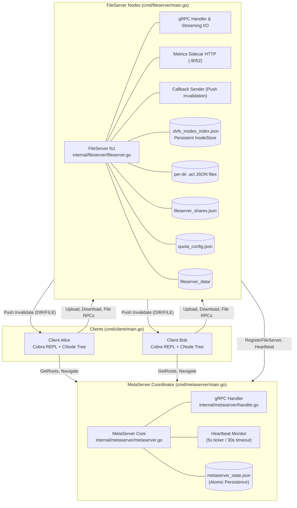
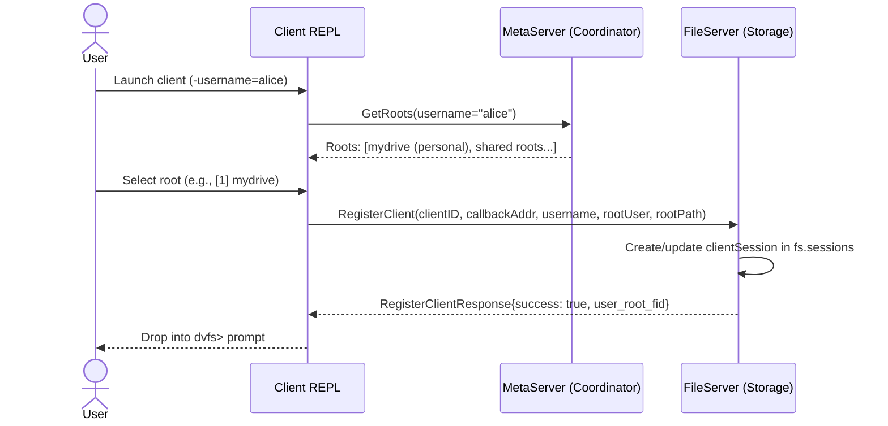
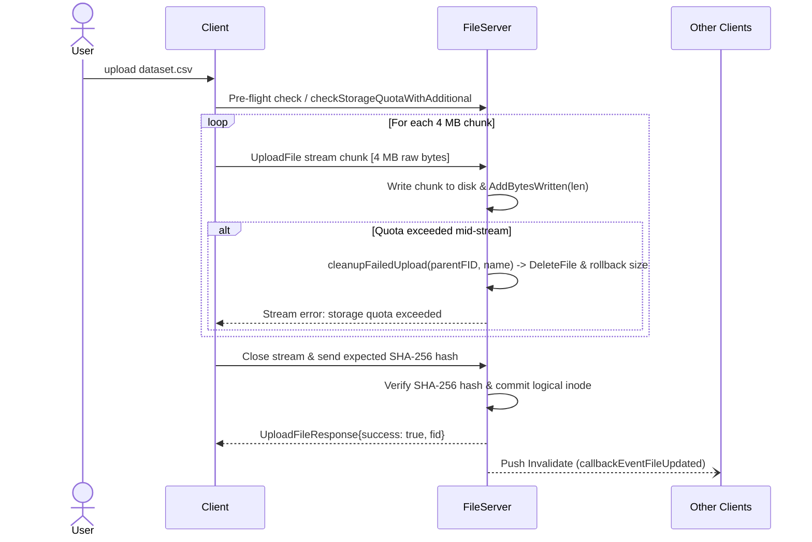
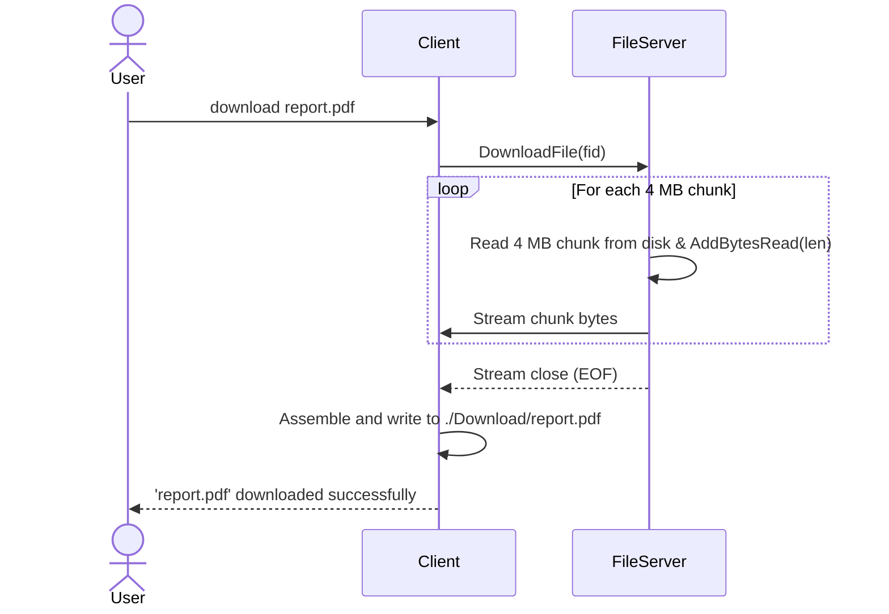
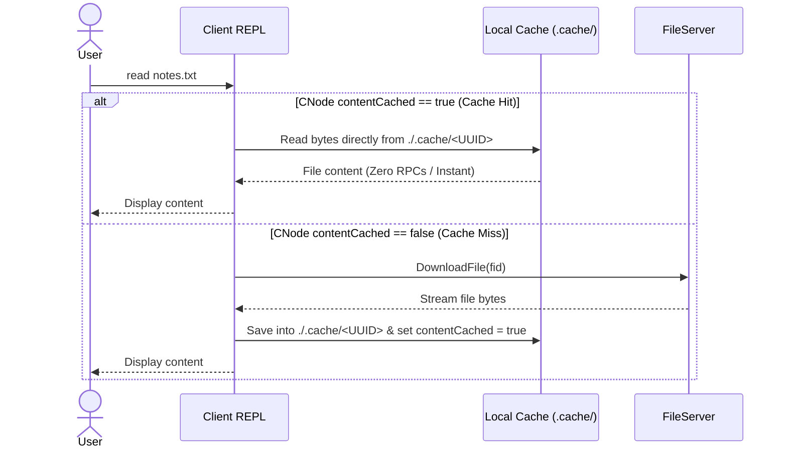
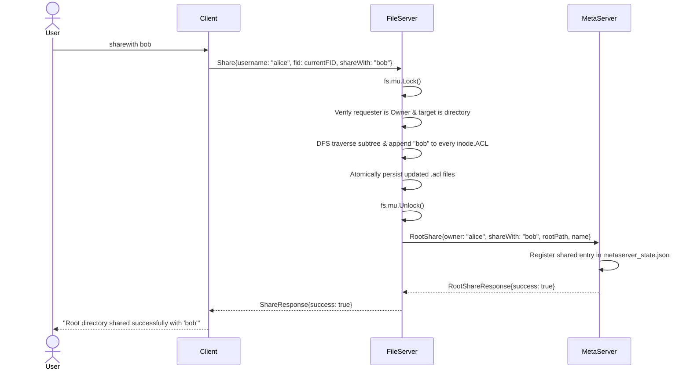
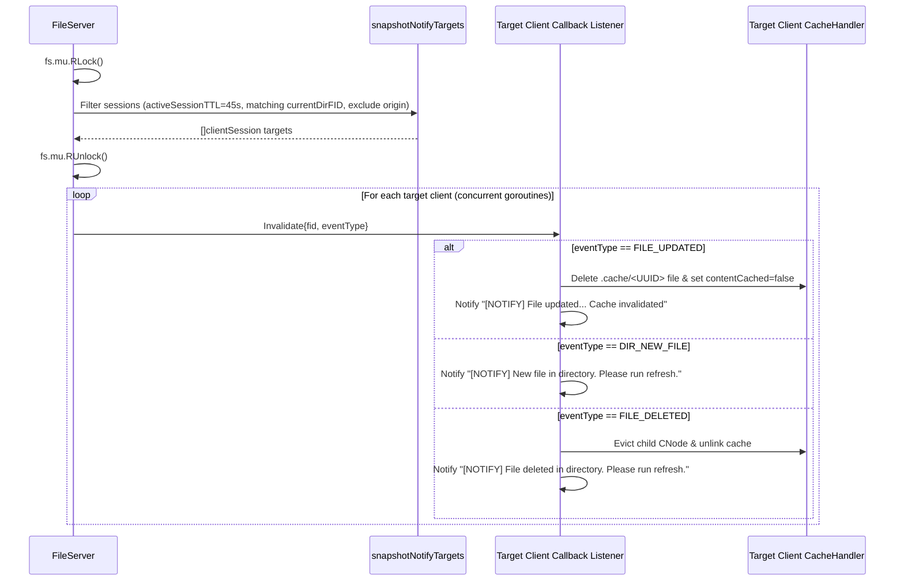

# System & Hosting Architecture

This document specifies the architecture of the Distributed Virtual File System (DVFS) across two foundational layers:
- **Level 1: System Architecture & Core Primitives** (Data structures, identity models, locking disciplines, and component responsibilities).
- **Level 2: Hosting Architecture & IITGN Workarounds** (Network isolation workarounds, captive portal automation, dynamic DHCP IP resolution via Tailscale and GitHub Gist, zero-trust TLS SNI decoupling, and 24/7 hardware persistence).

---

## Level 1: System Architecture & Core Primitives

### 1.1 Architectural Topology



### 1.2 Identity & Addressing

1. **Logical Inode vs. OS Inode**:
   A logical inode is an internal filesystem object managed by the FileServer. It maintains identity, permissions, and hierarchical relationships independently of the underlying operating system inode.
2. **File Identifier (FID)**:
   Every file and directory in DVFS has a globally unique FID formatted as:
   ```
   FID = "<FileServerID>_<InodeID>_<GenerationNumber>"
   Example: "fs1_42_1"
   ```
   - `FileServerID`: Identifies the authoritative owning server (e.g., `fs1`).
   - `InodeID`: Unique integer allocated by `atomic.AddUint64` on the storage node.
   - `GenerationNumber`: Monotonically incremented version reserved for reuse detection.

### 1.3 Core Data Structures

#### Logical Inode (Server-Side)
```go
type Inode struct {
    FID      *domain.FID      // Globally unique file identifier
    Type     domain.InodeType // InodeTypeFile (0) or InodeTypeDirectory (1)
    Name     string           // Basename of the file or directory
    OSPath   string           // Absolute path on the server physical filesystem
    ACL      domain.ACL       // Owner and shared user permissions
    Children []*domain.FID    // List of child FIDs (directories only)
    Size     uint64           // File size in bytes, or recursive subtree size
    Parent   *domain.Inode    // Parent pointer (root.Parent == root)
}
```

#### CNode (Client-Side Cache)
```go
type CNode struct {
    Name          string           // Basename
    Type          domain.InodeType // 0 = file, 1 = directory
    fid           *domain.FID      // Remote FID representation
    Size          uint64           // Cached file size in bytes
    children      map[string]*CNode// Child directory nodes
    contentCached bool             // True if file bytes exist locally
    contentUID    string           // UUID filename inside ./.cache/
    parent        *CNode           // Pointer to parent directory CNode
}
```

#### Access Control List (ACL)
```go
type ACL struct {
    Owner  string   // Username of creator
    Shared []string // Users granted read and write access
}
```

#### Shared Directory Entry (MetaServer Advisory Index)
```go
type SharedDirEntry struct {
    Owner       string // Username who owns the directory
    Path        string // Full relative path including owner namespace
    DisplayName string // Basename presented in the user's shared root
}
```

#### Client Session (FileServer Invalidation Registry)
```go
type clientSession struct {
    username            string    // Authenticated user
    callbackAddress     string    // Client gRPC callback host:port
    rootFID             string    // FID of active root directory
    currentDirFID       string    // FID of directory client is currently browsing
    lastSeenAt          time.Time // Timestamp of last client activity
    consecutiveFailures int       // Pruned after 3 callback delivery failures
}
```

### 1.4 Authority Separation & Consistency

| Responsibility | Authoritative Node | Advisory Node |
|---|---|---|
| **Raw File Data & Chunked Streams** | FileServer | None |
| **Logical Inodes & Parent/Child Graph** | FileServer | None |
| **ACL Permission Enforcement** | FileServer | None |
| **User Home Node Routing** | None | MetaServer |
| **Shared Directory Discovery** | None | MetaServer (`GetRoots`) |
| **Node Liveness & Heartbeats** | None | MetaServer |

- **Authoritative Enforcement**: When a client requests any file operation, the FileServer validates the requesting user against the target inode's ACL before executing physical disk I/O. The MetaServer never participates in access control.
- **Lock Discipline**: All FileServer operations lock `fs.mu` (`sync.RWMutex`). Any outgoing network RPCs (such as `RootShare` or `RootUnshare` to the MetaServer) are executed **strictly after unlocking** `fs.mu` to eliminate distributed deadlocks.
- **Atomic Persistence**: All disk state modifications (`metaserver_state.json`, `.acl`, `quota_config.json`, `fileserver_shares.json`, `command_history.json`, `admin_alerts.json`) write data to a temporary file (`.tmp`) followed by an atomic `os.Rename`. This prevents corruption in the event of an ungraceful shutdown.

### 1.5 Core Operation Workflows

#### Client Session Registration & Discovery


#### Chunked Streaming Upload (`UploadFile`)


#### Chunked Streaming Download (`DownloadFile`)


#### AFS Read Workflow (Cache Hit vs. Cache Miss)


#### Collaborative Sharing (`sharewith`)


#### Real-Time Push Invalidation


---

### 1.6 Key Architectural Design Decisions

The following table documents the core architectural trade-offs and rationale:

| Architectural Concern | Design Decision | Rationale |
|---|---|---|
| **FID Identity Model** | `serverID_inodeID_generationNumber` | Globally unique across cluster nodes. `inodeID` is allocated from persistent `next_inode_id` in `.dvfs_inodes_index.json`. |
| **In-Memory Inode Map** | All inodes held in `map[string]*Inode` | Reconstructed from disk on boot via `inodestore.go` and directory walk. Enables instantaneous path resolution and sub-millisecond lookups. |
| **ACL Granularity** | Per-directory `.acl` JSON files on disk | Balances disk overhead against permission agility. New child files deep-copy parent ACL at creation time. |
| **ACL Subtree Propagation** | DFS recursion on `Share` and `Unshare` | Guarantees recursive permissions across existing sub-directories while keeping runtime checks on individual reads lightweight. |
| **Concurrency & Synchronization** | Single `sync.RWMutex` on FileServer | Reads acquire `RLock`; mutations acquire `Lock`. Simple, dead-lock free synchronization across all in-memory graphs. |
| **Network Calls Outside Locks** | MetaServer RPCs called after `fs.mu` unlock | Prevents distributed deadlocks where a stalled MetaServer could block local FileServer mutexes. |
| **Streaming Transfers** | 4 MB gRPC chunk streams | Allows multi-gigabyte uploads and downloads without exhausting heap memory on resource-constrained nodes. |
| **64 MB gRPC Message Buffer** | `maxMsgSize = 64 * 1024 * 1024` on client & server | The gRPC default is 4 MB. Since DVFS uses 4 MB chunk streaming, protobuf framing, headers, and metadata push the serialized message slightly above 4 MB, causing `ResourceExhausted: received message larger than max (4194304)`. Raising buffer to 64 MB gives ample headroom for large chunked transfers with low memory pressure. |
| **Trash & Recycle Bin Model** | Soft delete via `os.Rename` into `.trash/` | Protects users against accidental deletions. `fs.trashMeta` in-memory table records original parent (falls back to user root if parent was deleted). |
| **Shared Directory Trash/Delete** | Owner can trash or delete shared directories | ACL state is cleaned under lock; MetaServer `RootUnshare` called after lock release so recipient menus update cleanly. |
| **Notification Targeting** | Filtered by `currentDirFID` and 45s activity TTL | Only clients actively browsing the affected directory receive callbacks, preventing broadcast noise across the cluster. |
| **Cache Invalidation Semantics** | Invalidate file content; require explicit directory refresh | Deletes local UUID cache files immediately. Directory listings are refreshed via `refresh` or re-entering the folder to avoid unexpected terminal prompt changes. |
| **Client Session Pruning** | Pruned after 3 consecutive callback failures | Automatically recovers resources and prevents lingering goroutines for ungracefully disconnected clients. |
| **Persistence Atomicity** | Write-to-temp (`.tmp`) followed by atomic `os.Rename` | Prevents corrupted, half-written JSON files if power is lost during disk writes. |
| **Zero-Trust TLS** | Mutual TLS 1.3 with offline Root CA ceremony | Node leaf certificates use DNS SANs (`dvfs1`..`dvfs9`) and dynamic SNI routing, decoupling encryption from dynamic DHCP IPs. |
| **Client Path Resolution** | Local CNode tree navigation for `pwd` and `cd` | Eliminates network round trips during routine directory navigation; server confirms directory validity on access. |
| **Storage Quota & Scrapping** | Dynamic per-user quotas with mid-stream scrapping | Pre-flight checks prevent over-quota creations. Mid-stream overflow automatically scraps partial bytes via `cleanupFailedUpload` and decrements directory size. |
| **Physical Host Disk Safety** | Enforced 20 GiB reserve floor (`DiskSafetyBuffer`) | Authoritatively blocks chunk writes if physical free space on host drops $\le 20\text{ GiB}$, preventing host OS lockups and journaling failure regardless of user logical quotas. |
| **Remote SSH Orchestration** | Key-based SSH dispatch with scoped sudoers | Admin Console dispatches remote lifecycle and maintenance commands (`systemctl`, `journalctl`, `reboot`) over SSH tunnels without requiring root passwords or cluster-wide daemon daemons. |
| **Shell Tab Completion** | CobraCompleter queries local CNode children | Provides instant, responsive shell tab completion without issuing network requests. |

---

## Level 2: Hosting Architecture & IITGN Workarounds

Operating a distributed cluster on a campus or residential network introduces real-world infrastructure challenges: dynamic DHCP IP renumbering, web captive portal authentication timeouts, and operating system sleep policies. DVFS incorporates dedicated architectural workarounds to guarantee 24/7 reliability.

```
+-----------------------------------------------------------------------------------+
|                           IITGN HOSTING INFRASTRUCTURE                            |
|                                                                                   |
|  [Campus Ethernet LAN]                                                            |
|  - Dynamic DHCP IPs (e.g. 10.7.52.85 -> 10.0.171.38 upon reboot)                 |
|  - 24-Hour Captive Portal Gateway (https://fwg.iitgn.ac.in)                       |
|                                                                                   |
|  +-----------------------------------------------------------------------------+  |
|  | WORKAROUND 1: CAPTIVE PORTAL AUTOMATION                                      |  |
|  | scripts/rp_115/connect.sh + fortinet.service + fortinet.timer               |  |
|  | - Parses portal redirect, extracts CSRF tokens (4Tredir, magic)             |  |
|  | - POSTs credentials headless on boot and every 60 minutes                   |  |
|  +-----------------------------------------------------------------------------+  |
|                                                                                   |
|  +-----------------------------------------------------------------------------+  |
|  | WORKAROUND 2: DYNAMIC DHCP IP RESOLUTION VIA GIST                           |  |
|  | scripts/rp_115/update_gist.py + dvfs-gist.timer (Hourly)                     |  |
|  | 1. Discovers active nodes via Tailscale API (tag:dvfsmachines)               |  |
|  | 2. SSHes over Tailscale overlay to query physical eth interface LAN IP      |  |
|  | 3. Patches public GitHub Gist (machines.json) with hostname -> LAN IP       |  |
|  +-----------------------------------------------------------------------------+  |
|                                       |                                           |
|                                       v                                           |
|  +-----------------------------------------------------------------------------+  |
|  | WORKAROUND 3: ZERO-TRUST TLS DECOUPLED FROM DHCP IPS                         |  |
|  | - Node certificates minted with DNS SANs (dvfs1 through dvfs9)               |  |
|  | - Client fetches LAN IP from Gist, dials IP, passes hostname in TLS SNI     |  |
|  | - Complete TLS 1.3 verification succeeds across dynamic IP reassignments   |  |
|  +-----------------------------------------------------------------------------+  |
|                                                                                   |
|  +-----------------------------------------------------------------------------+  |
|  | WORKAROUND 4: HARDWARE SLEEP MASKING                                        |  |
|  | scripts/rp_115/persist.sh                                                   |  |
|  | - Masks sleep.target, suspend.target, hibernate.target, hybrid-sleep.target  |  |
|  +-----------------------------------------------------------------------------+  |
|                                                                                   |
|  +-----------------------------------------------------------------------------+  |
|  | WORKAROUND 5: SCOPED SUDOERS ORCHESTRATION                                  |  |
|  | /etc/sudoers.d/dvfs                                                          |  |
|  | - Grants passwordless execution to systemctl, journalctl, reboot, apt      |  |
|  +-----------------------------------------------------------------------------+  |
+-----------------------------------------------------------------------------------+
```

### 2.1 Workaround 1: Automated 24h Captive Portal Re-Authentication

#### The Challenge
The IIT Gandhinagar campus network utilizes a Fortinet firewall gateway (`https://fwg.iitgn.ac.in`). Every connected device is disconnected every 24 hours, requiring interactive web-form authentication. Without intervention, headless cluster nodes lose internet connectivity daily, blocking GitHub Gist updates and external administration.

#### The Solution
1. `scripts/rp_115/connect.sh` automates the portal handshake:
   - Queries `http://example.com` to trigger and capture the HTTP redirect URL.
   - Extracts CSRF tokens and internal session state (`4Tredir` and `magic` variables).
   - Submits credentials headless via an HTTPS POST to `https://fwg.iitgn.ac.in/`.
2. `scripts/rp_115/fortinet.service` and `scripts/rp_115/fortinet.timer` schedule this script:
   - Fires 3 minutes after system boot (`OnBootSec=3min`).
   - Re-authenticates every 60 minutes (`OnUnitInactiveSec=60min`) with jitter (`RandomizedDelaySec=30s`).
   - Automatically runs as the primary user (UID 1000) using system credential isolation.

### 2.2 Workaround 2: Dynamic DHCP IP Resolution via Tailscale and GitHub Gist

#### The Challenge
Nodes on the campus network obtain dynamic IP addresses via DHCP. Static IP reservations are unavailable. If a node restarts and receives a new IP (e.g., changing from `10.7.52.85` to `10.0.171.38`), hardcoded connection strings cause clients and the MetaServer to fail.

#### The Solution
DVFS employs a dual-network discovery topology:
1. **Control Overlay (Tailscale)**: All cluster nodes run Tailscale and are assigned the tag `tag:dvfsmachines`. Each machine has a static Tailscale overlay IP (`100.x.y.z`).
2. **Data Network (Physical Ethernet)**: High-throughput file transfers must run over the high-speed campus Ethernet LAN (`eno*|enp*|eth*`), not through the slower Tailscale tunnel.
3. **Hourly Reconciliation Daemon (`scripts/rp_115/update_gist.py`)**:
   - Authenticates with Tailscale's OAuth API to list active nodes matching `dvfs(\d+)`.
   - Connects to each node over its Tailscale overlay IP via SSH (`BatchMode=yes`, 5s timeout).
   - Queries the physical interface IP directly on the node.
   - Updates a GitHub Gist containing `machines.json`:
     ```json
     [
         {
             "username": "dvfs1",
             "mac": "d8:3a:dd:xx:xx:xx",
             "ip": "10.7.52.85",
             "last_seen": "2026-09-07T12:00:00Z"
         },
         {
             "username": "dvfs2",
             "mac": "d8:3a:dd:yy:yy:yy",
             "ip": "10.7.52.86",
             "last_seen": "2026-09-07T12:00:00Z"
         }
     ]
     ```
4. **Client Bootstrap**: When the DVFS client starts, it fetches `machines.json` from the Gist, resolving the active LAN IP for `dvfs1` (MetaServer) and all storage nodes without requiring hardcoded IP flags.

### 2.3 Workaround 3: Zero-Trust TLS Decoupled from DHCP IPs via DNS SANs

#### The Challenge
Standard TLS certificates validate the connection target against the certificate's Subject Alternative Names (SANs). If IP addresses are baked into SANs, any DHCP lease change invalidates the certificate, causing clients to reject the connection with `x509: certificate is valid for 10.7.52.85, not 10.0.171.38`.

#### The Solution
1. `scripts/gen-certs/cmd/gen_node_certs/` mints certificates with **DNS hostnames**, not IP addresses:
   - `dvfs1` cert has DNS SANs: `dvfs1`, `dvfs1.local`, `localhost`.
   - `dvfs2` cert has DNS SANs: `dvfs2`, `dvfs2.local`, `localhost`.
2. When the client dials a server:
   - It queries the dynamic LAN IP from the Gist (e.g. `10.7.52.86:50052`).
   - It configures gRPC transport credentials with `ServerName: "dvfs2"`.
3. The TLS 1.3 handshake validates that the certificate is signed by the embedded Root CA and matches the SNI hostname (`dvfs2`). Handshakes succeed regardless of DHCP IP reassignments.

### 2.4 Workaround 4: 24/7 Hardware Persistence (`persist.sh`)

#### The Challenge
Ubuntu desktop and server installations default to aggressive power-saving configurations, putting idle nodes into sleep, suspend, or hybrid-sleep states after periods of inactivity.

#### The Solution
`scripts/rp_115/persist.sh` runs during base node setup:
```bash
sudo systemctl enable --now ssh
sudo systemctl mask sleep.target suspend.target hibernate.target hybrid-sleep.target
```
Masking these systemd targets prevents the Linux kernel and power management daemons from sleeping, ensuring fileservers remain continuously reachable.

### 2.5 Workaround 5: Scoped Sudoers Delegation (`/etc/sudoers.d/dvfs`)

#### The Challenge
The Admin Console provides remote cluster management over SSH (restarting fileserver daemons, streaming live systemd logs, updating packages via `apt`, and rebooting nodes). Running these operations traditionally requires interactive `sudo` passwords, which breaks automated web console control.

#### The Solution
During node setup, a restricted sudoers drop-in file is installed at `/etc/sudoers.d/dvfs`:
```text
$SUDO_USER ALL=(ALL) NOPASSWD: /usr/bin/systemctl restart dvfs-*, /usr/bin/systemctl status dvfs-*, /usr/bin/journalctl, /sbin/reboot, /usr/sbin/reboot, /usr/bin/systemctl reboot, /sbin/shutdown, /usr/bin/apt, /usr/bin/apt-get
```
This enables the Admin Console's background SSH executor (`internal/admin/ssh_executor.go`) to execute required maintenance tasks without interactive password prompts while strictly forbidding unrestricted root shell access.
