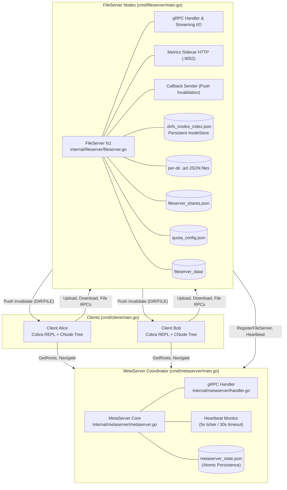
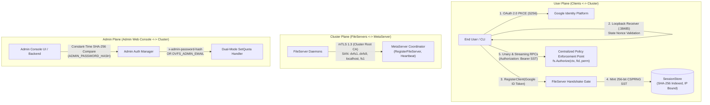
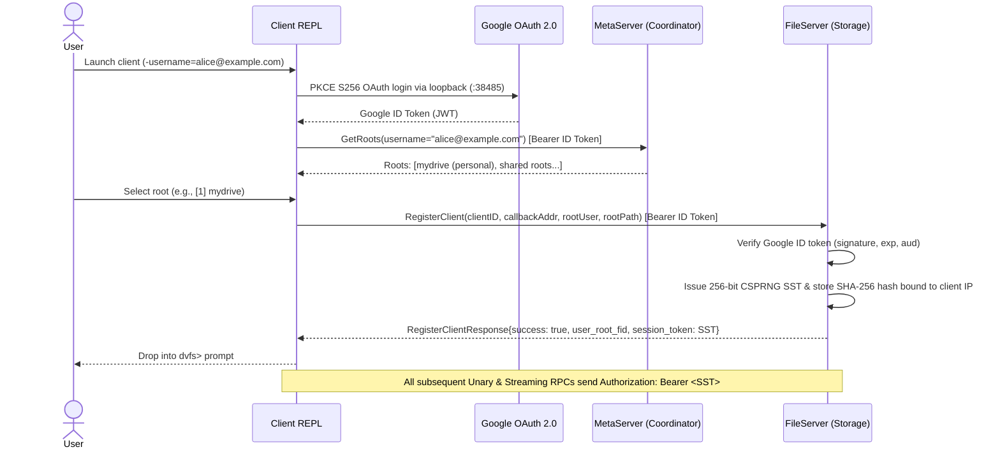
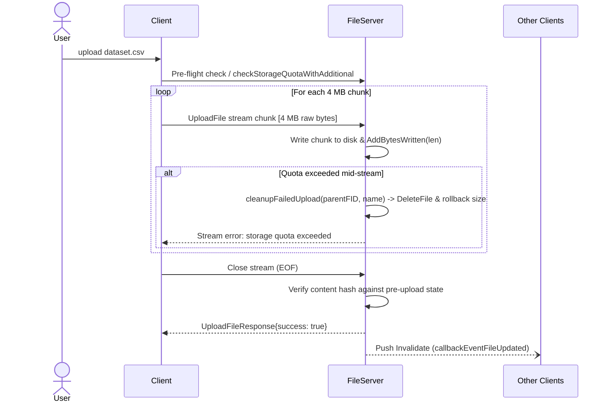
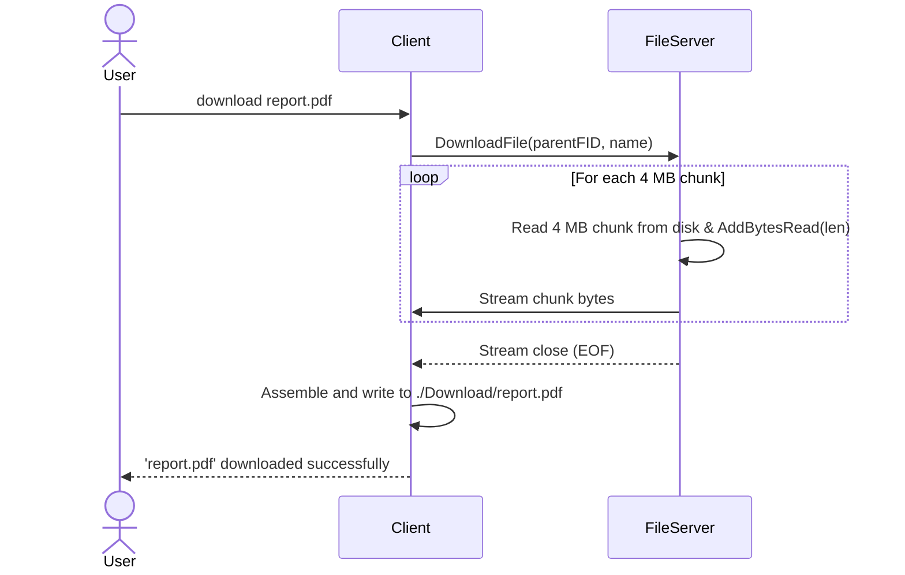
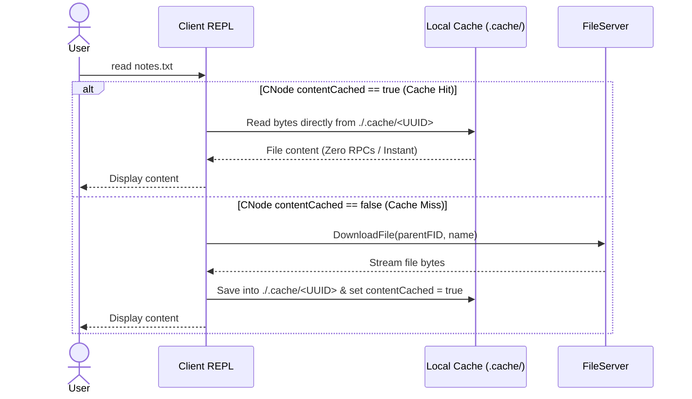
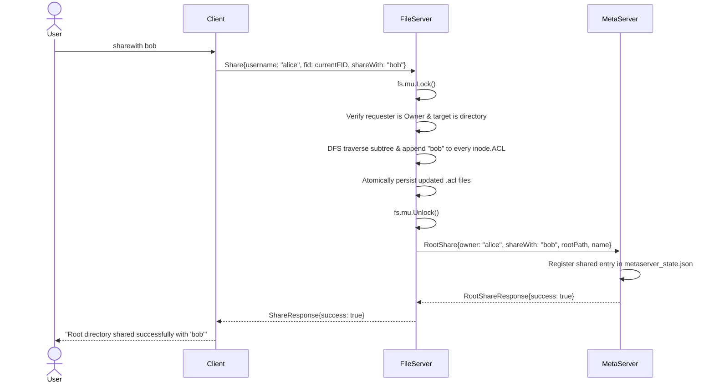

# System & Hosting Architecture

This document specifies the architecture of the Distributed Virtual File System (DVFS) across two foundational layers:
- **Level 1: System Architecture & Core Primitives** (Data structures, identity models, locking disciplines, and component responsibilities).
- **Level 2: Hosting Architecture & IITGN Workarounds** (Network isolation workarounds, captive portal automation, dynamic DHCP IP resolution via Tailscale and GitHub Gist, zero-trust TLS SNI decoupling, and 24/7 hardware persistence).

## System Diagrams Reference

For a comprehensive graphical view of the full system topology, data flows, and component interactions, see the [Master System Architecture Overview](diagrams/overview.md).

---

## Level 1: System Architecture & Core Primitives

### 1.1 Architectural Topology



### 1.2 Identity & Addressing

1. **Logical Inode vs. OS Inode**:
   A logical inode is an internal filesystem object managed by the FileServer. It maintains identity, permissions, and hierarchical relationships independently of the underlying operating system inode.
2. **File Identifier (FID)**:
   Every file and directory in DVFS has a globally unique FID formatted as:
   ```
   FID = "<FileServerID>_<InodeID>_<GenerationNumber>"
   Example: "fs1_42_1"
   ```
   - `FileServerID`: Identifies the authoritative owning server (e.g., `fs1`).
   - `InodeID`: Unique integer allocated by `atomic.AddUint64` on the storage node.
   - `GenerationNumber`: Monotonically incremented version reserved for reuse detection.

### 1.3 Core Data Structures

#### Logical Inode (Server-Side)
```go
type Inode struct {
    FID      *domain.FID      // Globally unique file identifier
    Type     domain.InodeType // InodeTypeFile (0) or InodeTypeDirectory (1)
    Name     string           // Basename of the file or directory
    OSPath   string           // Absolute path on the server physical filesystem
    ACL      domain.ACL       // Owner and shared user permissions
    Children []*domain.FID    // List of child FIDs (directories only)
    Size     uint64           // File size in bytes, or recursive subtree size
    Parent   *domain.Inode    // Parent pointer (root.Parent == root)
}
```

#### CNode (Client-Side Cache)
```go
type CNode struct {
    Name          string           // Basename
    Type          domain.InodeType // 0 = file, 1 = directory
    fid           *domain.FID      // Remote FID representation
    Size          uint64           // Cached file size in bytes
    children      map[string]*CNode// Child directory nodes
    contentCached bool             // True if file bytes exist locally
    contentUID    string           // UUID filename inside ./.cache/
    parent        *CNode           // Pointer to parent directory CNode
}
```

#### Access Control List (ACL)
```go
type ACL struct {
    Owner  string   // Username of creator
    Shared []string // Users granted read and write access
}
```

#### Shared Directory Entry (MetaServer Advisory Index)
```go
type SharedDirEntry struct {
    Owner       string // Username who owns the directory
    Path        string // Full relative path including owner namespace
    DisplayName string // Basename presented in the user's shared root
}
```

#### Client Session (FileServer Invalidation Registry)
```go
type clientSession struct {
    username            string    // Authenticated user
    callbackAddress     string    // Client gRPC callback host:port
    rootFID             string    // FID of active root directory
    currentDirFID       string    // FID of directory client is currently browsing
    lastSeenAt          time.Time // Timestamp of last client activity
    consecutiveFailures int       // Pruned after 3 callback delivery failures
}
```

#### Server Session & Session Store (High-Performance Auth)
```go
type Session struct {
    TokenHash   string    // SHA-256 hash of the raw Server Session Token (SST)
    Email       string    // Verified Google email of authenticated user
    ClientID    string    // Unique client identifier
    PeerIP      string    // Transport-bound client network IP address
    CreatedAt   time.Time // Session creation timestamp
    LastSeenAt  time.Time // Sliding inactivity timestamp (15-minute idle TTL)
    AbsoluteExp time.Time // Absolute expiration ceiling (12-hour session lifetime)
}
```

#### Authorization Permission (Centralized PEP)
```go
type Permission int

const (
    PermRead   Permission = iota // Read files, download, list directory, get attributes
    PermWrite                    // Create files/dirs, upload chunks, write bytes, share
    PermDelete                   // Delete files/dirs, move to trash, restore from trash
    PermAdmin                    // Quota modifications, root management
)
```

### 1.4 User Authentication & Session Security Model

DVFS implements a defense-in-depth, three-tier security model that separates user operations, cluster-internal orchestration, and administrative controls:



#### 1. User Plane Security
- **Native Desktop OAuth 2.0 with PKCE (RFC 7636)**: Clients perform Google OAuth 2.0 using the Authorization Code Flow with Proof Key for Code Exchange (PKCE S256). A cryptographically secure random `code_verifier` and SHA-256 `code_challenge` prevent authorization code interception.
- **Local Loopback Receiver**: An ephemeral HTTP listener on `http://127.0.0.1:38485/logincallback` receives the redirect. A cryptographically generated `state` parameter prevents CSRF attacks. Headless and SSH sessions feature an interactive console fallback.
- **Single-Gate Session Handshake**: Rather than validating bulky Google ID tokens on every high-throughput file RPC, clients present the Google ID token once during `RegisterClient`. The FileServer validates token signatures, expiration (`exp`), and audience (`aud`).
- **Server Session Tokens (SST)**: Upon successful handshake, the FileServer issues a 256-bit cryptographically secure random token (`sst_<43-character-base64url>`). The raw token is delivered to the client and never logged. The FileServer stores only its SHA-256 hash in a dedicated, thread-safe `SessionStore`.
- **Network & IP Binding**: Every session binds to the caller's peer network address (`ctx.PeerIP`). Any SST replay attempt from a different IP address is immediately rejected with `codes.PermissionDenied`.
- **Dual-Timeout Session Lifecycle**: Sessions enforce a 15-minute sliding inactivity timeout (`Touch()` updated on every valid RPC) bounded by an absolute 12-hour maximum lifetime ceiling. A background sweeper routine cleans expired sessions every 60 seconds.
- **Centralized Policy Enforcement Point (PEP)**: Insecure Direct Object References (IDOR) are eliminated across all file and directory handlers (`ReadFile`, `WriteFile`, `UploadFile`, `DownloadFile`, `DeleteFile`, `TrashFile`, `RestoreFile`, `ShowTrash`, `ListDir`, `GetAttr`, `ChangeDir`, `Share`, `Unshare`) via `fs.Authorize(ctx, fid, perm)`. The server extracts caller identity strictly from validated session context, completely disregarding client-supplied username fields.

#### 2. Cluster Plane Security
- Cluster daemon RPCs (`RegisterFileServer`, `Heartbeat`) require Mutual TLS 1.3.
- The MetaServer verifies the client certificate presented by the FileServer against the cluster Root CA and validates DNS SANs (`dvfs1` through `dvfs9`, `localhost`, `fs1`, `mds`).
- When `DVFS_AUTH_MOCK=false`, missing or unverified peer certificates cause immediate termination with `codes.Unauthenticated`.

#### 3. Admin Plane Security
- The Admin Web Console authenticates operators via `ADMIN_PASSWORD_HASH` stored in `.env`.
- **Dual-Mode `SetQuota` Enforcement**: Modifying user storage quotas requires administrative privileges:
  1. A Google-authenticated session matching `DVFS_ADMIN_EMAIL`, **OR**
  2. A gRPC request carrying the `x-admin-password-hash` metadata header injected by the Admin Web Console backend (`internal/admin/grpc_client.go:CallSetQuota`).
- Standard non-admin Google sessions cannot self-escalate or modify user quotas.

---

### 1.5 Authority Separation & Consistency

| Responsibility | Authoritative Node | Advisory Node |
|---|---|---|
| **Raw File Data & Chunked Streams** | FileServer | None |
| **Logical Inodes & Parent/Child Graph** | FileServer | None |
| **ACL Permission Enforcement** | FileServer | None |
| **User Home Node Routing** | None | MetaServer |
| **Shared Directory Discovery** | None | MetaServer (`GetRoots`) |
| **Node Liveness & Heartbeats** | None | MetaServer |

- **Authoritative Enforcement**: When a client requests any file operation, the FileServer validates the requesting user against the target inode's ACL before executing physical disk I/O. The MetaServer never participates in access control.
- **Lock Discipline**: All FileServer operations lock `fs.mu` (`sync.RWMutex`). Any outgoing network RPCs (such as `RootShare` or `RootUnshare` to the MetaServer) are executed **strictly after unlocking** `fs.mu` to eliminate distributed deadlocks.
- **Atomic Persistence**: All disk state modifications (`metaserver_state.json`, `.acl`, `quota_config.json`, `fileserver_shares.json`, `command_history.json`, `admin_alerts.json`) write data to a temporary file (`.tmp`) followed by an atomic `os.Rename`. This prevents corruption in the event of an ungraceful shutdown.

### 1.6 Core Operation Workflows

#### Client Authentication, Session Registration & Discovery


#### Chunked Streaming Upload (`UploadFile`)


#### Chunked Streaming Download (`DownloadFile`)


#### AFS Read Workflow (Cache Hit vs. Cache Miss)


#### Collaborative Sharing (`sharewith`)


#### Real-Time Push Invalidation


---

### 1.7 Key Architectural Design Decisions

The following table documents the core architectural trade-offs and rationale:

| Architectural Concern | Design Decision | Rationale |
|---|---|---|
| **FID Identity Model** | `serverID_inodeID_generationNumber` | Globally unique across cluster nodes. `inodeID` is allocated from persistent `next_inode_id` in `.dvfs_inodes_index.json`. |
| **In-Memory Inode Map** | All inodes held in `map[string]*Inode` | Reconstructed from disk on boot via `inodestore.go` and directory walk. Enables instantaneous path resolution and sub-millisecond lookups. |
| **ACL Granularity** | Per-directory `.acl` JSON files on disk | Balances disk overhead against permission agility. New child files deep-copy parent ACL at creation time. |
| **ACL Subtree Propagation** | DFS recursion on `Share` and `Unshare` | Guarantees recursive permissions across existing sub-directories while keeping runtime checks on individual reads lightweight. |
| **Concurrency & Synchronization** | Single `sync.RWMutex` on FileServer | Reads acquire `RLock`; mutations acquire `Lock`. Simple, dead-lock free synchronization across all in-memory graphs. |
| **Network Calls Outside Locks** | MetaServer RPCs called after `fs.mu` unlock | Prevents distributed deadlocks where a stalled MetaServer could block local FileServer mutexes. |
| **Streaming Transfers** | 4 MB gRPC chunk streams | Allows multi-gigabyte uploads and downloads without exhausting heap memory on resource-constrained nodes. |
| **64 MB gRPC Message Buffer** | `maxMsgSize = 64 * 1024 * 1024` on client & server | The gRPC default is 4 MB. Since DVFS uses 4 MB chunk streaming, protobuf framing, headers, and metadata push the serialized message slightly above 4 MB, causing `ResourceExhausted: received message larger than max (4194304)`. Raising buffer to 64 MB gives ample headroom for large chunked transfers with low memory pressure. |
| **Server Session Tokens (SST)** | 256-bit CSPRNG token issued at `RegisterClient` | Google ID tokens are verified once at handshake. The FileServer stores only the SHA-256 hash in a thread-safe `SessionStore`, allowing sub-millisecond validation without external HTTP latency. |
| **Transport IP Binding** | Peer IP address verified against session record | `ValidateSession` enforces `ctx.PeerIP == session.PeerIP`, preventing token replay attacks across differing client networks. |
| **Dual-Timeout Session Lifecycle** | 15-minute sliding TTL + absolute 12-hour ceiling | Inactive sessions expire after 15 minutes (`Touch()` on active RPCs). Sessions enforce a strict 12-hour absolute ceiling from initial registration. Sweeper runs every 60 seconds. |
| **Centralized Policy Enforcement (PEP)** | `fs.Authorize(ctx, fid, perm)` on all file handlers | Authoritatively verifies caller ownership or ACL entry for `PermRead`, `PermWrite`, or `PermDelete`. Completely purges reliance on untrusted client-supplied usernames. |
| **Dual-Mode Quota Authorization** | `DVFS_ADMIN_EMAIL` or `ADMIN_PASSWORD_HASH` | Allows quota modifications from both interactive CLI sessions matching the admin email and the Admin Web Console backend (`x-admin-password-hash`). Regular users cannot self-escalate. |
| **Cluster Plane mTLS** | X.509 client cert verification on daemon RPCs | MetaServer validates client certificate SANs (`dvfs1`..`dvfs9`, `localhost`) for `RegisterFileServer` and `Heartbeat`. Fails closed if certificates are missing and `DVFS_AUTH_MOCK=false`. |
| **Trash & Recycle Bin Model** | Soft delete via `os.Rename` into `.trash/` | Protects users against accidental deletions. `fs.trashMeta` in-memory table records original parent (falls back to user root if parent was deleted). |
| **Shared Directory Trash/Delete** | Owner can trash or delete shared directories | ACL state is cleaned under lock; MetaServer `RootUnshare` called after lock release so recipient menus update cleanly. |
| **Notification Targeting** | Filtered by `currentDirFID` and 45s activity TTL | Only clients actively browsing the affected directory receive callbacks, preventing broadcast noise across the cluster. |
| **Cache Invalidation Semantics** | Invalidate file content; require explicit directory refresh | Deletes local UUID cache files immediately. Directory listings are refreshed via `refresh` or re-entering the folder to avoid unexpected terminal prompt changes. |
| **Client Session Pruning** | Pruned after 3 consecutive callback failures | Automatically recovers resources and prevents lingering goroutines for ungracefully disconnected clients. |
| **Persistence Atomicity** | Write-to-temp (`.tmp`) followed by atomic `os.Rename` | Prevents corrupted, half-written JSON files if power is lost during disk writes. |
| **Zero-Trust TLS** | Mutual TLS 1.3 with offline Root CA ceremony | Node leaf certificates use DNS SANs (`dvfs1`..`dvfs9`) and dynamic SNI routing, decoupling encryption from dynamic DHCP IPs. |
| **Client Path Resolution** | Local CNode tree navigation for `pwd` and `cd` | Eliminates network round trips during routine directory navigation; server confirms directory validity on access. |
| **Storage Quota & Scrapping** | Dynamic per-user quotas with mid-stream scrapping | Pre-flight checks prevent over-quota creations. Mid-stream overflow automatically scraps partial bytes via `cleanupFailedUpload` and decrements directory size. |
| **Physical Host Disk Safety** | Enforced 20 GiB reserve floor (`DiskSafetyBuffer`) | Authoritatively blocks chunk writes if physical free space on host drops $\le 20\text{ GiB}$, preventing host OS lockups and journaling failure regardless of user logical quotas. |
| **Remote SSH Orchestration** | Key-based SSH dispatch with scoped sudoers | Admin Console dispatches remote lifecycle and maintenance commands (`systemctl`, `journalctl`, `reboot`) over SSH tunnels without requiring root passwords or cluster-wide daemon daemons. |
| **Shell Tab Completion** | CobraCompleter queries local CNode children | Provides instant, responsive shell tab completion without issuing network requests. |
| **Client Callback Port** | Ephemeral `0.0.0.0:0` port allocation | Automatically acquires an available port dynamically, removing the need for manual port/firewall configuration for every client instance. |

## Diagrams
For a deeper visual dive into the FileServer components, workflows, and state transitions, see the [FileServer Storage Engine Architecture](./diagrams/fileserver_engine.md) document.

### 1.8 Protobuf Service & RPC Inventory

DVFS defines three Protocol Buffer service interfaces in `api/`: `FileServer` (`api/fileserver/fileserver.proto`), `MetaServer` (`api/metaserver/metaserver.proto`), and `ClientCallback` (`api/callback/callback.proto`).

#### FileServer Service (`api/fileserver/fileserver.proto`)

> **Note on Authentication:** `RegisterClient` requires a valid Google ID token (or mock token in mock mode) and returns an SST in `RegisterClientResponse.session_token`. All subsequent RPCs require `Authorization: Bearer <SST>`, enforce peer IP binding, and pass through `fs.Authorize(ctx, fid, perm)`.

| RPC Method | Pattern | Request Type | Response Type | Description |
|---|---|---|---|---|
| `RegisterClient` | Unary | `RegisterClientRequest` | `RegisterClientResponse` | Authenticates client via Google ID token, returns root FID, registers callback address, and issues a 256-bit Server Session Token (SST). |
| `UnregisterClient` | Unary | `UnregisterClientRequest` | `UnregisterClientResponse` | Gracefully terminates client session, revokes SST from `SessionStore`, and unregisters callback listener. |
| `CreateFile` | Unary | `CreateFileRequest` | `CreateFileResponse` | Allocates new logical inode (file or directory) with quota pre-flight check. |
| `OpenFile` | Unary | `OpenFileRequest` | `OpenFileResponse` | Validates client access and returns current file size and version for cache checking. |
| `ReadFile` | Unary | `ReadFileRequest` | `ReadFileResponse` | Direct offset/length byte slice read (fallback/direct I/O). Protected by PEP `PermRead`. |
| `WriteFile` | Unary | `WriteFileRequest` | `WriteFileResponse` | Direct offset byte slice write with version increment. Protected by PEP `PermWrite`. |
| `CloseFile` | Unary | `CloseFileRequest` | `CloseFileResponse` | Closes active file descriptor reference on server. |
| `DeleteFile` | Unary | `DeleteFileRequest` | `DeleteFileResponse` | Permanently removes file or directory. Protected by PEP `PermDelete`. |
| `TrashFile` | Unary | `TrashFileRequest` | `TrashFileResponse` | Soft deletes file/directory into `.trash/` with collision suffixing. Protected by PEP `PermDelete`. |
| `RestoreFile` | Unary | `RestoreFileRequest` | `RestoreFileResponse` | Restores trashed item back to original parent directory. Protected by PEP `PermDelete`. |
| `ShowTrash` | Unary | `ShowTrashRequest` | `ShowTrashResponse` | Returns directory entries currently stored in user trash container. Protected by PEP `PermRead`. |
| `GetAttr` | Unary | `GetAttrRequest` | `GetAttrResponse` | Queries inode attributes (name, type, size, version). Protected by PEP `PermRead`. |
| `ListDir` | Unary | `ListDirRequest` | `ListDirResponse` | Returns listing of child directory entries (DirEntry slice). Protected by PEP `PermRead`. |
| `Lookup` | Unary | `LookupRequest` | `LookupResponse` | Resolves child entry name within parent FID to target FID. |
| `Path` | Unary | `PathRequest` | `PathResponse` | Reconstructs relative path string for display prompt. |
| `ChangeDir` | Unary | `ChangeDirRequest` | `ChangeDirResponse` | Validates target navigation directory and returns new active FID. Protected by PEP `PermRead`. |
| `UploadFile` | Client Streaming | `stream UploadFileRequest` | `UploadFileResponse` | Streams 4 MB chunks to disk; verifies pre/post hashes; scraps partial writes on quota failure. Protected by PEP `PermWrite`. |
| `DownloadFile` | Server Streaming | `DownloadFileRequest` | `stream DownloadFileResponse` | Streams 4 MB chunks to client for whole-file local caching. Protected by PEP `PermRead`. |
| `Share` | Unary | `ShareRequest` | `ShareResponse` | DFS propagates read/write access across directory subtree and persists `.acl` files. Protected by PEP `PermWrite` (owner only). |
| `Unshare` | Unary | `UnshareRequest` | `UnshareResponse` | Revokes shared access across directory subtree. Protected by PEP `PermWrite` (owner only). |
| `SetQuota` | Unary | `SetQuotaRequest` | `SetQuotaResponse` | Sets user storage limit in bytes (dynamically saved to `quota_config.json`). Requires `DVFS_ADMIN_EMAIL` or `x-admin-password-hash`. |

#### MetaServer Service (`api/metaserver/metaserver.proto`)

> **Note on Authentication:** Daemon control RPCs (`RegisterFileServer`, `Heartbeat`) verify mutual TLS (mTLS) client certificates. User navigation RPCs (`GetRoots`, `Navigate`) require Google ID token authentication when Google Auth is enabled.

| RPC Method | Pattern | Request Type | Response Type | Description |
|---|---|---|---|---|
| `RegisterFileServer` | Unary | `RegisterFileServerRequest` | `RegisterFileServerResponse` | Registers storage node address, managed users, and shared directories. Protected by mTLS cert verification. |
| `Navigate` | Unary | `NavigateRequest` | `NavigateResponse` | Resolves which FileServer node hosts a given root user. Protected by Google user token. |
| `Heartbeat` | Unary | `HeartbeatRequest` | `HeartbeatResponse` | Periodic ping from storage node to refresh liveness timestamp. Protected by mTLS cert verification. |
| `GetRoots` | Unary | `GetRootsRequest` | `GetRootsResponse` | Returns list of accessible personal and shared roots for interactive client menu. Protected by Google user token. |
| `RootShare` | Unary | `RootShareRequest` | `RootShareResponse` | Indexes a shared directory mapping in `metaserver_state.json`. Protected by mTLS cert verification. |
| `RootUnshare` | Unary | `RootUnshareRequest` | `RootUnshareResponse` | Removes an indexed shared directory mapping. Protected by mTLS cert verification. |

#### ClientCallback Service (`api/callback/callback.proto`)

| RPC Method | Pattern | Request Type | Response Type | Description |
|---|---|---|---|---|
| `Invalidate` | Unary | `InvalidateRequest` | `InvalidateResponse` | Pushes cache invalidation event from FileServer to client. The `new_version` field carries the event type (1 = `FILE_UPDATED`, 2 = `DIR_NEW_FILE`, 3 = `FILE_DELETED`). |

---

## Level 2: Hosting Architecture & IITGN Workarounds

Operating a distributed cluster on a campus or residential network introduces real-world infrastructure challenges: dynamic DHCP IP renumbering, web captive portal authentication timeouts, and operating system sleep policies. DVFS incorporates dedicated architectural workarounds to guarantee 24/7 reliability.

```
+-----------------------------------------------------------------------------------+
|                           IITGN HOSTING INFRASTRUCTURE                            |
|                                                                                   |
|  [Campus Ethernet LAN]                                                            |
|  - Dynamic DHCP IPs (e.g. 10.7.52.85 -> 10.0.171.38 upon reboot)                 |
|  - 24-Hour Captive Portal Gateway (https://fwg.iitgn.ac.in)                       |
|                                                                                   |
|  +-----------------------------------------------------------------------------+  |
|  | WORKAROUND 1: CAPTIVE PORTAL AUTOMATION                                      |  |
|  | scripts/rp_115/connect.sh + fortinet.service + fortinet.timer               |  |
|  | - Parses portal redirect, extracts CSRF tokens (4Tredir, magic)             |  |
|  | - POSTs credentials headless on boot and every 60 minutes                   |  |
|  +-----------------------------------------------------------------------------+  |
|                                                                                   |
|  +-----------------------------------------------------------------------------+  |
|  | WORKAROUND 2: DYNAMIC DHCP IP RESOLUTION VIA GIST                           |  |
|  | scripts/rp_115/update_gist.py + dvfs-gist.timer (Hourly)                     |  |
|  | 1. Discovers active nodes via Tailscale API (tag:dvfsmachines)               |  |
|  | 2. SSHes over Tailscale overlay to query physical eth interface LAN IP      |  |
|  | 3. Patches public GitHub Gist (machines.json) with hostname -> LAN IP       |  |
|  +-----------------------------------------------------------------------------+  |
|                                       |                                           |
|                                       v                                           |
|  +-----------------------------------------------------------------------------+  |
|  | WORKAROUND 3: ZERO-TRUST TLS DECOUPLED FROM DHCP IPS                         |  |
|  | - Node certificates minted with DNS SANs (dvfs1 through dvfs9)               |  |
|  | - Client fetches LAN IP from Gist, dials IP, passes hostname in TLS SNI     |  |
|  | - Complete TLS 1.3 verification succeeds across dynamic IP reassignments   |  |
|  +-----------------------------------------------------------------------------+  |
|                                                                                   |
|  +-----------------------------------------------------------------------------+  |
|  | WORKAROUND 4: HARDWARE SLEEP MASKING                                        |  |
|  | scripts/rp_115/persist.sh                                                   |  |
|  | - Masks sleep.target, suspend.target, hibernate.target, hybrid-sleep.target  |  |
|  +-----------------------------------------------------------------------------+  |
|                                                                                   |
|  +-----------------------------------------------------------------------------+  |
|  | WORKAROUND 5: SCOPED SUDOERS ORCHESTRATION                                  |  |
|  | /etc/sudoers.d/dvfs                                                          |  |
|  | - Grants passwordless execution to systemctl, journalctl, reboot, apt      |  |
|  +-----------------------------------------------------------------------------+  |
+-----------------------------------------------------------------------------------+
```

### 2.1 Workaround 1: Automated 24h Captive Portal Re-Authentication

#### The Challenge
The IIT Gandhinagar campus network utilizes a Fortinet firewall gateway (`https://fwg.iitgn.ac.in`). Every connected device is disconnected every 24 hours, requiring interactive web-form authentication. Without intervention, headless cluster nodes lose internet connectivity daily, blocking GitHub Gist updates and external administration.

#### The Solution
1. `scripts/rp_115/connect.sh` automates the portal handshake:
   - Queries `http://example.com` to trigger and capture the HTTP redirect URL.
   - Extracts CSRF tokens and internal session state (`4Tredir` and `magic` variables).
   - Submits credentials headless via an HTTPS POST to `https://fwg.iitgn.ac.in/`.
2. `scripts/rp_115/fortinet.service` and `scripts/rp_115/fortinet.timer` schedule this script:
   - Fires 3 minutes after system boot (`OnBootSec=3min`).
   - Re-authenticates every 60 minutes (`OnUnitInactiveSec=60min`) with jitter (`RandomizedDelaySec=30s`).
   - Automatically runs as the primary user (UID 1000) using system credential isolation.

### 2.2 Workaround 2: Dynamic DHCP IP Resolution via Tailscale and GitHub Gist

#### The Challenge
Nodes on the campus network obtain dynamic IP addresses via DHCP. Static IP reservations are unavailable. If a node restarts and receives a new IP (e.g., changing from `10.7.52.85` to `10.0.171.38`), hardcoded connection strings cause clients and the MetaServer to fail.

#### The Solution
DVFS employs a dual-network discovery topology:
1. **Control Overlay (Tailscale)**: All cluster nodes run Tailscale and are assigned the tag `tag:dvfsmachines`. Each machine has a static Tailscale overlay IP (`100.x.y.z`).
2. **Data Network (Physical Ethernet)**: High-throughput file transfers must run over the high-speed campus Ethernet LAN (`eno*|enp*|eth*`), not through the slower Tailscale tunnel.
3. **Hourly Reconciliation Daemon (`scripts/rp_115/update_gist.py`)**:
   - Authenticates with Tailscale's OAuth API to list active nodes matching `dvfs(\d+)`.
   - Connects to each node over its Tailscale overlay IP via SSH (`BatchMode=yes`, 5s timeout).
   - Queries the physical interface IP directly on the node.
   - Updates a GitHub Gist containing `machines.json`:
     ```json
     [
         {
             "username": "dvfs1",
             "mac": "d8:3a:dd:xx:xx:xx",
             "ip": "10.7.52.85",
             "last_seen": "2026-09-07T12:00:00Z"
         },
         {
             "username": "dvfs2",
             "mac": "d8:3a:dd:yy:yy:yy",
             "ip": "10.7.52.86",
             "last_seen": "2026-09-07T12:00:00Z"
         }
     ]
     ```
4. **Client Bootstrap**: When the DVFS client starts, it fetches `machines.json` from the Gist, resolving the active LAN IP for `dvfs1` (MetaServer) and all storage nodes without requiring hardcoded IP flags.

### 2.3 Workaround 3: Zero-Trust TLS Decoupled from DHCP IPs via DNS SANs

#### The Challenge
Standard TLS certificates validate the connection target against the certificate's Subject Alternative Names (SANs). If IP addresses are baked into SANs, any DHCP lease change invalidates the certificate, causing clients to reject the connection with `x509: certificate is valid for 10.7.52.85, not 10.0.171.38`.

#### The Solution
1. `scripts/gen-certs/cmd/gen_node_certs/` mints certificates with **DNS hostnames**, not IP addresses:
   - `dvfs1` cert has DNS SANs: `dvfs1`, `dvfs1.local`, `localhost`.
   - `dvfs2` cert has DNS SANs: `dvfs2`, `dvfs2.local`, `localhost`.
2. When the client dials a server:
   - It queries the dynamic LAN IP from the Gist (e.g. `10.7.52.86:50052`).
   - It configures gRPC transport credentials with `ServerName: "dvfs2"`.
3. The TLS 1.3 handshake validates that the certificate is signed by the embedded Root CA and matches the SNI hostname (`dvfs2`). Handshakes succeed regardless of DHCP IP reassignments.

### 2.4 Workaround 4: 24/7 Hardware Persistence (`persist.sh`)

#### The Challenge
Ubuntu desktop and server installations default to aggressive power-saving configurations, putting idle nodes into sleep, suspend, or hybrid-sleep states after periods of inactivity.

#### The Solution
`scripts/rp_115/persist.sh` runs during base node setup:
```bash
sudo systemctl enable --now ssh
sudo systemctl mask sleep.target suspend.target hibernate.target hybrid-sleep.target
```
Masking these systemd targets prevents the Linux kernel and power management daemons from sleeping, ensuring fileservers remain continuously reachable.

### 2.5 Workaround 5: Scoped Sudoers Delegation (`/etc/sudoers.d/dvfs`)

#### The Challenge
The Admin Console provides remote cluster management over SSH (restarting fileserver daemons, streaming live systemd logs, updating packages via `apt`, and rebooting nodes). Running these operations traditionally requires interactive `sudo` passwords, which breaks automated web console control.

#### The Solution
During node setup, a restricted sudoers drop-in file is installed at `/etc/sudoers.d/dvfs`:
```text
$SUDO_USER ALL=(ALL) NOPASSWD: /usr/bin/systemctl restart dvfs-*, /usr/bin/systemctl status dvfs-*, /usr/bin/journalctl, /sbin/reboot, /usr/sbin/reboot, /usr/bin/systemctl reboot, /sbin/shutdown, /usr/bin/apt, /usr/bin/apt-get
```
This enables the Admin Console's background SSH executor (`internal/admin/ssh_executor.go`) to execute required maintenance tasks without interactive password prompts while strictly forbidding unrestricted root shell access.
