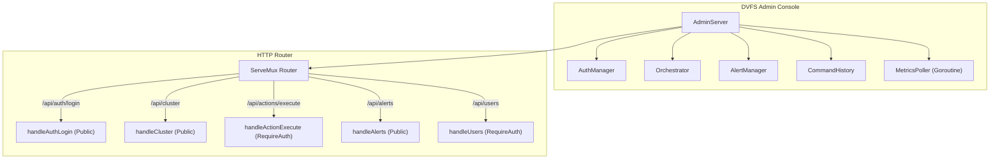
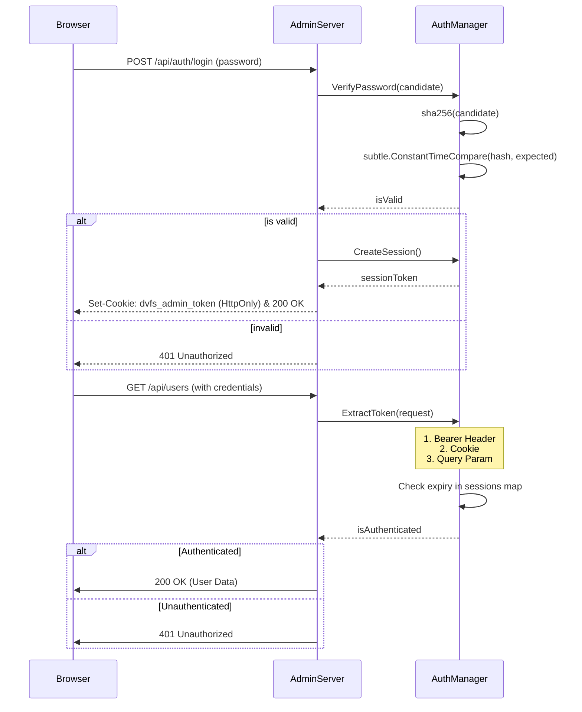
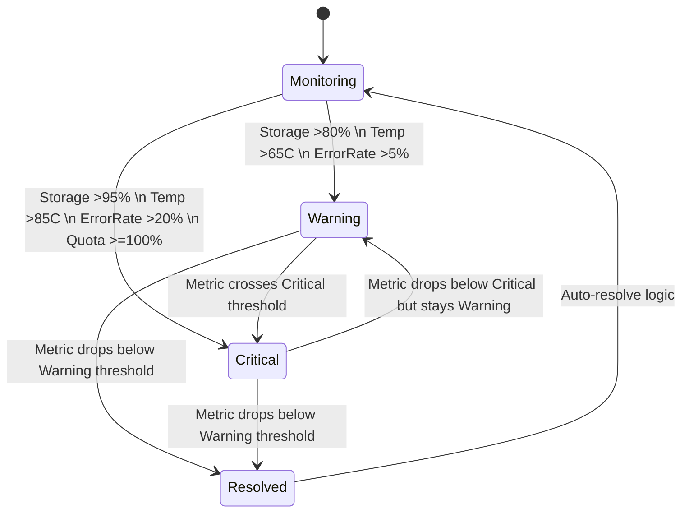
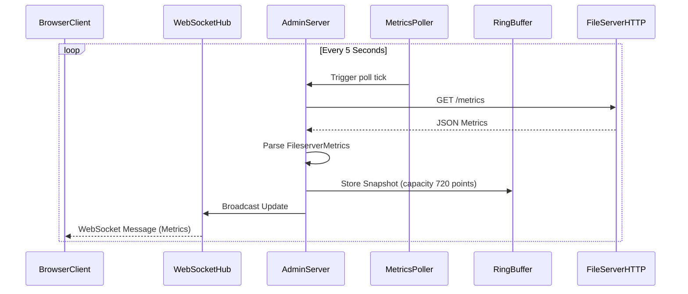
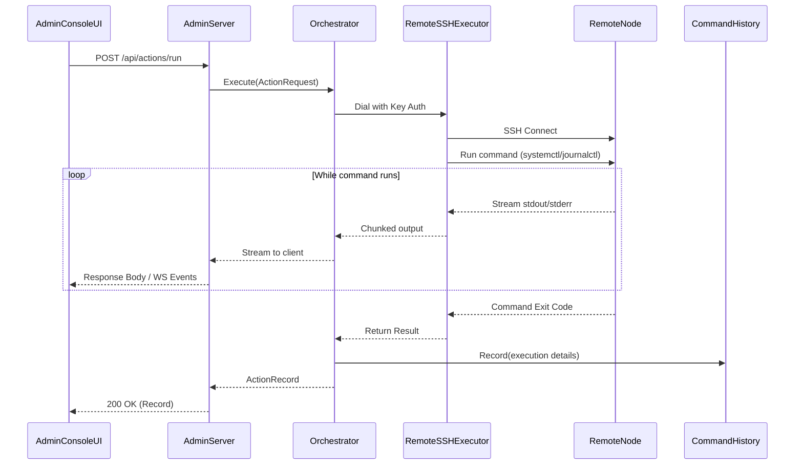

# Admin System Diagrams

This document contains architectural and behavioral diagrams for the DVFS Admin Console and Authentication systems. The Admin Console acts as the central control plane, polling metrics, processing telemetry, and dispatching orchestration commands.

## Component Overview

## Authentication Flow

## Alert State Machine

## Admin HTTP Routes Table

| Method | Path | Auth Required | Handler Function |
|--------|------|---------------|------------------|
| POST | `/api/auth/login` | No | `handleAuthLogin` |
| POST | `/api/auth/logout` | No | `handleAuthLogout` |
| GET | `/api/auth/status` | No | `handleAuthStatus` |
| GET | `/api/cluster` | No | `handleCluster` |
| GET | `/api/cluster/summary` | No | `handleCluster` |
| GET | `/api/performance` | No | `handlePerformance` |
| GET | `/api/performance/export`| No | `handlePerformanceExport` |
| GET | `/api/history/` | No | `handleHistory` |
| GET | `/api/users` | Yes | `handleUsers` |
| PUT/POST | `/api/users/` | Yes | `handleUserQuota` |
| GET | `/api/actions/presets` | Yes | `handleActionPresets` |
| GET | `/api/actions/history` | Yes | `handleActionHistory` |
| POST | `/api/actions/execute` | Yes | `handleActionExecute` |
| GET | `/api/alerts` | No | `handleAlerts` |
| GET | `/api/alerts/summary` | No | `handleAlertSummary` |
| POST | `/api/alerts/resolve` | Yes | `handleResolveAlert` |
| POST | `/api/alerts/resolve-all`| Yes | `handleResolveAllAlerts` |
| GET | `/api/logs/tail` | Yes | `handleLogTail` |
| WS | `/ws/actions` | Yes | `NewWebSocketHandler` |

## Metrics Polling Pipeline

## SSH Remote Orchestration Flow

