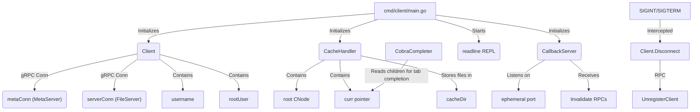
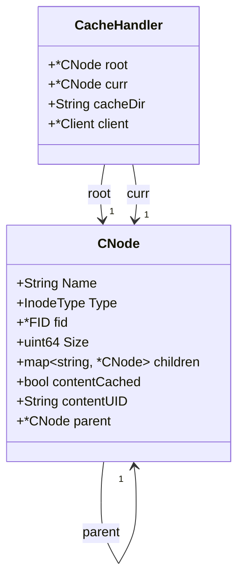
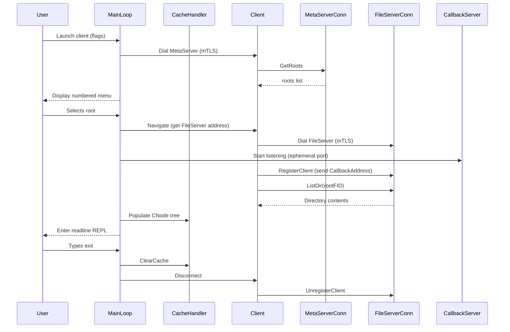
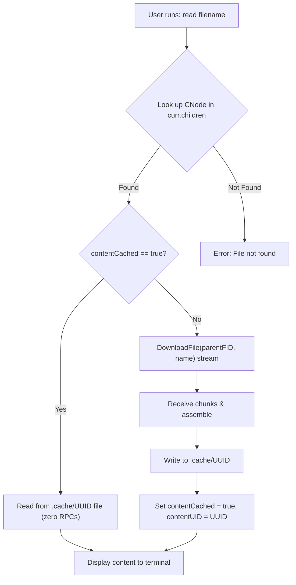
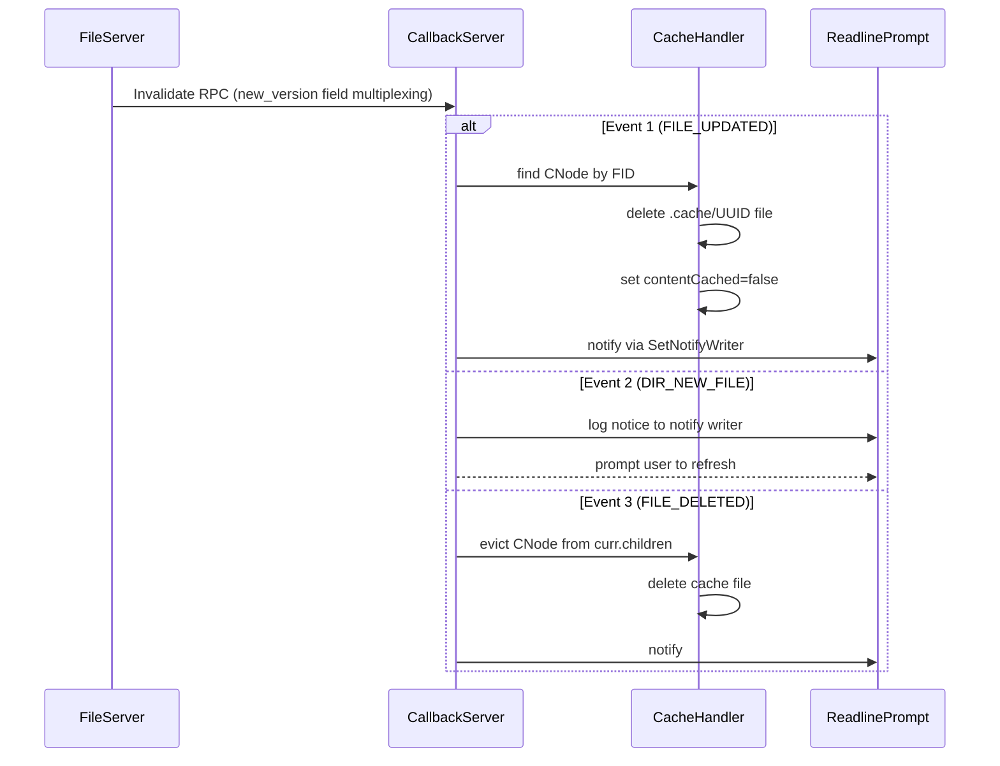
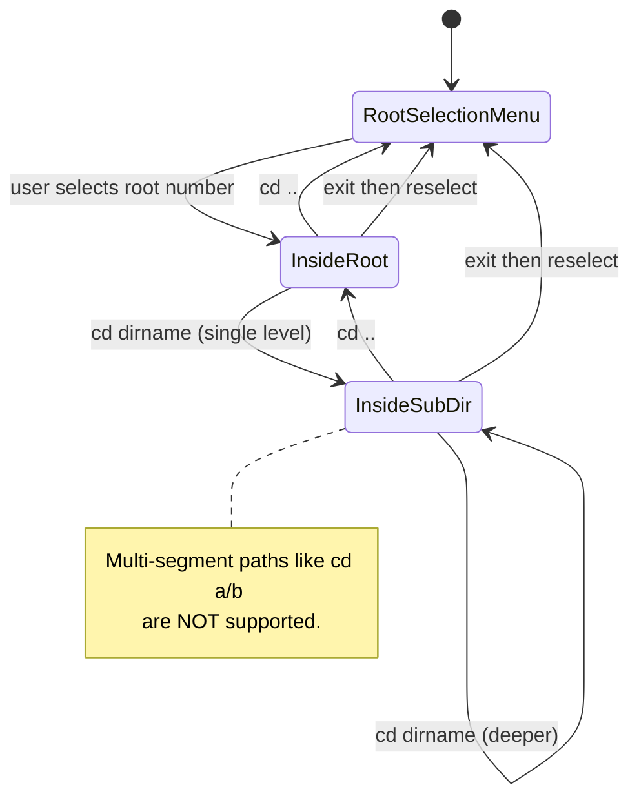
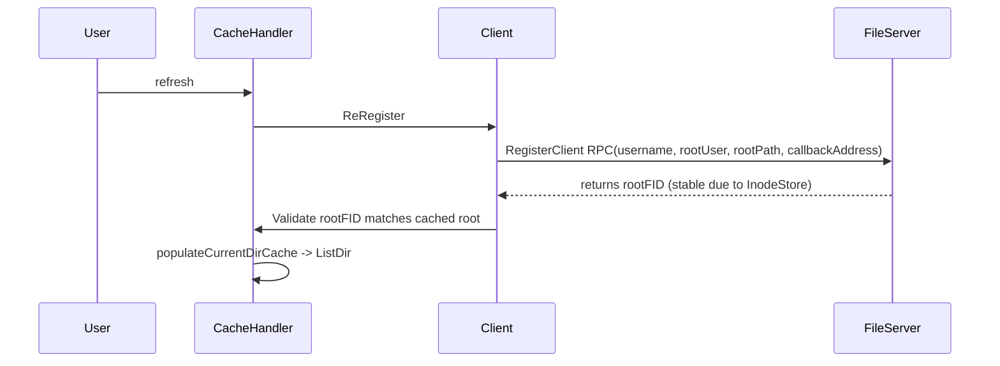

# DVFS Client System Architecture Diagrams

This document outlines the detailed system architecture and interactions of the DVFS Client Shell, Caching System, and Callback Listener.

## 1. Client System Component Map

## 2. CNode Tree Structure and State

## 3. Interactive Session Lifecycle

## 4. Cache Miss and Hit Flow

## 5. Push Invalidation Callback Handler

## 6. cd Command Navigation State

## 7. ReRegister Session Healing

