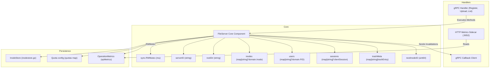
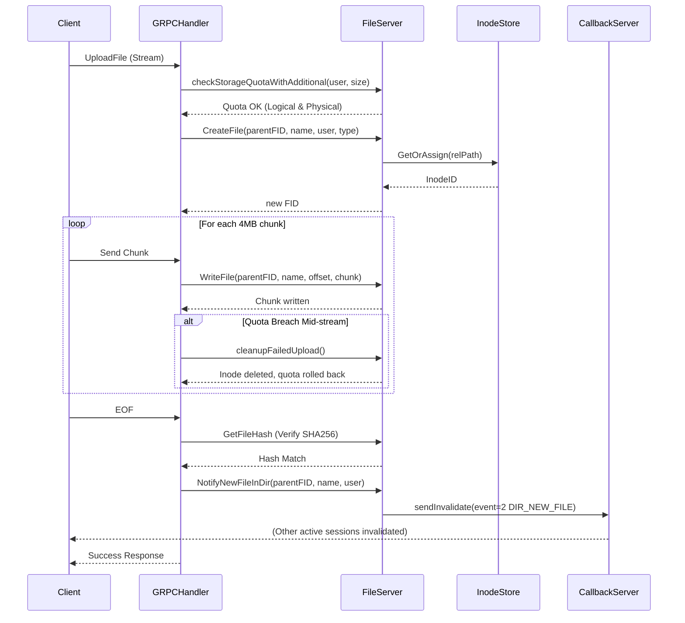
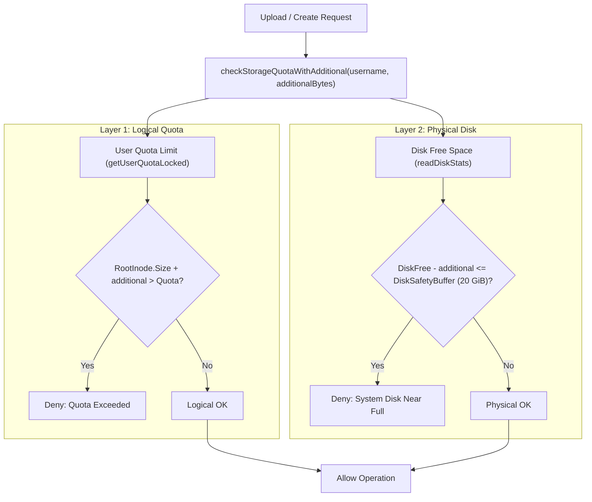
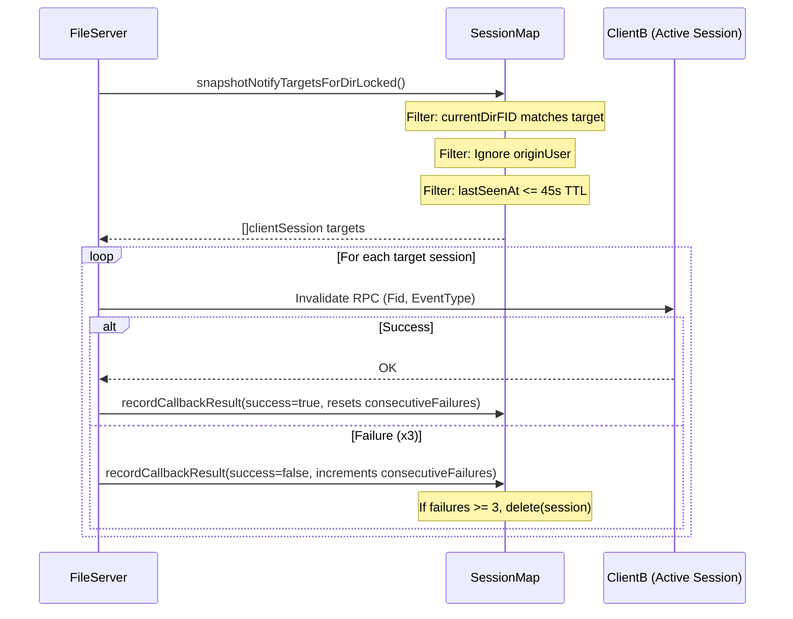
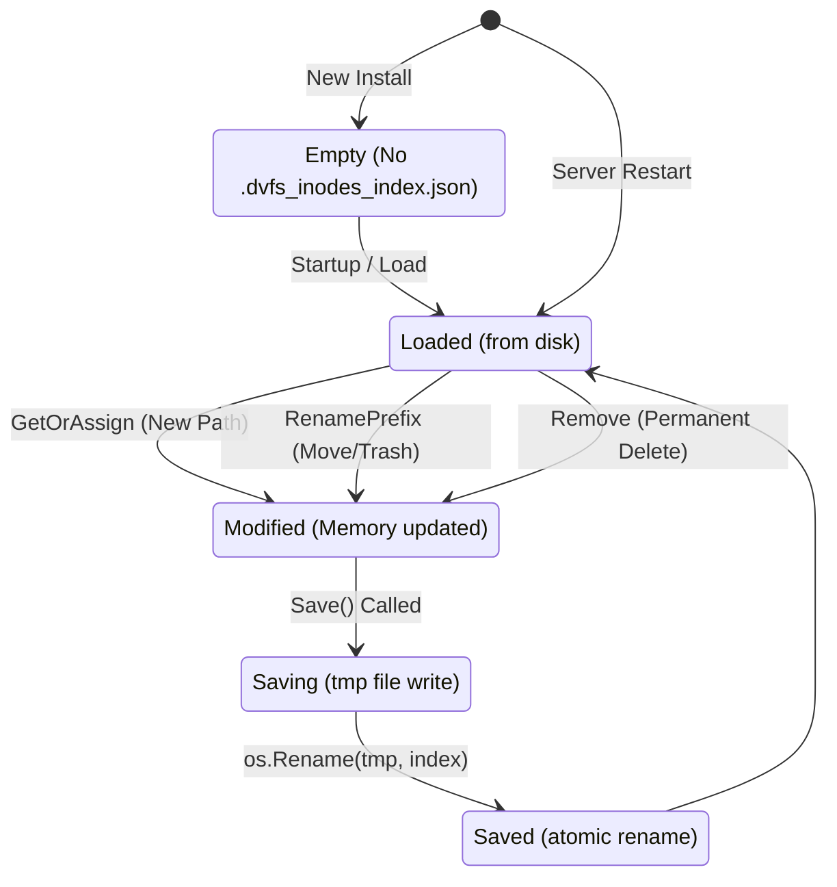

# FileServer Storage Engine Architecture

This document illustrates the internal architecture, state flows, and component interactions of the DVFS FileServer storage engine based on the underlying source code implementations.

## 1. FileServer Component Structure

This diagram outlines the `FileServer` struct and its integration with external handlers (gRPC, Metrics, Callback).

## 2. Upload File Workflow

The complete lifecycle of a file upload, including chunking, disk checks, quota checks, hashing, and invalidation.

## 3. Trash and Restore Flow

The operational flow for moving files to the `.trash` directory and restoring them back to their original locations.

```mermaid
flowchart TD
    subgraph TrashFile
        T1["Verify ACL/Owner"] --> T2["Unique Name Gen (name__inodeID)"]
        T2 --> T3["os.Rename (src -> .trash/dst)"]
        T3 --> T4["InodeStore.RenamePrefix"]
        T4 --> T5["Store trashMeta (origParent, origRelPath)"]
        T5 --> T6["Detach shared snapshots"]
        T6 --> T7["Update Parent & Subtree Paths"]
    end

    subgraph RestoreFile
        R1["Look up trashMeta by FID"] --> R2["Verify original parent exists (fallback to root)"]
        R2 --> R3["os.Rename (.trash/src -> dst)"]
        R3 --> R4["InodeStore.RenamePrefix (reverse)"]
        R4 --> R5["Reattach shared snapshots"]
        R5 --> R6["Remove from trashMeta"]
    end
```

## 4. Quota Enforcement Layers

The dual-layer strategy ensuring both per-user fair usage and physical host system stability.

## 5. Push Invalidation and Session Targeting

How the callback system targets active client sessions for cache invalidation.

## 6. InodeStore State Transitions

State transitions for persistent tracking of Inode assignments based on the index file behavior.

