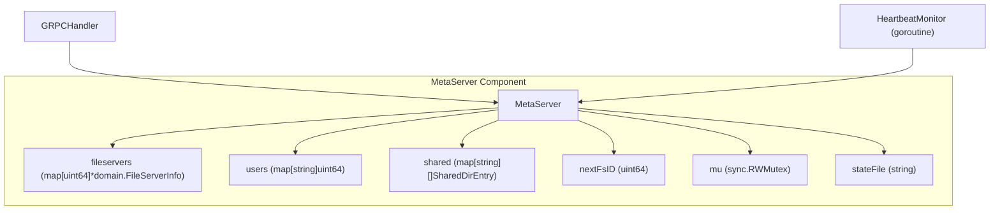
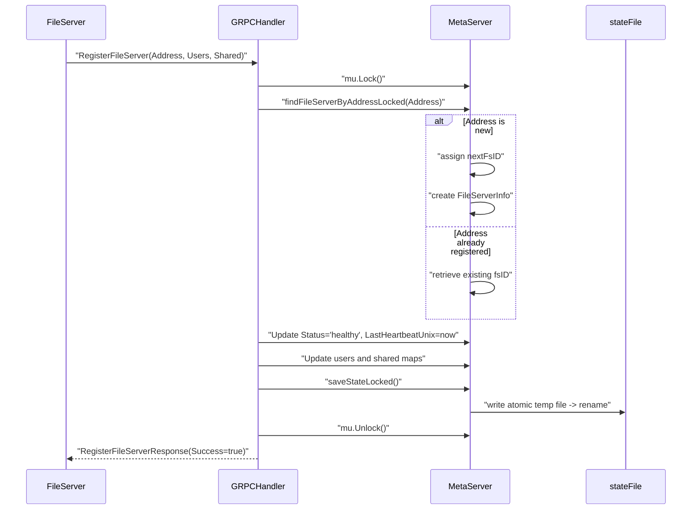
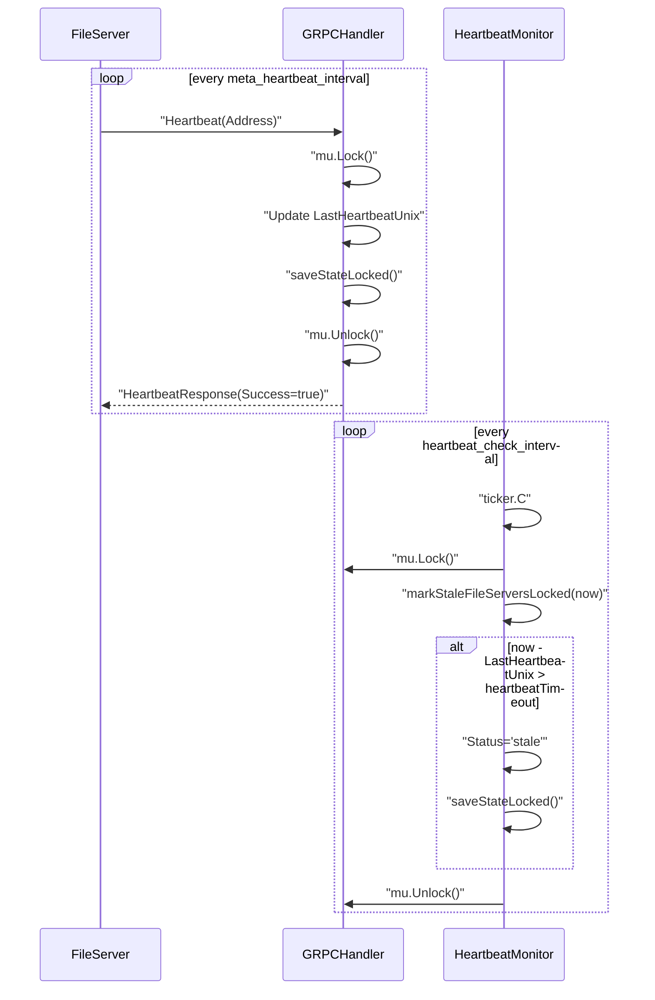
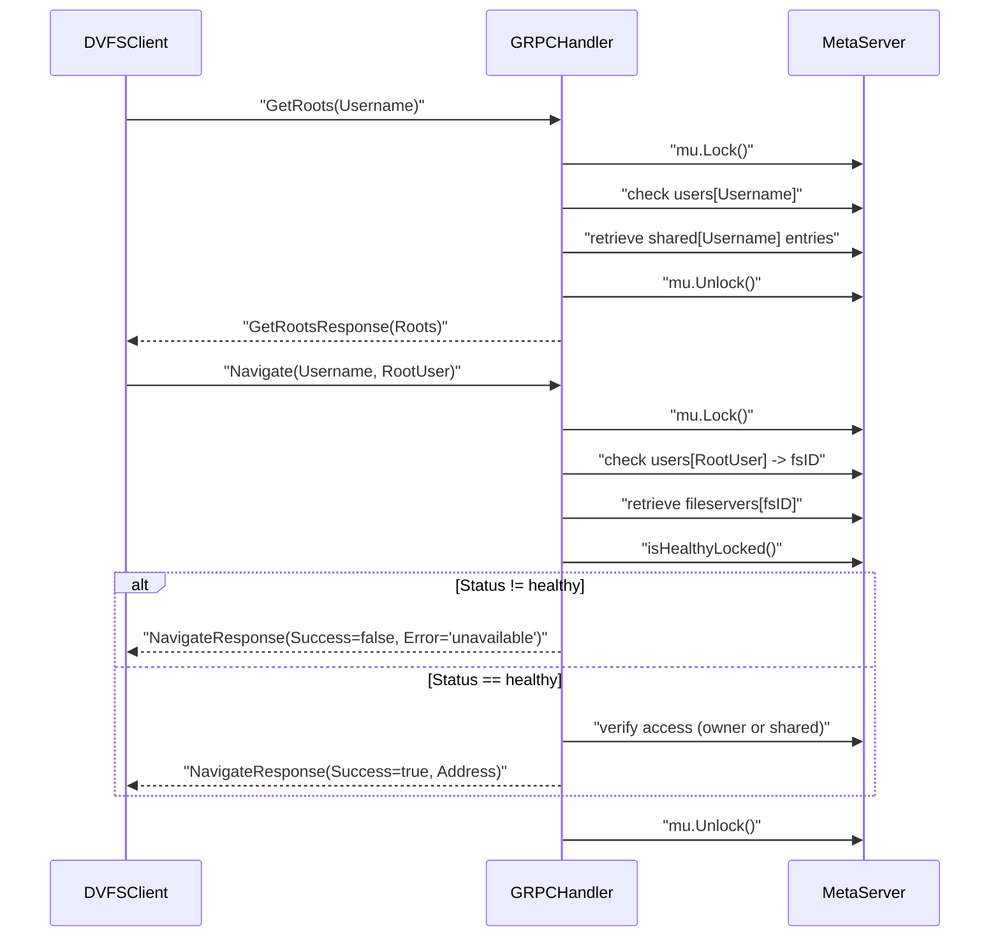
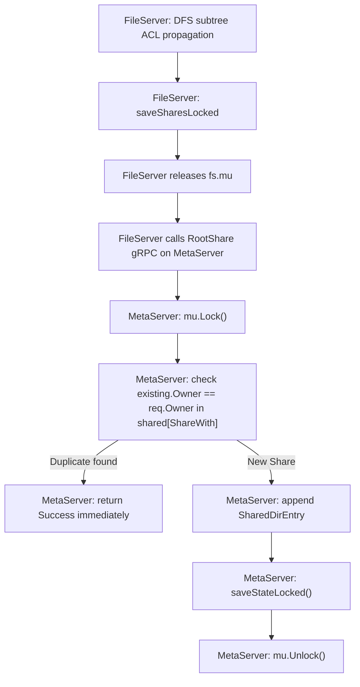
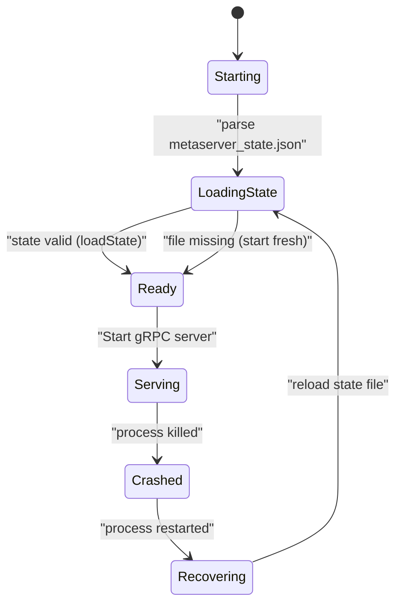

# MetaServer Coordinator & Cluster Topology

This document illustrates the data flow, state transitions, and component interactions within the DVFS MetaServer Coordinator. The diagrams show how file servers register, how liveness is monitored, how client navigation works, and how crash recovery handles state.

## 1. MetaServer Component Structure

## 2. FileServer Registration and Deduplication

## 3. Heartbeat Liveness Monitor

## 4. Navigate and Root Selection Flow

## 5. RootShare Deduplication and State Persistence

## 6. MetaServer Crash Recovery State Machine

