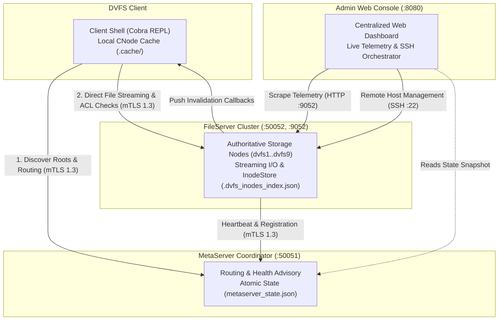
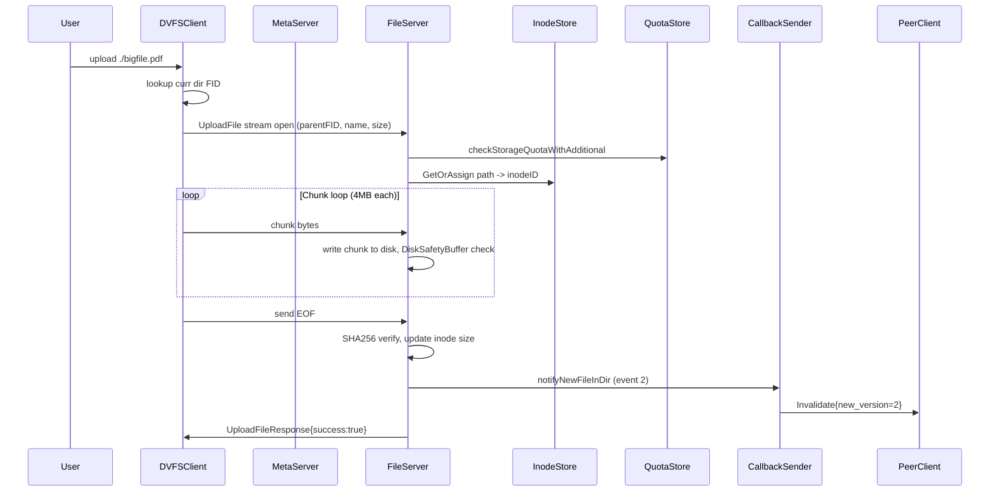
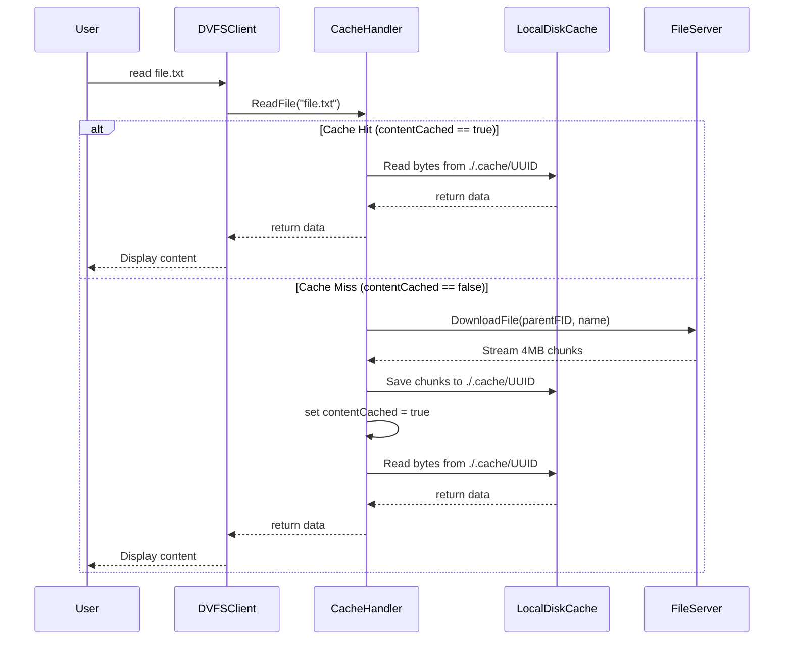
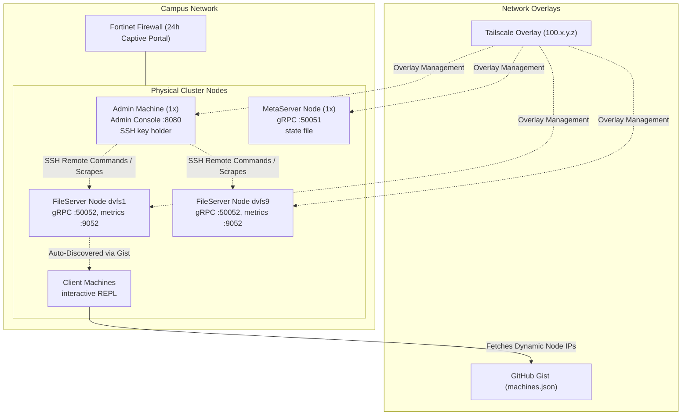
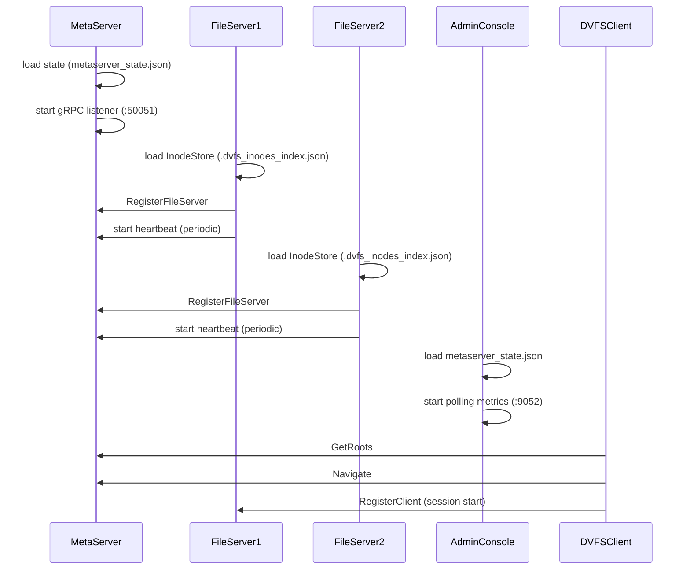

# MASTER SYSTEM ARCHITECTURE OVERVIEW

This document serves as the top-level reference for the Distributed Virtual File System (DVFS). It illustrates the complete system topology, end-to-end data flows, deployment layout, and component interaction matrices based directly on the implementation.

---

## 1. System Topology

### 1.1 Core Architecture (High-Level)

The following diagram depicts the primary architectural tiers and communication boundaries across the cluster:

---

### 1.2 Detailed Subsystem Wiring Topology

The following comprehensive diagram shows internal subsystem modules, persistence files, and network discovery mechanisms across all cluster components:

```mermaid
graph TD
    subgraph PKINetwork["Zero-Trust PKI and Network Discovery"]
        RC["Root CA (ca.crt / ca.key)"]
        NC["Node Leaf Certificates (server.crt/key)"]
        GG["GitHub Gist (machines.json)"]
        TO["Tailscale Overlay Network"]

        RC -->|"Issues and Signs (DNS SANs)"| NC
    end

    subgraph Clients["DVFS Client Application"]
        CR["Client REPL Shell"]
        CC["CNode Cache Tree (.cache/UUID)"]
        CL["Callback Listener (ephemeral port)"]

        CR <-->|"Instant Cache Hits / Navigation"| CC
        CL -->|"Evicts Stale Entries"| CC
    end

    subgraph MetaServer["MetaServer Coordinator (:50051)"]
        MG["gRPC Coordinator Handler"]
        MH["Heartbeat Liveness Monitor"]
        MS[("State Persistence (metaserver_state.json)")]

        MG <-->|"Persist Routing / Reconstitute"| MS
        MH -->|"Evaluate Timeouts (30s) and Mark Stale"| MS
    end

    subgraph FileServerNodes["Authoritative FileServer Nodes (:50052, :9052)"]
        FG["gRPC Storage Handler"]
        FI[("Persistent InodeStore (.dvfs_inodes_index.json)")]
        FQ[("QuotaStore (quota_config.json)")]
        FM["HTTP Metrics Sidecar (:9052)"]
        FC["Callback Invalidation Sender"]
        FHOST["Host Daemon Environment (sshd :22, systemd)"]

        FG <-->|"Path to Inode ID Resolution"| FI
        FG <-->|"Soft/Hard Quota and 20 GiB Buffer"| FQ
        FG -->|"Trigger Cache Invalidation Events"| FC
        FG -.->|"Expose Latencies and IOPS"| FM
    end

    subgraph AdminConsole["Admin Console and Web Dashboard (:8080)"]
        AH["HTTP REST API"]
        AM["Auth Manager (SHA-256 / HttpOnly Cookie)"]
        AW["WebSocket Terminal (/ws/actions)"]
        AA["Alert Engine (Storage, Temp, Quota)"]
        AP["Metrics Poller (5s Scrape Ticker)"]
        AS["Remote SSH Orchestrator"]

        AH --- AM
        AP -->|"Evaluate Health Rules"| AA
        AP -->|"Feed Real-Time Dashboard"| AW
    end

    %% Client Communication Flows
    CR -->|"1. Query Server LAN IPs"| GG
    CR -->|"2. GetRoots, Navigate (mTLS 1.3)"| MG
    CR -->|"3. Upload, Download, ListDir, Share (mTLS 1.3)"| FG
    FC -->|"4. Push Invalidate (FILE_UPDATED, DIR_NEW, DELETED)"| CL

    %% Inter-Server Coordination
    FG -->|"RegisterFileServer, Heartbeat, RootShare (mTLS 1.3)"| MG

    %% Telemetry and Management
    AP -->|"HTTP Scrape GET /metrics"| FM
    AS -->|"Execute systemctl / journalctl via SSH"| FHOST
    AH -->|"Inspect Cluster State File"| MS
    AS -.->|"Secure Fallback Tunnel"| TO

    %% Security and Trust Bindings
    RC -.->|"Embeds Root CA Trust Pool"| CR
    NC -.->|"Server TLS Verification"| MG
    NC -.->|"Server TLS Verification"| FG
```

## 2. End-to-End Data Flow: File Upload

## 3. End-to-End Data Flow: File Read with Cache

## 4. Component Interaction Matrix

| Source Component | Target Component | Protocol | Auth Mechanism | Description |
|---|---|---|---|---|
| Client | MetaServer | mTLS gRPC | Zero-Trust Root CA | GetRoots, Navigate routing |
| Client | FileServer | mTLS gRPC | Zero-Trust Root CA | File I/O (Upload, Download, ListDir) |
| FileServer | MetaServer | mTLS gRPC | Zero-Trust Root CA | RegisterFileServer, Heartbeats |
| Admin Console | FileServer | HTTP | None (internal sidecar) | Scrape `/metrics` for telemetry |
| Admin Console | FileServer | SSH | SSH Keys / scoped sudoers | Remote command orchestration |
| Admin Console | MetaServer | File I/O | FS Permissions | Reads `metaserver_state.json` |
| FileServer | Client | mTLS gRPC | Zero-Trust Root CA | Push Invalidation callbacks |

## 5. Deployment Topology on IITGN Cluster

## 6. System Startup Sequence

