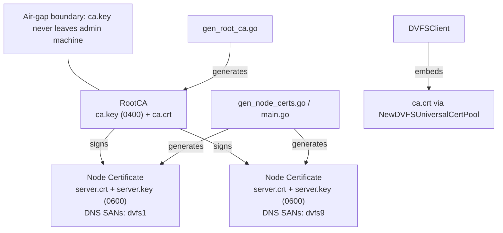
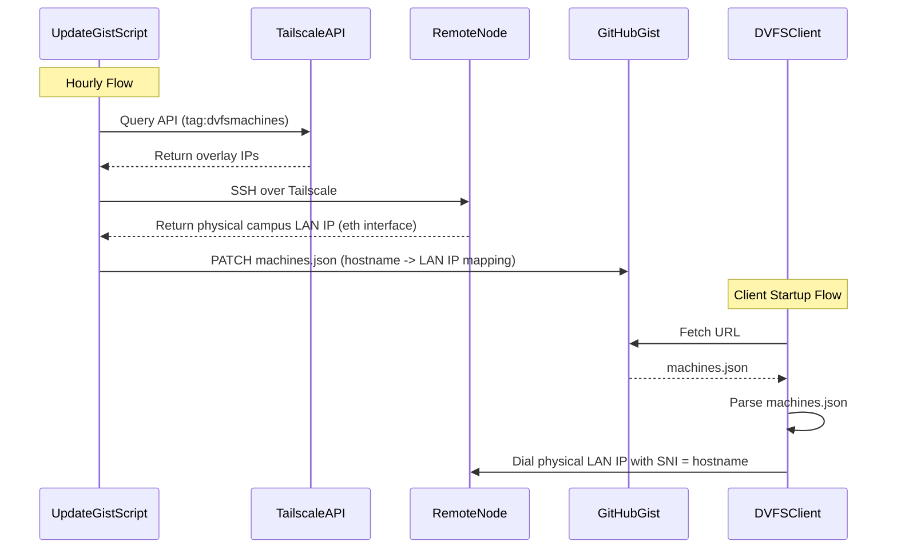
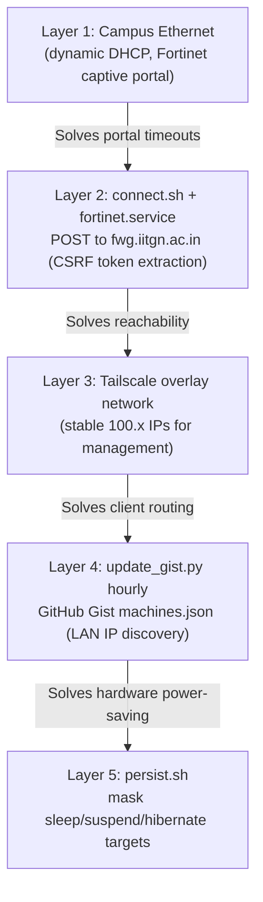

# DVFS ZERO-TRUST PKI, TLS CONFIGURATION, and NETWORK TOPOLOGY

This document provides comprehensive Mermaid diagrams detailing the DVFS cryptographic design, transport security, and network workarounds.

## 1. Zero-Trust PKI Certificate Hierarchy



## 2. mTLS Handshake Flow

```mermaid
sequenceDiagram
    participant DVFSClient
    participant FileServer

    Note over DVFSClient: Client resolves physical IP from Gist
    DVFSClient->>FileServer: Dial IP (SNI: dvfs1) / TLS ClientHello
    FileServer-->>DVFSClient: server.crt (DNS SAN: dvfs1)
    Note over DVFSClient: Verifies against embedded ca.crt pool (NewDVFSUniversalCertPool)
    FileServer->>DVFSClient: Request client cert (for mutual TLS)
    DVFSClient-->>FileServer: client cert
    Note over DVFSClient,FileServer: Connection established with TLS 1.3
    Note over DVFSClient,FileServer: DHCP IP Decoupling: physical IP changes but SNI hostname stays constant
```



## 3. Dynamic IP Discovery via GitHub Gist



## 4. IITGN Campus Network Workarounds



## 5. Certificate Generation Workflow

```mermaid
flowchart TD
    MakeCerts["make certs"] --> MainGo["scripts/gen-certs/main.go"]
    MakeForce["make certs-force"] -->|always regenerate| MainGo
    
    MainGo --> CheckCA{"Check if ca.crt exists"}
    
    CheckCA -->|No| GenRoot["gen_root_ca"]
    GenRoot --> OutRoot["ca.key (0400) + ca.crt"]
    
    CheckCA -->|Yes| ForEachNode
    OutRoot --> ForEachNode["For each node (dvfs1..dvfs9)"]
    
    ForEachNode --> GenNode["gen_node_certs"]
    GenNode --> OutNode["server.key (0600) + server.crt (DNS SAN: dvfsN)"]
    
    OutNode --> CopyCA["Copy ca.crt to client embed path"]
