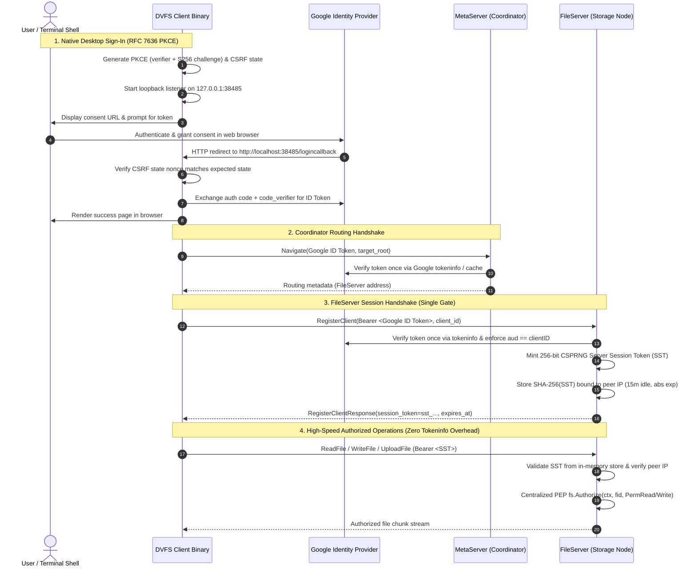

# Authentication & Security Access Controls

This document details the two core security subsystems in DVFS:
1. **User-Facing Google OAuth 2.0 & Session Architecture**: The primary identity, session handshake, centralized authorization (PEP), and cluster mTLS subsystem governing file access across clients and servers.
2. **Administrative Console Authentication & Data Redaction**: The SHA-256 credential verification, session cookie management, and telemetry sanitization protecting the admin dashboard.

---

## 1. User-Facing Google OAuth 2.0 & Session Architecture

DVFS replaces legacy unauthenticated or per-RPC token verification models with a **Single-Gate Session Handshake Protocol** backed by Google OAuth 2.0, RFC 7636 PKCE S256, and high-performance Server Session Tokens (SST).

### Architecture Topology & Handshake Flow



---

### Core Principles & Security Invariants

#### 1. Native Desktop Authorization Code Flow with PKCE (`internal/auth/pkce.go`, `internal/auth/google.go`)
- **RFC 7636 S256 PKCE**: Before generating the OAuth URL, the client generates a 32-byte cryptographic random code verifier (`[A-Za-z0-9\-._~]`, 43–128 characters) and computes the SHA-256 code challenge (`BASE64URL-ENCODE(SHA256(verifier))`).
- **Authorization Request**: The consent URL includes `code_challenge`, `code_challenge_method=S256`, `response_type=code`, `scope=openid email profile`, and a cryptographically random `state` nonce.
- **Loopback Redirect Listener**: The client binds a local HTTP server on `127.0.0.1:38485` (`/logincallback`). Upon redirect:
  1. The server validates that `r.URL.Query().Get("state")` matches the expected nonce, mitigating CSRF and malicious local redirects.
  2. The authorization code is exchanged with Google's token endpoint (`POST https://oauth2.googleapis.com/token`) including `code_verifier`.
  3. A responsive, user-friendly HTML confirmation page is rendered in the user's browser, displaying their authenticated email address.
- **Headless Fallback**: If running over headless SSH where a local browser cannot open, the CLI provides a copy-paste prompt (`Paste your token: `).

#### 2. Strict Token Verification & Audience Guard (`internal/auth/google.go`)
- **Validation**: Google ID tokens are verified against Google's tokeninfo API (`https://oauth2.googleapis.com/tokeninfo?id_token=...`).
- **Strict Audience Enforcement**: The token's `aud` claim is validated using strict string equality against `GOOGLE_CLIENT_ID`. If `GOOGLE_CLIENT_ID` is unconfigured in production mode (`DVFS_AUTH_MOCK=false`), token verification immediately fails closed before making external network calls.
- **Verified Email**: The `email_verified` claim must evaluate to `true` (or boolean `"true"`).
- **Bounded In-Memory Cache**: Successfully verified tokens are cached in-memory (`tokenCache`) for up to their remaining token lifetime (`exp`) (capped at 2 hours). Mock tokens enforce a 5,000-entry capacity limit with automatic expired-entry eviction to prevent memory exhaustion under automated testing concurrency.

#### 3. Single-Gate Handshake Protocol (`RegisterClient`)
- In legacy systems, verifying a Google ID token over HTTP on every single gRPC call introduced 150–400ms of synchronous latency and vulnerability to Google API rate-limiting.
- In DVFS, Google ID token verification occurs **only once** when the client initiates its session via `RegisterClient`.
- Upon successful verification, the FileServer:
  1. Mints a cryptographically secure 256-bit random Server Session Token (`sst_<43-character-base64url>`) providing 256 bits of CSPRNG entropy encoded via unpadded URL-safe Base64 per NIST SP 800-63B.
  2. Hashes the token using `SHA-256` for storage indexing (ensuring raw session tokens are never stored in plaintext in memory).
  3. Binds the session to the client's network IP (`p.Addr`).
  4. Returns the raw SST and absolute expiration timestamp to the client in `RegisterClientResponse`.

#### 4. High-Performance Session Subsystem (`internal/fileserver/session/`)
- **Decoupled Concurrency**: The session subsystem operates with a standalone `sync.RWMutex` decoupled from the filesystem inode lock (`fs.mu`). High-throughput chunk streaming never blocks session validation.
- **Sliding Idle Timeout**: Sessions enforce a 15-minute sliding inactivity timeout. Active operations touch the session (`sess.Touch()`) to reset the idle timer.
- **Chunk Stream Touch Discipline**: Streaming transfers validate and refresh session state upon stream initiation via the gRPC stream interceptor. During streaming `UploadFile` RPCs, `sess.Touch()` is actively refreshed inside each chunk receiving loop, ensuring prolonged multi-gigabyte uploads never time out regardless of duration.
- **Absolute Expiry Ceiling**: Sessions cannot be extended indefinitely. An absolute expiration ceiling is established at session creation (configured to a 12-hour ceiling: `now + 12h`). When reached, the session expires and the client must re-authenticate.
- **Cryptographic Transport & IP Binding**: The FileServer extracts the client IP (`extractIP`) using `net.SplitHostPort` and validates it on every request. If a request arrives with a valid SST from a different IP address, the FileServer triggers a security alert and rejects the request with `codes.PermissionDenied` (`ErrIPMismatch`).
- **DoS Limits & Eviction**:
  - **Per-User Limit**: Hard cap of 5 concurrent sessions per user. Creating a 6th session automatically evicts the user's oldest session (FIFO).
  - **Global Limit**: Bounded global table cap of 10,000 sessions.
  - **Background Sweeper**: A background goroutine cleans expired sessions every 60 seconds.

#### 5. Centralized Policy Enforcement Point (`fs.Authorize`) & IDOR Immunity
All FileServer gRPC handlers pass through a centralized Policy Enforcement Point (`fs.Authorize(ctx, fid, perm)`) in `internal/fileserver/fileserver.go`:
- **Identity Resolution**: Handlers never trust client-supplied protobuf fields such as `req.RootUser` or `req.Username`. The authenticated identity is extracted directly from the verified session context via `session.UsernameFromContext(ctx)`.
- **Permission Matrix**:
  | Permission Level | Enum Value | Permitted Inode Types | Access Rule |
  |---|---|---|---|
  | **`PermRead`** | `0` | File, Directory | Allowed if caller is Inode Owner OR listed in Inode `ACL.Shared` |
  | **`PermWrite`** | `1` | File, Directory | Allowed if caller is Inode Owner OR listed in Inode `ACL.Shared` |
  | **`PermDelete`** | `2` | File, Directory | Strict Ownership: Allowed **only** if caller is Inode Owner |
  | **`PermAdmin`** | `3` | Any Resource | Allowed only if caller is configured cluster administrator |
- **Protected RPCs**:
  - `CreateFile`, `ReadFile`, `WriteFile`, `UploadFile`, `DownloadFile`
  - `GetAttr`, `ListDir`, `ChangeDir`
  - `DeleteFile`, `TrashFile`, `RestoreFile`, `ShowTrash`
  - `Share`, `Unshare` (validates caller ownership before recursively updating directory subtree ACLs)

#### 6. Dual-Mode Administrative Quota Authorization
Modifying storage limits via `SetQuota` is restricted to authorized cluster administrators through two distinct mechanisms:
1. **Password-Based Admin Authorization (Admin Web Console)**:
   - When an administrator logged in via password updates quotas in the Admin Web Console, the backend invokes `CallSetQuota` over gRPC, attaching the `x-admin-password-hash` metadata header.
   - The FileServer verifies the submitted hash in constant time (`crypto/subtle.ConstantTimeCompare`) against `ADMIN_PASSWORD_HASH` or `ADMIN_PASSWORD`.
2. **Identity-Based Admin Authorization (CLI / Google Session)**:
   - If invoked by an authenticated Google user via gRPC, `session.UsernameFromContext(ctx)` must match `DVFS_ADMIN_EMAIL`.
   - Regular users (e.g. `student@gmail.com`) attempting to call `SetQuota` to self-escalate storage limits are rejected with `SetQuotaResponse{Success: false, Error: "permission denied: only cluster administrators can modify quotas"}`.

#### 7. Cluster Control Plane Mutual TLS (mTLS)
Cluster daemon RPCs on the MetaServer are separated from end-user RPCs:
- **User Plane RPCs** (`GetRoots`, `Navigate`): Require a valid Google ID token.
- **Cluster Control RPCs** (`RegisterFileServer`, `Heartbeat`, `RootShare`, `RootUnshare`): Handled by `verifyClusterPeer(ctx)` in `internal/metaserver/auth_google.go`. In production mode (`DVFS_AUTH_MOCK=false`), requests are rejected with `codes.Unauthenticated` unless presented with a valid mutual TLS client certificate signed by the Root CA whose Subject Alternative Name (SAN) matches `*.cluster.local`, `fileserver`, or `localhost`.

#### 8. Offline & Automated Testing Mock Mode (`DVFS_AUTH_MOCK`)
For local integration testing and CI environments without live Google credentials:
- Set `DVFS_AUTH_MOCK=true` or `1`.
- `auth.MockToken(email)` generates a valid mock token prefixed with `mock-jwt.`.
- In production mode (`DVFS_AUTH_MOCK=false`), any token with the `mock-jwt.` prefix is strictly rejected with a fatal security alert.

---

## 2. Administrative Console Authentication & Data Redaction

The administrative web console provides hardware observability, quota management, and remote cluster execution. It uses a **dual-mode presentation model** separating casual visitors from authenticated cluster operators.

```
[Unauthenticated Visitor] -------------> [Public Dashboard View]
                                          - Node uptimes & hardware temps
                                          - Cluster throughput & IOPS
                                          - Redacted user identities & quotas

[Administrator + Password] ------------> [Admin Console Mode]
                                          - User listing & dynamic quota editing
                                          - Remote SSH commands (reboot, git, apt)
                                          - Live journalctl log streaming
                                          - Alert resolution
```

### Core Security Invariants
1. **Zero Plaintext Passwords**: Passwords are never stored in plaintext on disk or in source code. Verification compares submitted passwords strictly against a precomputed SHA-256 hash.
2. **Timing Attack Immunity**: Hash comparisons use constant-time verification (`crypto/subtle.ConstantTimeCompare`) to prevent side-channel timing attacks.
3. **Data Redaction by Default**: All API endpoints scrub user identities, active usernames, and quota details when accessed without valid administrative session credentials.
4. **Cookie-Based WebSocket Protection**: Real-time operational streams authenticate via browser session cookies by default, preventing credentials from appearing in web server access logs.

---

### Implementation Details (`internal/admin/auth.go`)

#### The SHA-256 Authentication Engine
```go
type AuthManager struct {
    hash     string
    sessions map[string]time.Time // Token -> Expiration
    mu       sync.RWMutex
}
```

- **Configuration**: Configured in `.env` via `ADMIN_PASSWORD_HASH`:
  - **Linux / macOS / WSL**:
    ```bash
    echo -n "YourSecretPassword" | sha256sum | awk '{print "ADMIN_PASSWORD_HASH="$1}' >> .env
    ```
  - **Windows PowerShell**:
    ```powershell
    $hash = [System.BitConverter]::ToString([System.Security.Cryptography.SHA256]::Create().ComputeHash([System.Text.Encoding]::UTF8.GetBytes("YourSecretPassword"))).Replace("-","").ToLower()
    "ADMIN_PASSWORD_HASH=$hash" | Out-File -Append -Encoding ascii .env
    ```
- **Session Tokens**: On successful authentication (`POST /api/auth/login`), the server generates a 32-byte cryptographically secure random token (`crypto/rand`) hex-encoded to a 64-character string.
- **Session TTL**: Tokens remain valid for 12 hours.
- **Cookie Delivery**: Tokens are written to the browser via an `HttpOnly`, `Path=/`, `SameSite=Lax` cookie named `dvfs_admin_token`.

#### Protected Endpoints (`RequireAuth` Middleware)
Privileged endpoints require a valid session:
- `GET /api/users` (User quota directory)
- `PUT /api/users/{username}/quota` (Quota adjustments — invokes `CallSetQuota` on FileServer with `x-admin-password-hash`)
- `POST /api/actions/*` (Cluster command execution)
- `GET /api/actions/presets` & `GET /api/actions/history`
- `POST /api/alerts/resolve` and `POST /api/alerts/resolve-all`
- `GET /api/logs/tail` (Live journalctl log streaming)
- `GET /ws/actions` (WebSocket command stream)

#### Public Data Redaction (`internal/admin/handlers.go`)
When unauthenticated visitors access telemetry endpoints:
- **`GET /api/cluster` & `GET /api/cluster/summary`**: The `users` dictionary is sanitized to an empty map `{}` (`total_users` is set to `0`), and per-node user storage/quota dictionaries are stripped. Hardware health, storage capacities, cluster throughput (MiB/s), and IOPS remain visible.
- **`GET /api/alerts`**: Suppresses all `quota_exceeded` alerts and strips user identity strings from alert messages.

---

## 3. Configuration Summary

| Variable | Target Component | Required | Default | Description |
|---|---|---|---|---|
| `GOOGLE_CLIENT_ID` | FileServer, MetaServer, Client | Yes (Prod) | `""` | OAuth 2.0 Client ID; strictly enforced against token `aud` |
| `GOOGLE_CLIENT_SECRET` | Client, Admin UI | Yes (Prod) | `""` | OAuth 2.0 Client Secret for code exchange |
| `GOOGLE_REDIRECT_URI` | Client, Admin UI | No | `http://localhost:38485/logincallback` | Local loopback redirect URI |
| `DVFS_AUTH_MOCK` | FileServer, MetaServer, Client | No | `false` | Enables mock token generation and verification for testing |
| `DVFS_ADMIN_EMAIL` | FileServer | No | `""` | Google account email authorized to call `SetQuota` via CLI |
| `ADMIN_PASSWORD_HASH` | Admin Console, FileServer | Yes (Admin) | `8c6976...` ("admin") | SHA-256 hash of cluster admin password |
| `USE_GOOGLE_AUTH` | Build Tag / Makefile | No | `1` | Build flag enabling Google Auth interceptors in binaries |
