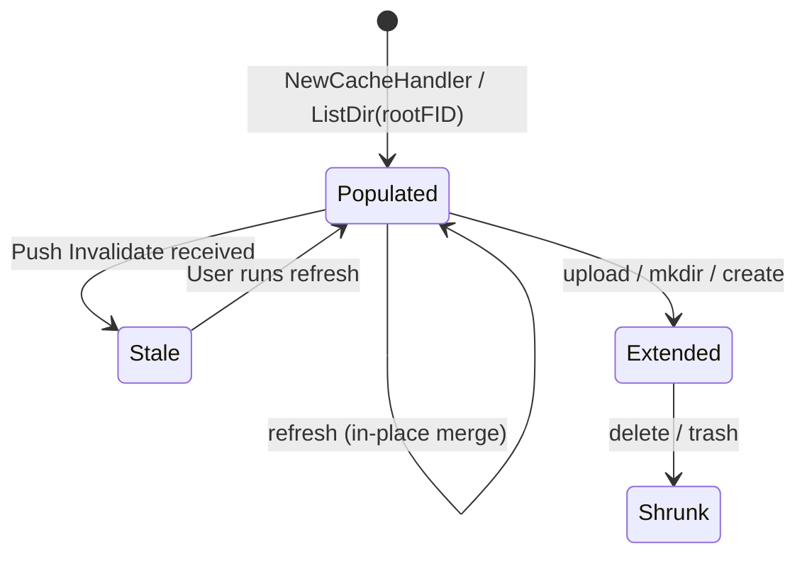
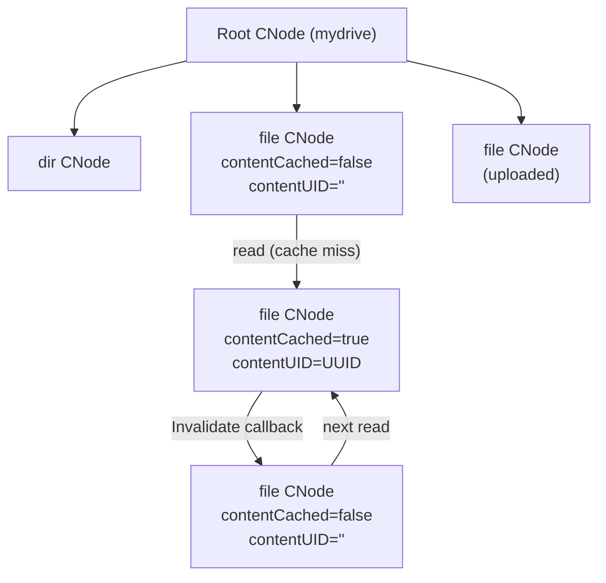

# Client-Side Caching & Invalidation Callbacks

This document details the DVFS client caching architecture, split into its theoretical foundation (**In Essence**) and its concrete engineering realities (**Implementation Quirks**).

---

## 1. In Essence: The AFS Caching Model

### Whole-File Caching
DVFS adopts the client caching philosophy pioneered by the Andrew File System (AFS). Rather than transferring file data in small block-level requests over the network during every read call, the client fetches the entire file upon first access and caches it on the local filesystem.

Subsequent reads are served directly from local storage with **zero network latency and zero RPC overhead**.

```
[Client Application]
         |
         v
  [Check Cache]
    /         \
 (Hit)       (Miss)
  /             \
Read Local    Download Entire File
Cache File    into Local Cache File
                |
                v
          Mark Cached & Read
```

### Server-Driven Invalidation Callbacks
Local caching creates a cache coherence challenge: if User A updates a file that User B has cached, User B might read stale data.

DVFS resolves this using **server-push callbacks**:
- When a client reads a file, the FileServer notes the client's presence.
- When any user modifies or deletes that file, the FileServer initiates an outbound gRPC `Invalidate` RPC to all clients holding that file in their active directory.
- Upon receiving the callback, the client immediately evicts the local cache file and clears its cached status flag.
- The next time the user reads the file, a cache miss triggers a fresh download of the updated content.

This push-invalidation architecture completely eliminates repetitive "check if modified" polling requests, preserving network bandwidth and fileserver CPU cycles.

---

## 2. Implementation Quirks & Practical Realities

### 2.1 The CNode Tree Hierarchy
The client represents cached directory metadata as a tree of `CNode` structs (`internal/client/cache_handler.go`):

```go
type CNode struct {
    Name          string
    Type          domain.InodeType  // InodeTypeFile (0) or InodeTypeDirectory (1)
    fid           *domain.FID       // Remote File Identifier
    Size          uint64            // Cached file size in bytes
    children      map[string]*CNode // Child directory nodes
    contentCached bool              // True if file bytes are cached locally
    contentUID    string            // UUID matching ./.cache/<UUID>
    parent        *CNode            // Parent directory pointer
}
```

- **Tree Mirroring**: When navigating with `cd`, the client walks its local CNode tree.
- **Size Caching**: Unlike early development prototypes, file sizes are cached directly in `CNode.Size` and updated whenever `ListFilesAt` or upload operations execute.
- **In-Place Cache Merging**: When running `refresh` or re-entering a directory, `populateCurrentDirCache` merges server listings into existing CNodes. If a file is already cached and its size has not changed, its `contentCached` status and local UUID file are preserved. Old CNodes whose names still appear in the server listing are updated in-place, new server entries create fresh CNodes, and removed entries are dropped.

#### CNode Lifecycle State Machine



#### CNode File Content Caching Transition



### 2.2 Local UUID Content Storage (`./.cache/`)
Cached files are stored in `./.cache/` relative to the client binary:
- Each cached file is given a unique version 4 UUID name (e.g., `./.cache/4a9c687e-85eb-42d3-9bc3-7a912bb0e182`).
- UUID naming prevents local path collisions when files with the same name exist in different directories or roots.
- On client exit (`exit`), `h.cacheHandler.ClearCache()` automatically unlinks all UUID files and removes `./.cache/`.

### 2.3 Push Callback Event Types
The FileServer callback sender (`internal/fileserver/callback_server.go`) issues three distinct invalidation event codes:

```
+--------------------------+------------+--------------------------------------------+
| Event Constant           | Enum Value | Trigger Source                             |
+--------------------------+------------+--------------------------------------------+
| callbackEventFileUpdated | 1          | UploadFile stream close (file hash changed) |
| callbackEventDirNewFile  | 2          | CreateFile RPC or UploadFile stream open   |
| callbackEventFileDeleted | 3          | DeleteFile RPC handler                     |
+--------------------------+------------+--------------------------------------------+
```

When an event arrives at the client's callback listener (`internal/client/callback_server.go`):
1. **`FILE_UPDATED`**: Searches the active directory for the matching FID, deletes the local `./.cache/<contentUID>` file, sets `contentCached = false`, and logs a cache invalidation notice.
2. **`DIR_NEW_FILE`**: Logs a notice alerting the user that a new file was created in their current directory.
3. **`FILE_DELETED`**: Evicts the deleted node from `curr.children`, deletes any associated local cache file, and alerts the user.

### 2.4 Callback Session Targeting & Failure Pruning
Broadcasting callbacks to every known client would degrade performance. The FileServer optimizes callbacks with strict session filtering:
- **Directory Matching**: Callbacks are only delivered to sessions whose `currentDirFID` matches the directory where the event occurred.
- **Origin Exclusion**: The user who triggered the modification is excluded from notifications (their local cache is already updated).
- **Activity TTL**: Sessions with no activity for more than 45 seconds (`activeSessionTTL = 45 * time.Second`) are skipped.
- **Failure Pruning**: If dialing a client's callback listener fails 3 consecutive times (`maxCallbackFailures = 3`), the session is purged from `fs.sessions`.

### 2.5 Client Session Lifecycle: Graceful Disconnect & Re-Registration
Maintaining accurate connection counts on FileServers and Admin Dashboards requires deterministic lifecycle hooks:
- **Graceful Disconnect (`UnregisterClient`)**:
  - When a client exits cleanly (`exit`), switches storage roots (`cd ..` at root), or receives an OS interrupt (`SIGINT`/`SIGTERM` trapped via Go signals), `Client.Disconnect()` dispatches an `UnregisterClient` RPC to the FileServer before terminating.
  - The FileServer immediately removes the client's session from `fs.sessions`, closes active callback listeners, and decrements its active connections metric to 0.
- **Session Self-Healing (`ReRegister`)**:
  - If a FileServer crashes and reboots while a client remains open, the FileServer's in-memory callback sessions are lost.
  - When the client executes `refresh` (or navigates directories), `CacheHandler.Refresh()` invokes `Client.ReRegister()`.
  - The client re-registers with the FileServer, re-binds its callback port, verifies the root FID has not shifted, and restores push notification delivery without client restarts.

### 2.6 Terminal Prompt Safety (`SetNotifyWriter`)
Because callbacks are received asynchronously over gRPC, printing alerts while the user is typing would corrupt the interactive readline prompt. 
DVFS integrates callbacks with the readline library:
- When the REPL loop starts, it registers `rl.Stdout()` via `client.SetNotifyWriter(rl.Stdout())`.
- Callback notifications write to this stream, which cleanly redraws the current input buffer and the `dvfs>` prompt on a new line.

### 2.7 Cache Inspection (`viscache`)
Users can visualize their client's in-memory CNode tree at any time using the `viscache` command:
```text
dvfs> viscache
mydrive (dir) [fs1_0_1]
  |-- documents (dir) [fs1_1_1]
  |    |-- notes.txt (file, 1.2 KB, cached) [fs1_3_1]
  |-- report.pdf (file, 4.5 MB, not cached) [fs1_2_1]
```
