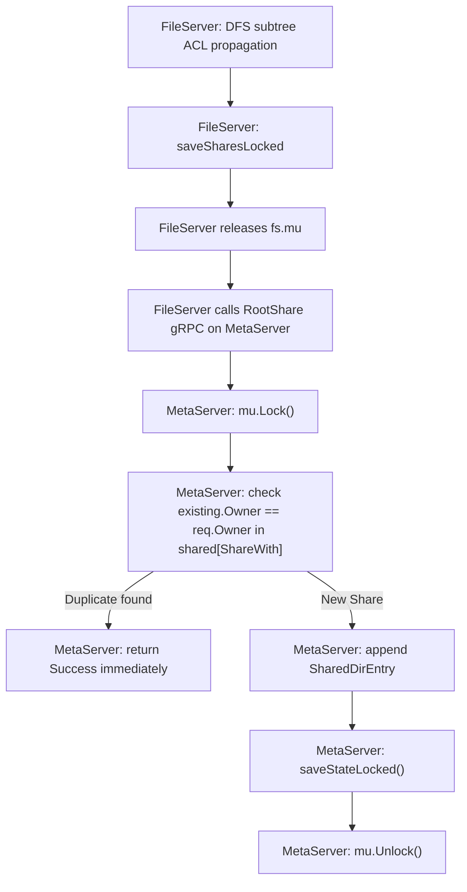

# Sharing & Access Control Lists (ACLs)

This document specifies the multi-user sharing and access control subsystem in DVFS, divided into the theoretical model (**In Essence**) and the production implementation details (**Implementation Quirks**).

---

## 1. In Essence: Two-Tier Namespaces & Authoritative ACLs

### Multi-Root Namespace Architecture
DVFS eliminates complex distributed mount hierarchies by presenting every user with a clean, dynamic root model:

```
                  User Namespace
                 /              \
           [mydrive]         [Shared Roots]
        (Personal Root)     (e.g., alice: project)
               |                     |
        Private Storage       Collaborative Storage
      (Authoritative FS)   (Indexed by MDS, Hosted on Peer FS)
```

- **`mydrive` (Personal Root)**: The user's private workspace, hosted authoritatively on their assigned FileServer. Accessible exclusively by the owner unless explicitly shared.
- **Shared Roots**: Folders shared with the user by other cluster members across different FileServers. These are indexed by the MetaServer via `GetRoots`.
- **Root Selection & Switching**: Upon login, the client displays an interactive numbered menu of all available roots. When inside any root, running `cd ..` from the root directory cleanly unregisters the current session and returns the user to the root selection menu, allowing effortless switching between private storage and shared collaboration roots.

### Authoritative Enforcement vs. Advisory Indexing
A core architectural invariant of DVFS is the strict separation between permission checking and location discovery:
- **FileServers are Authoritative**: Permissions are enforced directly on the FileServer hosting the physical data. Even if metadata in the shared index becomes out of sync, an unauthorized client can never read or write data because the FileServer verifies the user's identity against the inode's ACL before every disk operation.
- **MetaServer is Advisory**: The MetaServer acts as an indexing service. It tracks which roots have been shared with which users to provide instant responses to `GetRoots` queries without broadcasting network requests to every storage node.

### Formal Correctness Properties

1. **Root Visibility Consistency**:
   A root or directory appears in `GetRoots(user)` if and only if the user owns it or it has been shared with them.
   ```
   For all users U, root owners R:
     R in GetRoots(U) <=> (U == R) or (R in MetaServer.shared[U])
   ```

2. **Access Control Enforcement**:
   A client registration or file operation succeeds if and only if the user is the owner or is recorded in the inode's shared ACL list.
   ```
   RegisterClient(U, R).success == true <=> (U == R) or (U in Inode.ACL.Shared)
   ```

3. **Sharing Idempotence**:
   Repeating a `sharewith` operation for an already-shared directory produces no duplicate records and returns success.
   ```
   Share(U, Target); Share(U, Target) => len(MetaServer.shared[Target]) is unchanged
   ```

4. **Unsharing Revocation**:
   Immediately upon unsharing, the shared directory disappears from the recipient's available roots, and subsequent access attempts fail with permission denied.
   ```
   Unshare(U, Target) => Target not in GetRoots(U) and Access(Target) fails
   ```

5. **ACL Recovery Completeness**:
   When a FileServer restarts, all sharing relationships and `.acl` files persisted to disk are reloaded and re-registered with the MetaServer, restoring full multi-user cluster visibility.

---

## 2. Implementation Quirks & Practical Realities

### 2.1 The SharedDirEntry Schema
Early development proposals assumed only top-level user roots could be shared (`map[string][]string`). The production implementation in `internal/metaserver/metaserver.go` supports arbitrary directory sharing across the tree:

```go
type SharedDirEntry struct {
    Owner       string  // Original directory creator
    Path        string  // Full relative path (e.g., "romit/projects/dvfs")
    DisplayName string  // Directory name displayed to shared users ("projects")
}
```

When a user shares `mydrive/projects`, the recipient sees `projects` as an accessible root in their root menu.

### 2.2 Deep-Copy ACL Inheritance
When a new file or directory is created (`CreateFile` in `internal/fileserver/fileserver.go`), it inherits permissions from its parent directory:

```go
// Allocate new ACL deep-copying parent shared permissions
childACL := domain.ACL{
    Owner:  rootUser,
    Shared: make([]string, len(parentInode.ACL.Shared)),
}
copy(childACL.Shared, parentInode.ACL.Shared)
```

This guarantees that any file uploaded inside a shared folder automatically becomes accessible to all users who have access to that folder.

### 2.3 Recursive Subtree DFS Propagation
When an existing directory containing files and subdirectories is shared via `sharewith`, the FileServer performs a depth-first search (DFS) over the entire subtree (`collectSubtreeInodes`):
1. Traverses all child inodes recursively under the target directory.
2. Appends the target username to each descendant inode's `ACL.Shared` slice.
3. Atomically writes the updated `.acl` file for each modified directory on physical disk.
4. Updates `fileserver_shares.json` to persist the explicit share mapping.

### 2.4 Deadlock-Free Lock Discipline
Sharing involves updating local FileServer state and notifying the remote MetaServer via `RootShare` / `RootUnshare` RPCs. 
If network calls were made while holding `fs.mu.Lock()`, a slow or unresponsive MetaServer could freeze all operations on the FileServer.

DVFS enforces strict lock discipline:
1. Acquire `fs.mu.Lock()`.
2. Perform all in-memory map updates and disk writes.
3. Capture the required metadata for remote notifications.
4. **Release `fs.mu.Unlock()`**.
5. Dispatch `RootShare` or `RootUnshare` gRPC calls to the MetaServer outside the mutex.

### 2.5 Interactive Root Selection Workflow
When a client connects to DVFS (`cmd/client/main.go`):
1. Calls `MetaServer.GetRoots(username)` over gRPC.
2. The MetaServer queries `shared[username]` and returns the user's personal root (`mydrive`) along with any directories shared with them.
3. The client renders a numbered interactive menu:
   ```text
   Available roots:
     [1] mydrive (personal)
     [2] projects (shared by romit)
     [3] dataset (shared by jaskirat)
   Select root [1-3] or 0 to exit: 
   ```
4. Upon selection, the client invokes `MetaServer.Navigate(username, selectedRoot)`.
5. The MetaServer validates access, finds the healthy FileServer hosting that root, and returns its network address.
6. The client dials the FileServer, registers its session, and enters the Cobra REPL.
7. Typing `cd ..` from the top of any root safely returns the user to the MetaServer selection menu.

### 2.6 CLI Commands
- `sharewith <username>`: Shares the active directory with `<username>`.
- `unsharewith <username>`: Revokes access for `<username>` from the active directory.

### 2.7 MetaServer Root Share Deduplication
To keep the client's interactive root selection menu streamlined and prevent duplicate mountpoint collisions, the MetaServer enforces an advisory deduplication constraint in `internal/metaserver/handler.go`:
- When `ShareRoot` is invoked, the MetaServer scans `h.MetaServer.shared[req.ShareWith]`.
- If an entry with `existing.Owner == req.Owner` is already present, the MetaServer logs `Share skipped: root '%s' already shared with '%s'` and returns success immediately without appending a redundant record.
- As a result, each distinct owner exposes at most one top-level shared root entry in any recipient's `GetRoots` selection menu at a time.

## Diagrams

### RootShare Deduplication and State Persistence

