# Flow Diagrams: Before and After PR #16

Every section shows the flow as it was on `main` before the PR (JSON state file) and as it is at the head of the PR (MongoDB MetaStore). Narrative detail for each flow is in [Previous System](before.md) and [New System](after.md).

## 1. System topology

### Before

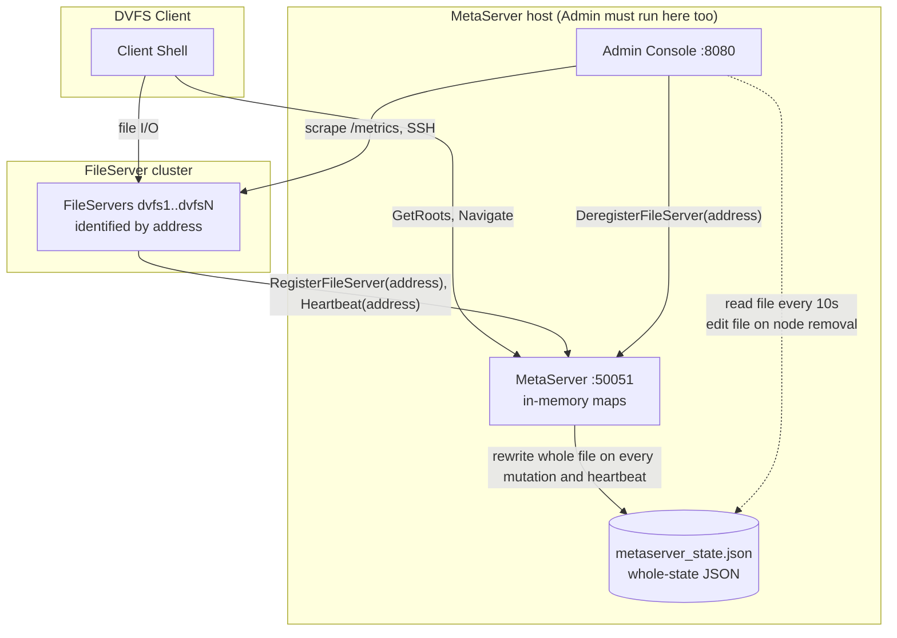
```mermaid
graph TB
    subgraph Clients["DVFS Client"]
        CLI["Client Shell"]
    end
    subgraph MetaHost["MetaServer host (Admin must run here too)"]
        MDS["MetaServer :50051<br>in-memory maps"]
        SF[("metaserver_state.json<br>whole-state JSON")]
        ADMIN["Admin Console :8080"]
        MDS -->|"rewrite whole file on every mutation and heartbeat"| SF
        ADMIN -.->|"read file every 10s<br>edit file on node removal"| SF
    end
    subgraph Storage["FileServer cluster"]
        FS["FileServers dvfs1..dvfsN<br>identified by address"]
    end
    CLI -->|"GetRoots, Navigate"| MDS
    CLI -->|"file I/O"| FS
    FS -->|"RegisterFileServer(address), Heartbeat(address)"| MDS
    ADMIN -->|"scrape /metrics, SSH"| FS
    ADMIN -->|"DeregisterFileServer(address)"| MDS
```

### After

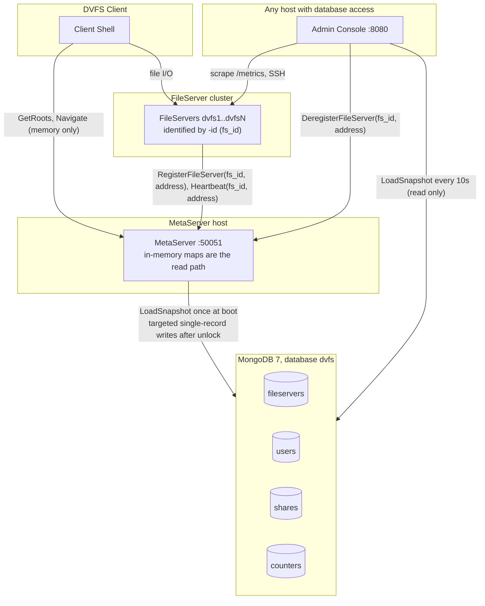
```mermaid
graph TB
    subgraph Clients["DVFS Client"]
        CLI["Client Shell"]
    end
    subgraph MetaHost["MetaServer host"]
        MDS["MetaServer :50051<br>in-memory maps are the read path"]
    end
    subgraph DB["MongoDB 7, database dvfs"]
        FSC[("fileservers")]
        UC[("users")]
        SC[("shares")]
        CC[("counters")]
    end
    subgraph AdminHost["Any host with database access"]
        ADMIN["Admin Console :8080"]
    end
    subgraph Storage["FileServer cluster"]
        FS["FileServers dvfs1..dvfsN<br>identified by -id (fs_id)"]
    end
    CLI -->|"GetRoots, Navigate (memory only)"| MDS
    CLI -->|"file I/O"| FS
    FS -->|"RegisterFileServer(fs_id, address), Heartbeat(fs_id, address)"| MDS
    MDS -->|"LoadSnapshot once at boot<br>targeted single-record writes after unlock"| DB
    ADMIN -->|"LoadSnapshot every 10s (read only)"| DB
    ADMIN -->|"scrape /metrics, SSH"| FS
    ADMIN -->|"DeregisterFileServer(fs_id, address)"| MDS
```

## 2. MetaServer internal structure

### Before

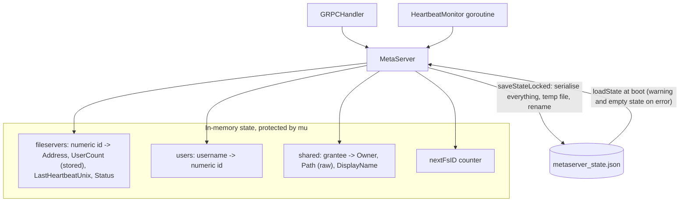
```mermaid
graph TD
    H["GRPCHandler"] --> MS["MetaServer"]
    MON["HeartbeatMonitor goroutine"] --> MS
    subgraph Memory["In-memory state, protected by mu"]
        F["fileservers: numeric id -> Address, UserCount (stored), LastHeartbeatUnix, Status"]
        U["users: username -> numeric id"]
        S["shared: grantee -> Owner, Path (raw), DisplayName"]
        N["nextFsID counter"]
    end
    MS --> F
    MS --> U
    MS --> S
    MS --> N
    MS -->|"saveStateLocked: serialise everything, temp file, rename"| FILE[("metaserver_state.json")]
    FILE -->|"loadState at boot (warning and empty state on error)"| MS
```

### After

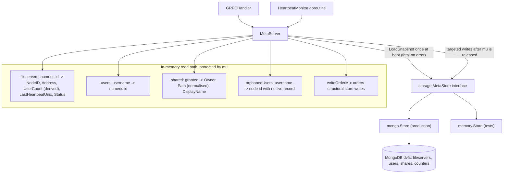
```mermaid
graph TD
    H["GRPCHandler"] --> MS["MetaServer"]
    MON["HeartbeatMonitor goroutine"] --> MS
    subgraph Memory["In-memory read path, protected by mu"]
        F["fileservers: numeric id -> NodeID, Address, UserCount (derived), LastHeartbeatUnix, Status"]
        U["users: username -> numeric id"]
        S["shared: grantee -> Owner, Path (normalised), DisplayName"]
        O["orphanedUsers: username -> node id with no live record"]
        WO["writeOrderMu: orders structural store writes"]
    end
    MS --> F
    MS --> U
    MS --> S
    MS --> O
    MS --> WO
    MS -->|"LoadSnapshot once at boot (fatal on error)"| ST["storage.MetaStore interface"]
    MS -->|"targeted writes after mu is released"| ST
    ST --> MG["mongo.Store (production)"]
    ST --> MEM["memory.Store (tests)"]
    MG --> DB[("MongoDB dvfs: fileservers, users, shares, counters")]
```

## 3. Startup and state recovery

### Before

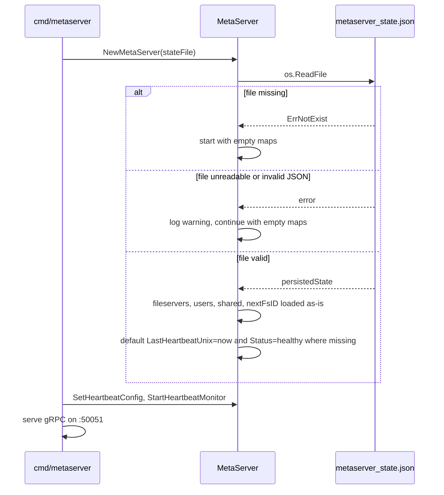
```mermaid
sequenceDiagram
    participant Main as cmd/metaserver
    participant MS as MetaServer
    participant File as metaserver_state.json

    Main->>MS: NewMetaServer(stateFile)
    MS->>File: os.ReadFile
    alt file missing
        File-->>MS: ErrNotExist
        MS->>MS: start with empty maps
    else file unreadable or invalid JSON
        File-->>MS: error
        MS->>MS: log warning, continue with empty maps
    else file valid
        File-->>MS: persistedState
        MS->>MS: fileservers, users, shared, nextFsID loaded as-is
        MS->>MS: default LastHeartbeatUnix=now and Status=healthy where missing
    end
    Main->>MS: SetHeartbeatConfig, StartHeartbeatMonitor
    Main->>Main: serve gRPC on :50051
```

### After

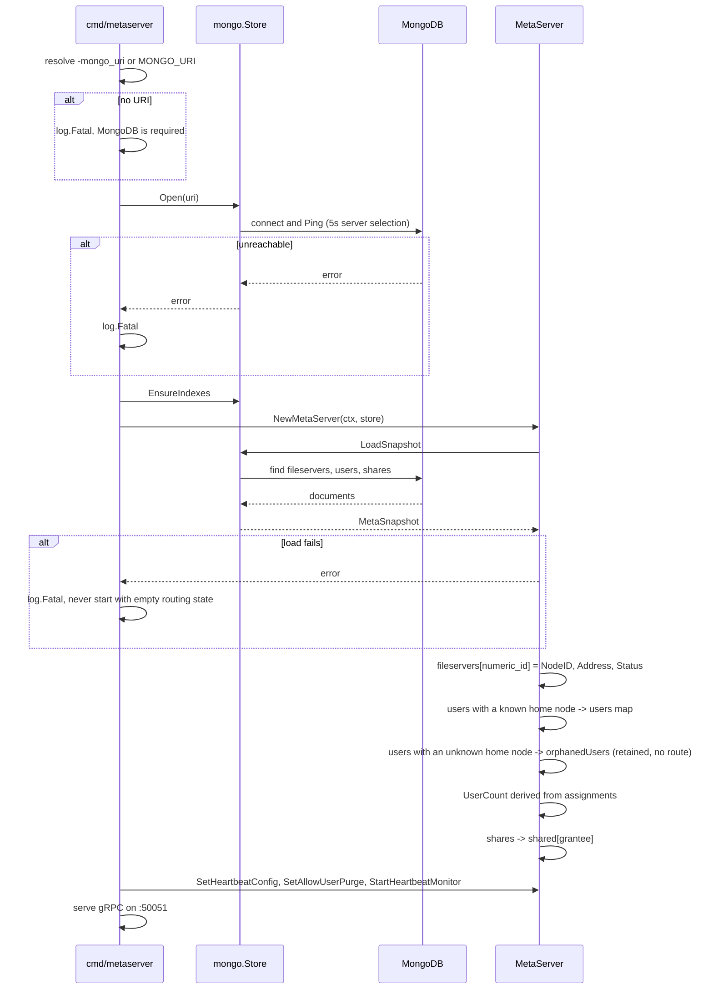
```mermaid
sequenceDiagram
    participant Main as cmd/metaserver
    participant Store as mongo.Store
    participant DB as MongoDB
    participant MS as MetaServer

    Main->>Main: resolve -mongo_uri or MONGO_URI
    alt no URI
        Main->>Main: log.Fatal, MongoDB is required
    end
    Main->>Store: Open(uri)
    Store->>DB: connect and Ping (5s server selection)
    alt unreachable
        DB-->>Store: error
        Store-->>Main: error
        Main->>Main: log.Fatal
    end
    Main->>Store: EnsureIndexes
    Main->>MS: NewMetaServer(ctx, store)
    MS->>Store: LoadSnapshot
    Store->>DB: find fileservers, users, shares
    DB-->>Store: documents
    Store-->>MS: MetaSnapshot
    alt load fails
        MS-->>Main: error
        Main->>Main: log.Fatal, never start with empty routing state
    end
    MS->>MS: fileservers[numeric_id] = NodeID, Address, Status
    MS->>MS: users with a known home node -> users map
    MS->>MS: users with an unknown home node -> orphanedUsers (retained, no route)
    MS->>MS: UserCount derived from assignments
    MS->>MS: shares -> shared[grantee]
    Main->>MS: SetHeartbeatConfig, SetAllowUserPurge, StartHeartbeatMonitor
    Main->>Main: serve gRPC on :50051
```

## 4. Fileserver registration

### Before

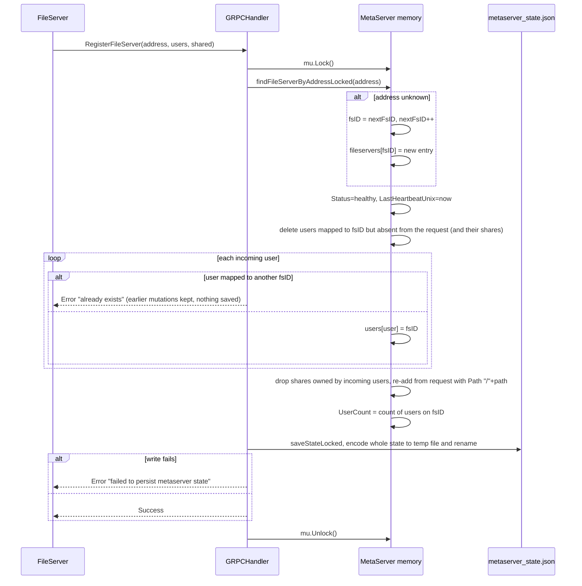
```mermaid
sequenceDiagram
    participant FS as FileServer
    participant H as GRPCHandler
    participant MS as MetaServer memory
    participant File as metaserver_state.json

    FS->>H: RegisterFileServer(address, users, shared)
    H->>MS: mu.Lock()
    H->>MS: findFileServerByAddressLocked(address)
    alt address unknown
        MS->>MS: fsID = nextFsID, nextFsID++
        MS->>MS: fileservers[fsID] = new entry
    end
    MS->>MS: Status=healthy, LastHeartbeatUnix=now
    MS->>MS: delete users mapped to fsID but absent from the request (and their shares)
    loop each incoming user
        alt user mapped to another fsID
            H-->>FS: Error "already exists" (earlier mutations kept, nothing saved)
        else
            MS->>MS: users[user] = fsID
        end
    end
    MS->>MS: drop shares owned by incoming users, re-add from request with Path "/"+path
    MS->>MS: UserCount = count of users on fsID
    H->>File: saveStateLocked, encode whole state to temp file and rename
    alt write fails
        H-->>FS: Error "failed to persist metaserver state"
    else
        H-->>FS: Success
    end
    H->>MS: mu.Unlock()
```

### After

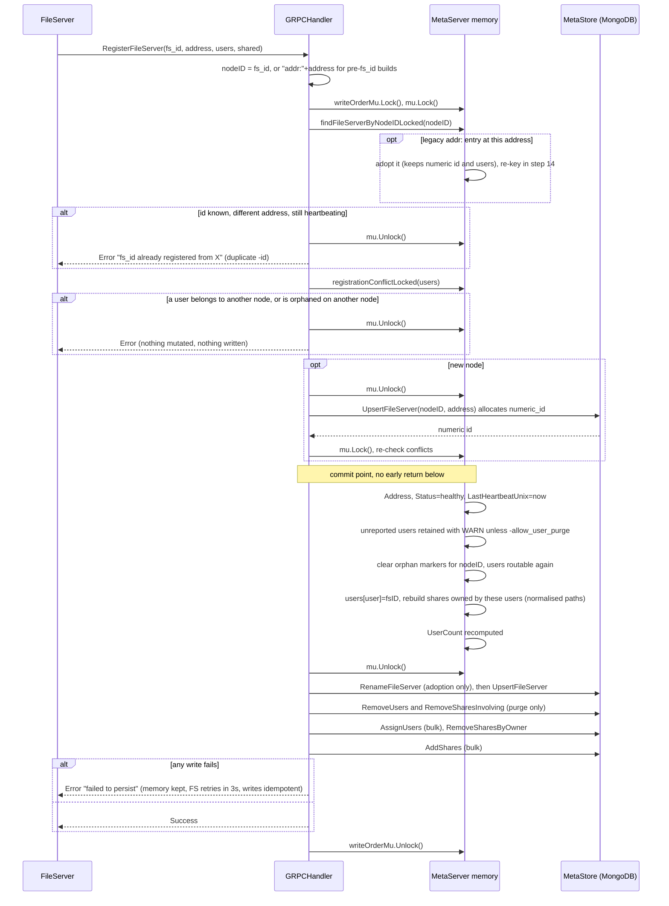
```mermaid
sequenceDiagram
    participant FS as FileServer
    participant H as GRPCHandler
    participant MS as MetaServer memory
    participant Store as MetaStore (MongoDB)

    FS->>H: RegisterFileServer(fs_id, address, users, shared)
    H->>H: nodeID = fs_id, or "addr:"+address for pre-fs_id builds
    H->>MS: writeOrderMu.Lock(), mu.Lock()
    H->>MS: findFileServerByNodeIDLocked(nodeID)
    opt legacy addr: entry at this address
        MS->>MS: adopt it (keeps numeric id and users), re-key in step 14
    end
    alt id known, different address, still heartbeating
        H->>MS: mu.Unlock()
        H-->>FS: Error "fs_id already registered from X" (duplicate -id)
    end
    H->>MS: registrationConflictLocked(users)
    alt a user belongs to another node, or is orphaned on another node
        H->>MS: mu.Unlock()
        H-->>FS: Error (nothing mutated, nothing written)
    end
    opt new node
        H->>MS: mu.Unlock()
        H->>Store: UpsertFileServer(nodeID, address) allocates numeric_id
        Store-->>H: numeric id
        H->>MS: mu.Lock(), re-check conflicts
    end
    Note over H,MS: commit point, no early return below
    MS->>MS: Address, Status=healthy, LastHeartbeatUnix=now
    MS->>MS: unreported users retained with WARN unless -allow_user_purge
    MS->>MS: clear orphan markers for nodeID, users routable again
    MS->>MS: users[user]=fsID, rebuild shares owned by these users (normalised paths)
    MS->>MS: UserCount recomputed
    H->>MS: mu.Unlock()
    H->>Store: RenameFileServer (adoption only), then UpsertFileServer
    H->>Store: RemoveUsers and RemoveSharesInvolving (purge only)
    H->>Store: AssignUsers (bulk), RemoveSharesByOwner
    H->>Store: AddShares (bulk)
    alt any write fails
        H-->>FS: Error "failed to persist" (memory kept, FS retries in 3s, writes idempotent)
    else
        H-->>FS: Success
    end
    H->>MS: writeOrderMu.Unlock()
```

## 5. Heartbeat and stale monitor

### Before

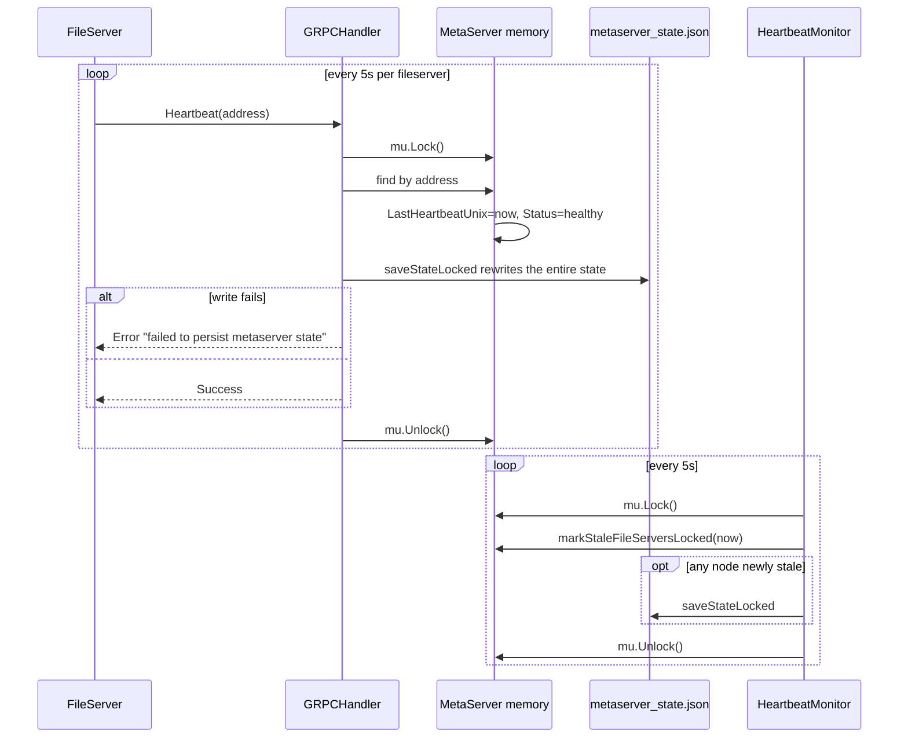
```mermaid
sequenceDiagram
    participant FS as FileServer
    participant H as GRPCHandler
    participant MS as MetaServer memory
    participant File as metaserver_state.json
    participant Mon as HeartbeatMonitor

    loop every 5s per fileserver
        FS->>H: Heartbeat(address)
        H->>MS: mu.Lock()
        H->>MS: find by address
        MS->>MS: LastHeartbeatUnix=now, Status=healthy
        H->>File: saveStateLocked rewrites the entire state
        alt write fails
            H-->>FS: Error "failed to persist metaserver state"
        else
            H-->>FS: Success
        end
        H->>MS: mu.Unlock()
    end

    loop every 5s
        Mon->>MS: mu.Lock()
        Mon->>MS: markStaleFileServersLocked(now)
        opt any node newly stale
            Mon->>File: saveStateLocked
        end
        Mon->>MS: mu.Unlock()
    end
```

### After

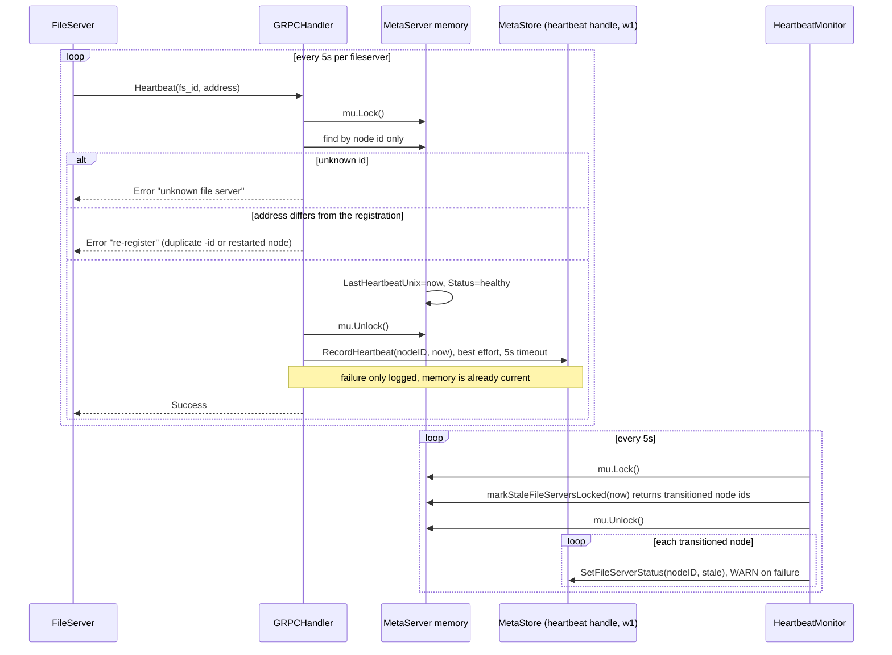
```mermaid
sequenceDiagram
    participant FS as FileServer
    participant H as GRPCHandler
    participant MS as MetaServer memory
    participant Store as MetaStore (heartbeat handle, w1)
    participant Mon as HeartbeatMonitor

    loop every 5s per fileserver
        FS->>H: Heartbeat(fs_id, address)
        H->>MS: mu.Lock()
        H->>MS: find by node id only
        alt unknown id
            H-->>FS: Error "unknown file server"
        else address differs from the registration
            H-->>FS: Error "re-register" (duplicate -id or restarted node)
        else
            MS->>MS: LastHeartbeatUnix=now, Status=healthy
            H->>MS: mu.Unlock()
            H->>Store: RecordHeartbeat(nodeID, now), best effort, 5s timeout
            Note over H,Store: failure only logged, memory is already current
            H-->>FS: Success
        end
    end

    loop every 5s
        Mon->>MS: mu.Lock()
        Mon->>MS: markStaleFileServersLocked(now) returns transitioned node ids
        Mon->>MS: mu.Unlock()
        loop each transitioned node
            Mon->>Store: SetFileServerStatus(nodeID, stale), WARN on failure
        end
    end
```

## 6. First login: GetRoots

### Before

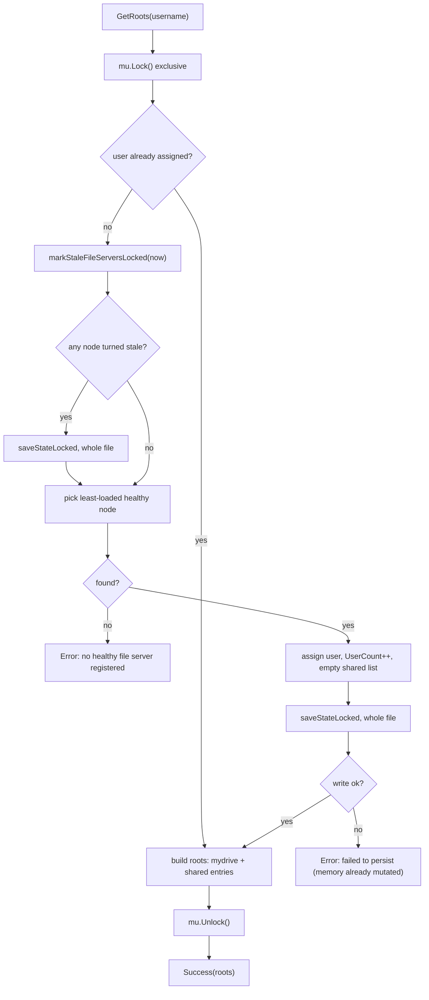
```mermaid
flowchart TD
    A["GetRoots(username)"] --> B["mu.Lock() exclusive"]
    B --> C{"user already assigned?"}
    C -->|yes| R["build roots: mydrive + shared entries"]
    C -->|no| D["markStaleFileServersLocked(now)"]
    D --> E{"any node turned stale?"}
    E -->|yes| F["saveStateLocked, whole file"]
    F --> G["pick least-loaded healthy node"]
    E -->|no| G
    G --> Hh{"found?"}
    Hh -->|no| X1["Error: no healthy file server registered"]
    Hh -->|yes| I["assign user, UserCount++, empty shared list"]
    I --> J["saveStateLocked, whole file"]
    J --> K{"write ok?"}
    K -->|no| X2["Error: failed to persist (memory already mutated)"]
    K -->|yes| R
    R --> U["mu.Unlock()"]
    U --> Z["Success(roots)"]
```

### After

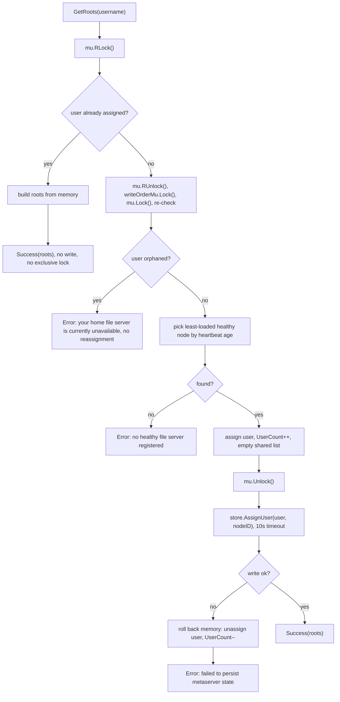
```mermaid
flowchart TD
    A["GetRoots(username)"] --> B["mu.RLock()"]
    B --> C{"user already assigned?"}
    C -->|yes| R1["build roots from memory"]
    R1 --> Z1["Success(roots), no write, no exclusive lock"]
    C -->|no| D["mu.RUnlock(), writeOrderMu.Lock(), mu.Lock(), re-check"]
    D --> O{"user orphaned?"}
    O -->|yes| X0["Error: your home file server is currently unavailable, no reassignment"]
    O -->|no| G["pick least-loaded healthy node by heartbeat age"]
    G --> Hh{"found?"}
    Hh -->|no| X1["Error: no healthy file server registered"]
    Hh -->|yes| I["assign user, UserCount++, empty shared list"]
    I --> U["mu.Unlock()"]
    U --> W["store.AssignUser(user, nodeID), 10s timeout"]
    W --> K{"write ok?"}
    K -->|no| RB["roll back memory: unassign user, UserCount--"]
    RB --> X2["Error: failed to persist metaserver state"]
    K -->|yes| Z2["Success(roots)"]
```

## 7. Navigate

### Before

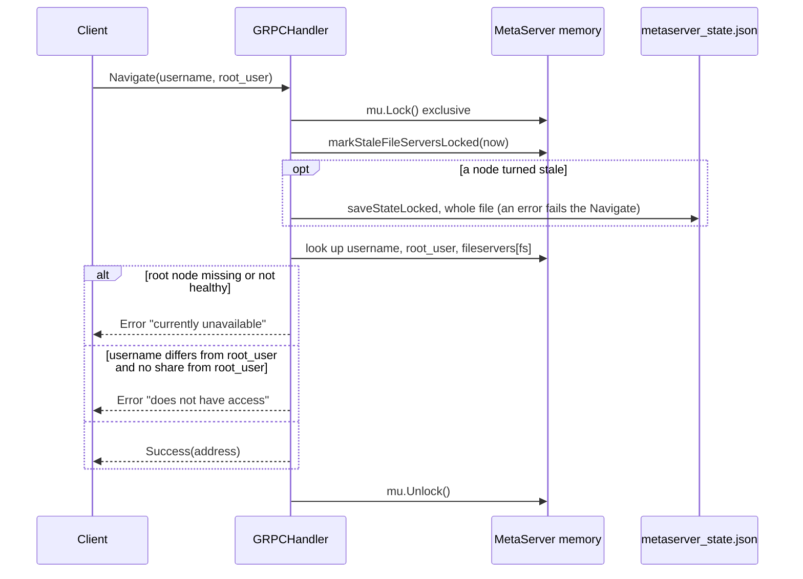
```mermaid
sequenceDiagram
    participant C as Client
    participant H as GRPCHandler
    participant MS as MetaServer memory
    participant File as metaserver_state.json

    C->>H: Navigate(username, root_user)
    H->>MS: mu.Lock() exclusive
    H->>MS: markStaleFileServersLocked(now)
    opt a node turned stale
        H->>File: saveStateLocked, whole file (an error fails the Navigate)
    end
    H->>MS: look up username, root_user, fileservers[fs]
    alt root node missing or not healthy
        H-->>C: Error "currently unavailable"
    else username differs from root_user and no share from root_user
        H-->>C: Error "does not have access"
    else
        H-->>C: Success(address)
    end
    H->>MS: mu.Unlock()
```

### After

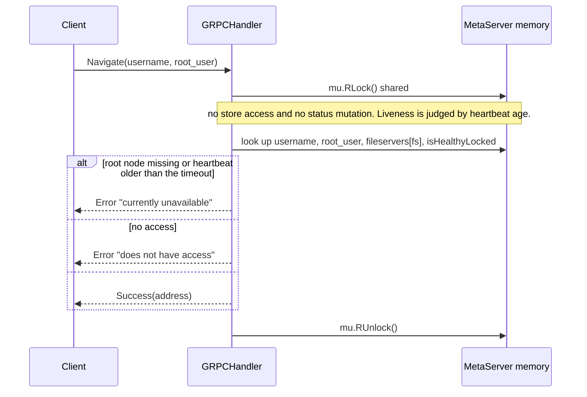
```mermaid
sequenceDiagram
    participant C as Client
    participant H as GRPCHandler
    participant MS as MetaServer memory

    C->>H: Navigate(username, root_user)
    H->>MS: mu.RLock() shared
    Note over H,MS: no store access and no status mutation. Liveness is judged by heartbeat age.
    H->>MS: look up username, root_user, fileservers[fs], isHealthyLocked
    alt root node missing or heartbeat older than the timeout
        H-->>C: Error "currently unavailable"
    else no access
        H-->>C: Error "does not have access"
    else
        H-->>C: Success(address)
    end
    H->>MS: mu.RUnlock()
```

## 8. Share and unshare

### Before

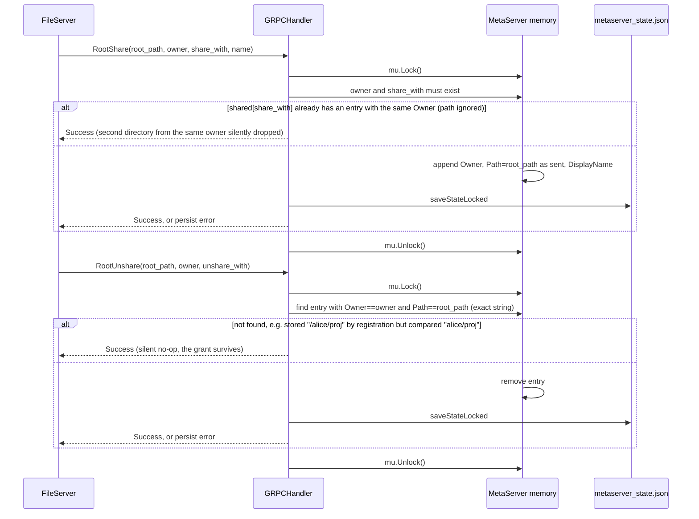
```mermaid
sequenceDiagram
    participant FS as FileServer
    participant H as GRPCHandler
    participant MS as MetaServer memory
    participant File as metaserver_state.json

    FS->>H: RootShare(root_path, owner, share_with, name)
    H->>MS: mu.Lock()
    H->>MS: owner and share_with must exist
    alt shared[share_with] already has an entry with the same Owner (path ignored)
        H-->>FS: Success (second directory from the same owner silently dropped)
    else
        MS->>MS: append Owner, Path=root_path as sent, DisplayName
        H->>File: saveStateLocked
        H-->>FS: Success, or persist error
    end
    H->>MS: mu.Unlock()

    FS->>H: RootUnshare(root_path, owner, unshare_with)
    H->>MS: mu.Lock()
    H->>MS: find entry with Owner==owner and Path==root_path (exact string)
    alt not found, e.g. stored "/alice/proj" by registration but compared "alice/proj"
        H-->>FS: Success (silent no-op, the grant survives)
    else
        MS->>MS: remove entry
        H->>File: saveStateLocked
        H-->>FS: Success, or persist error
    end
    H->>MS: mu.Unlock()
```

### After

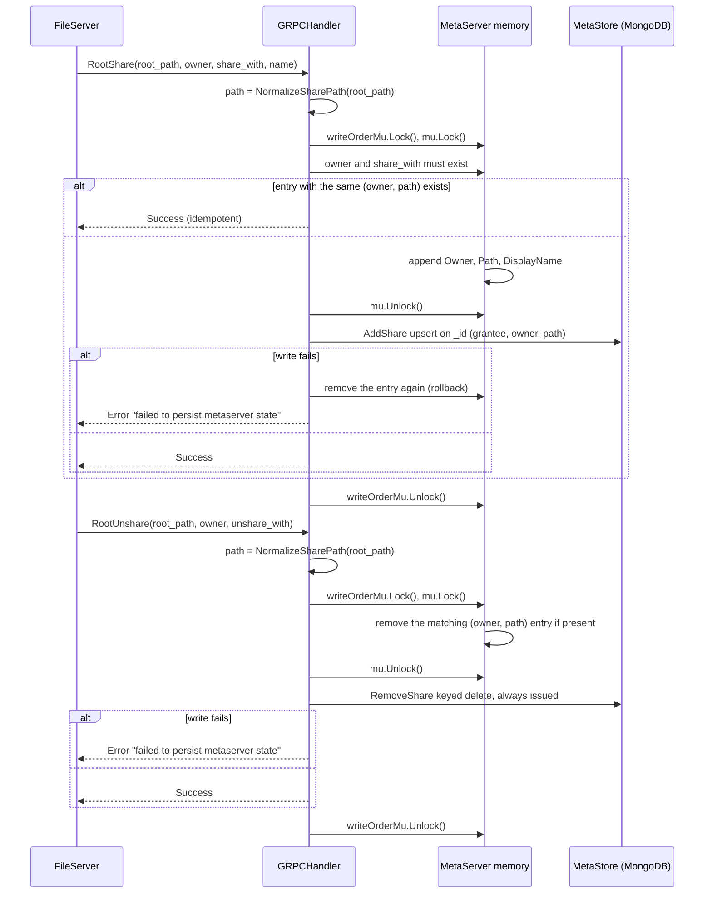
```mermaid
sequenceDiagram
    participant FS as FileServer
    participant H as GRPCHandler
    participant MS as MetaServer memory
    participant Store as MetaStore (MongoDB)

    FS->>H: RootShare(root_path, owner, share_with, name)
    H->>H: path = NormalizeSharePath(root_path)
    H->>MS: writeOrderMu.Lock(), mu.Lock()
    H->>MS: owner and share_with must exist
    alt entry with the same (owner, path) exists
        H-->>FS: Success (idempotent)
    else
        MS->>MS: append Owner, Path, DisplayName
        H->>MS: mu.Unlock()
        H->>Store: AddShare upsert on _id (grantee, owner, path)
        alt write fails
            H->>MS: remove the entry again (rollback)
            H-->>FS: Error "failed to persist metaserver state"
        else
            H-->>FS: Success
        end
    end
    H->>MS: writeOrderMu.Unlock()

    FS->>H: RootUnshare(root_path, owner, unshare_with)
    H->>H: path = NormalizeSharePath(root_path)
    H->>MS: writeOrderMu.Lock(), mu.Lock()
    MS->>MS: remove the matching (owner, path) entry if present
    H->>MS: mu.Unlock()
    H->>Store: RemoveShare keyed delete, always issued
    alt write fails
        H-->>FS: Error "failed to persist metaserver state"
    else
        H-->>FS: Success
    end
    H->>MS: writeOrderMu.Unlock()
```

## 9. Deregister a fileserver

### Before

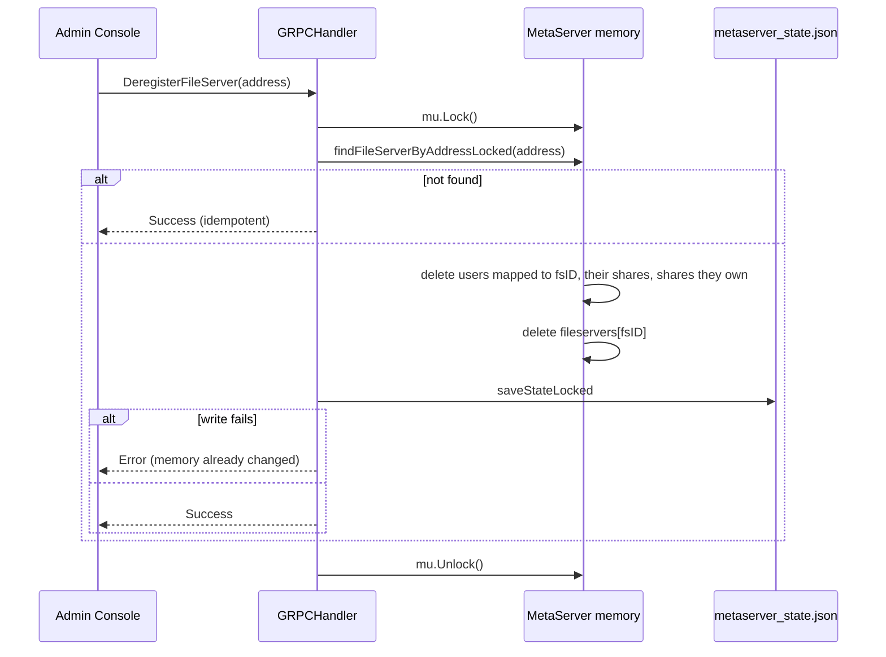
```mermaid
sequenceDiagram
    participant A as Admin Console
    participant H as GRPCHandler
    participant MS as MetaServer memory
    participant File as metaserver_state.json

    A->>H: DeregisterFileServer(address)
    H->>MS: mu.Lock()
    H->>MS: findFileServerByAddressLocked(address)
    alt not found
        H-->>A: Success (idempotent)
    else
        MS->>MS: delete users mapped to fsID, their shares, shares they own
        MS->>MS: delete fileservers[fsID]
        H->>File: saveStateLocked
        alt write fails
            H-->>A: Error (memory already changed)
        else
            H-->>A: Success
        end
    end
    H->>MS: mu.Unlock()
```

### After

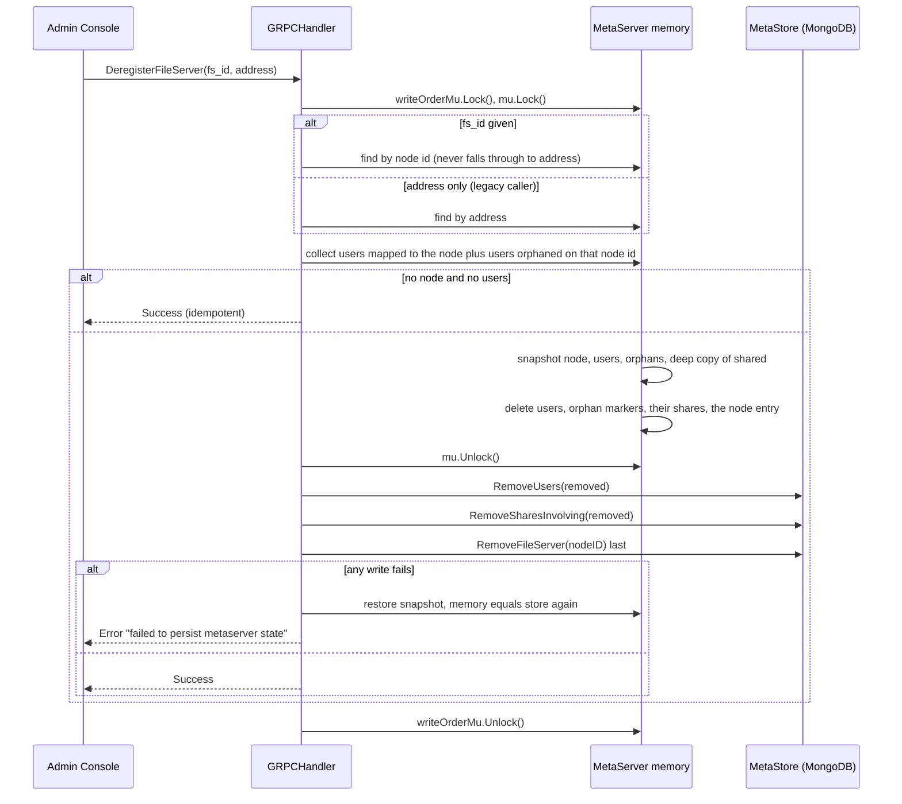
```mermaid
sequenceDiagram
    participant A as Admin Console
    participant H as GRPCHandler
    participant MS as MetaServer memory
    participant Store as MetaStore (MongoDB)

    A->>H: DeregisterFileServer(fs_id, address)
    H->>MS: writeOrderMu.Lock(), mu.Lock()
    alt fs_id given
        H->>MS: find by node id (never falls through to address)
    else address only (legacy caller)
        H->>MS: find by address
    end
    H->>MS: collect users mapped to the node plus users orphaned on that node id
    alt no node and no users
        H-->>A: Success (idempotent)
    else
        MS->>MS: snapshot node, users, orphans, deep copy of shared
        MS->>MS: delete users, orphan markers, their shares, the node entry
        H->>MS: mu.Unlock()
        H->>Store: RemoveUsers(removed)
        H->>Store: RemoveSharesInvolving(removed)
        H->>Store: RemoveFileServer(nodeID) last
        alt any write fails
            H->>MS: restore snapshot, memory equals store again
            H-->>A: Error "failed to persist metaserver state"
        else
            H-->>A: Success
        end
    end
    H->>MS: writeOrderMu.Unlock()
```

## 10. Admin Console cluster refresh

### Before

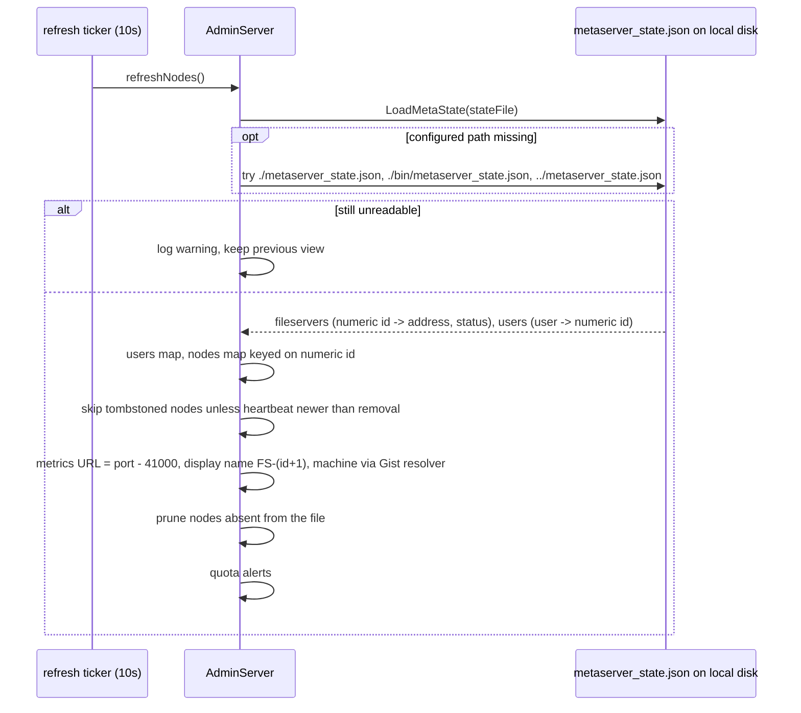
```mermaid
sequenceDiagram
    participant T as refresh ticker (10s)
    participant A as AdminServer
    participant File as metaserver_state.json on local disk

    T->>A: refreshNodes()
    A->>File: LoadMetaState(stateFile)
    opt configured path missing
        A->>File: try ./metaserver_state.json, ./bin/metaserver_state.json, ../metaserver_state.json
    end
    alt still unreadable
        A->>A: log warning, keep previous view
    else
        File-->>A: fileservers (numeric id -> address, status), users (user -> numeric id)
        A->>A: users map, nodes map keyed on numeric id
        A->>A: skip tombstoned nodes unless heartbeat newer than removal
        A->>A: metrics URL = port - 41000, display name FS-(id+1), machine via Gist resolver
        A->>A: prune nodes absent from the file
        A->>A: quota alerts
    end
```

### After

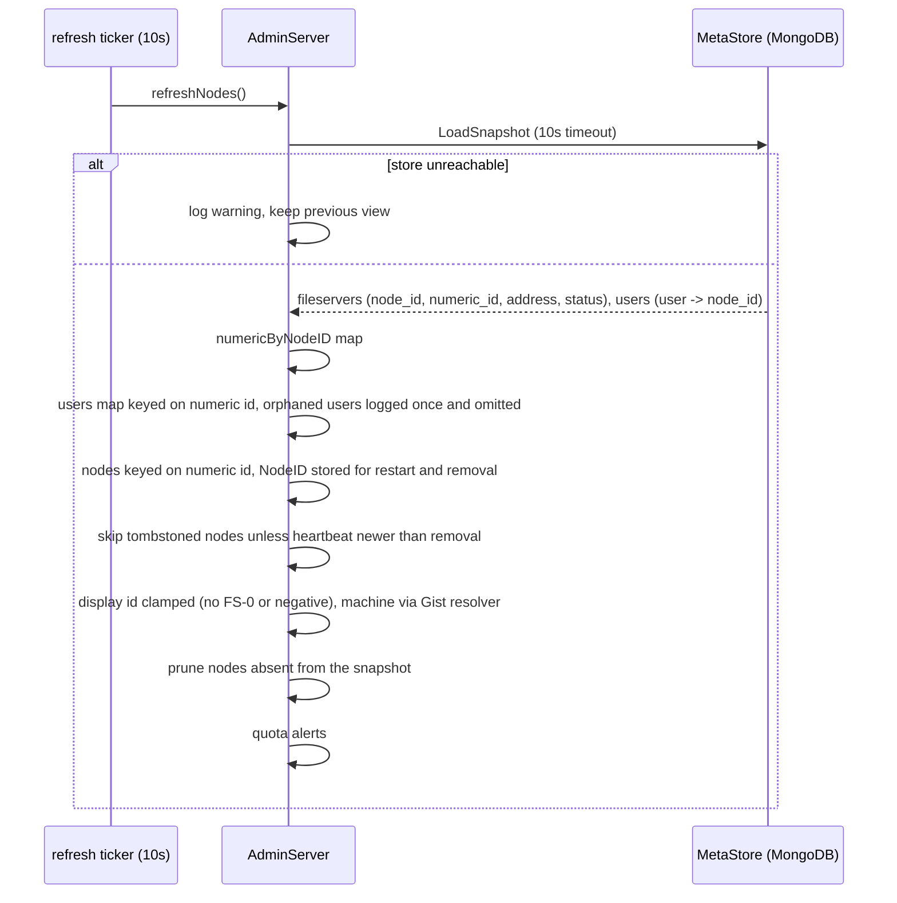
```mermaid
sequenceDiagram
    participant T as refresh ticker (10s)
    participant A as AdminServer
    participant Store as MetaStore (MongoDB)

    T->>A: refreshNodes()
    A->>Store: LoadSnapshot (10s timeout)
    alt store unreachable
        A->>A: log warning, keep previous view
    else
        Store-->>A: fileservers (node_id, numeric_id, address, status), users (user -> node_id)
        A->>A: numericByNodeID map
        A->>A: users map keyed on numeric id, orphaned users logged once and omitted
        A->>A: nodes keyed on numeric id, NodeID stored for restart and removal
        A->>A: skip tombstoned nodes unless heartbeat newer than removal
        A->>A: display id clamped (no FS-0 or negative), machine via Gist resolver
        A->>A: prune nodes absent from the snapshot
        A->>A: quota alerts
    end
```

## 11. Admin Console node removal

### Before

```mermaid
flowchart TD
    A["DELETE /api/nodes/:id"] --> B{"node in the console list?"}
    B -->|no| N404["404 not found"]
    B -->|yes| C["hide node: remove from a.nodes, tombstone, drop its users"]
    C --> D["RemoveNodeFromMetaStateFile: edit metaserver_state.json on disk"]
    D --> E{"metaserver address known?<br>(flag, env, or Gist discovery)"}
    E -->|no| S1["200 success (node hidden, cluster still routes to it)"]
    E -->|yes| F["DeregisterFileServer(address)"]
    F --> G{"RPC ok?"}
    G -->|no| S2["200 success with metaserver_warning"]
    G -->|yes| S3["200 success"]
```

### After

```mermaid
flowchart TD
    A["DELETE /api/nodes/:id"] --> B{"node in the console list?"}
    B -->|no| B2{"metaserver address configured?"}
    B2 -->|no| N404["404 not found"]
    B2 -->|yes| R["DeregisterFileServer(fs_id = :id) releases users orphaned on an unlisted node"]
    R --> R1{"RPC ok?"}
    R1 -->|no| E502a["502 metaserver deregister failed"]
    R1 -->|yes| S0["200 success, released_only = true"]
    B -->|yes| C{"metaserver address known?<br>(flag, env, or Gist discovery)"}
    C -->|no| W["warning: hidden from this console only, cluster not changed"]
    C -->|yes| F["DeregisterFileServer(fs_id = node.NodeID, address = node.Address)"]
    F --> G{"RPC ok?"}
    G -->|no| E502["502, node left visible"]
    G -->|yes| Hh["hide node: remove from a.nodes, tombstone, drop its users"]
    W --> Hh
    Hh --> S["200 success (plus metaserver_warning if any)"]
```

## 12. Admin Console SSH restart, binary mode

### Before

```mermaid
flowchart LR
    A["Admin: restart in binary mode"] --> B["ssh to node"]
    B --> C["kill old process"]
    C --> D["nohup bin/metaserver -port=50051 -state_file=REPO/bin/metaserver_state.json"]
    C --> E["nohup bin/admin -port=8080 -state_file=REPO/bin/metaserver_state.json"]
    C --> F["nohup bin/fileserver -id=NUMERIC_KEY ... (the console's numeric id, not the real -id)"]
```

### After

```mermaid
flowchart LR
    A["Admin: restart in binary mode"] --> B["ssh to node"]
    B --> T{"target"}
    T -->|"metaserver, admin, all"| L["source ~/.profile and ~/.bashrc"]
    L --> R{"MONGO_URI set on that host?"}
    R -->|no| X["refuse: exit 1 with a clear message"]
    R -->|yes| C["kill old process"]
    C --> D["nohup bin/metaserver -port=50051 (reads MONGO_URI itself)"]
    C --> E["nohup bin/admin -port=8080 (reads MONGO_URI itself)"]
    T -->|"fileserver"| C2["kill old process"]
    C2 --> F["nohup bin/fileserver -id=NodeID ... (shell-quoted stable id)"]
    C --> F
    D -.-> Hh["command history shows any URI with the password redacted"]
```

## 13. Behaviour during a MongoDB outage (after only)

```mermaid
flowchart TD
    S["MongoDB unreachable or a primary election is in progress"] --> A{"operation"}
    A -->|"GetRoots for a known user, Navigate"| A1["served from memory, unaffected"]
    A -->|"Heartbeat"| A2["memory updated, store write logged as WARN, RPC succeeds"]
    A -->|"stale transition"| A3["memory updated, SetFileServerStatus logged as WARN"]
    A -->|"first login (AssignUser)"| A4["fail closed: memory rolled back, client gets an error and retries later"]
    A -->|"RootShare"| A5["fail closed: entry removed from memory, error returned"]
    A -->|"RootUnshare"| A6["error returned, memory entry already removed, idempotent delete can be retried"]
    A -->|"RegisterFileServer"| A7["error returned, memory kept, fileserver retries every 3s with idempotent writes"]
    A -->|"DeregisterFileServer"| A8["fail closed: snapshot restored, 502 to the admin"]
    A -->|"metaserver start"| A9["fatal exit, never start with empty routing state"]
    A -->|"admin refresh"| A10["warning, console keeps its last view"]
```

## 14. User lifecycle (after only)

```mermaid
stateDiagram-v2
    [*] --> Unknown
    Unknown --> Assigned : GetRoots picks the least-loaded healthy node and AssignUser is written
    Unknown --> Assigned : a node registers reporting the user
    Assigned --> Assigned : node heartbeats, Navigate routes
    Assigned --> Unroutable : node stale, heartbeat older than 30s, Navigate says unavailable
    Unroutable --> Assigned : heartbeat resumes
    Assigned --> Orphaned : metaserver restarts while the node has no record in the store
    Orphaned --> Assigned : a node with that fs_id registers again, user list not required
    Orphaned --> Orphaned : GetRoots refused, no reassignment
    Orphaned --> Unknown : DeregisterFileServer with that fs_id releases the user
    Assigned --> Unknown : DeregisterFileServer of the home node
```

## 15. Lock ordering (after only)

```mermaid
flowchart LR
    subgraph Structural["Structural writers: Register, first-login GetRoots, RootShare, RootUnshare, Deregister"]
        W1["1. writeOrderMu.Lock()"] --> W2["2. mu.Lock() and mutate memory"]
        W2 --> W3["3. mu.Unlock()"]
        W3 --> W4["4. store writes in memory order"]
        W4 --> W5["5. writeOrderMu.Unlock()"]
    end
    subgraph Readers["Readers: Navigate, GetRoots for known users"]
        R1["mu.RLock() only, never wait on the store"]
    end
    subgraph Liveness["Heartbeat and stale monitor"]
        L1["mu.Lock() briefly, then best-effort store write, writeOrderMu skipped"]
    end
```
