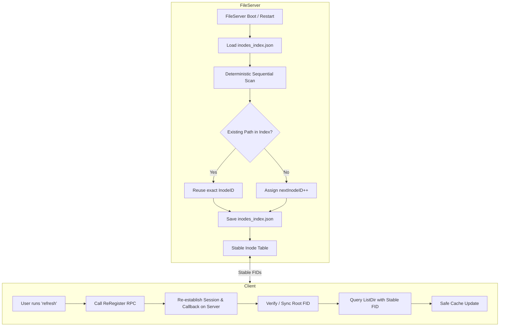

# Fileserver Restart Cache Recovery & Inode Persistence Plan

## 1. The Problem: What This Plan Solves

### Observed Behavior
When a fileserver is restarted (either manually, via `systemctl restart dvfs-fileserver`, or through the Admin Console), an actively connected client experiences cache corruption and directory desynchronization:

```text
dvfs> ls
Name                 Type             Size
----                 ----             ----
.trash               dir                 0
proj.c3p             file         28692060

[ Fileserver restarts in background ]

dvfs> refresh
Current directory cache refreshed.

dvfs> ls
(empty directory)

dvfs> pwd
mydrive

dvfs> ls
(empty directory)

dvfs> cd ..
Returning to metaserver root selection...
Select root [1-1] or 0 to exit: 1
Connecting to server at 10.7.0.169:50052 as user jassi...
Connected successfully! Root FID: fs1_2_1

Cache Structure:
- mydrive (directory)
  - .trash (directory)
  - proj.c3p (file (cached: false))

dvfs> ls
Name                 Type             Size
----                 ----             ----
.trash               dir                 0
proj.c3p             file         28692060
```

### What Went Wrong?
1. **Before Restart**: The client was connected to the fileserver and held an in-memory `FID` for its root directory (e.g., `fs1_0_1`).
2. **During Restart**: The fileserver cleared all in-memory state and re-scanned the disk using `FileScanner.loadExistingData`. Inode IDs were generated on the fly starting from `0`. Because user directories were scanned in parallel goroutines, the user `jassi` was assigned **`fs1_2_1`** instead of `fs1_0_1`, and `fs1_0_1` was assigned to a different (empty) entry.
3. **During `refresh`**: The client sent `ListDir(fs1_0_1)` using its stale FID. The restarted fileserver found `fs1_0_1`, which was an empty folder, and returned `Success: true, Entries: []` (0 files).
4. **Cache Wipeout**: Because the fileserver reported success with 0 files, the client's `populateCurrentDirCache()` replaced its valid local cache (`proj.c3p`, `.trash`) with an empty children map.
5. **Recovery Only on Reconnect**: When the user typed `cd ..` and re-selected `mydrive`, the client called `c.serverConn.RegisterClient(...)`, receiving the newly assigned root FID `fs1_2_1`. Only then did the directory contents reappear.

---

## 2. Technical Root Cause Analysis

### Root Cause 1: InodeIDs are Volatile & Non-Deterministic Across Restarts

**File**: [`filescanner.go`](file:///C:/Users/GSRAJA/Desktop/IIT%20GN/DVFS_project/Distributed-Virtual-File-System/internal/fileserver/filescanner.go) lines 20-97

**Issue A — Non-Deterministic Goroutines**:
```go
for _, entry := range entries {
    if entry.IsDir() {
        go func(entry os.DirEntry) error {
            ...
            atomic.AddUint64(nextInodeID, 1)
            (*users)[username] = userRootFID
            (*inodes)[userRootFID.String()] = userRootInode
```
Scanning uses unsynchronized parallel goroutines. Depending on thread scheduling, on one boot `jassi` gets Inode `0`, on the next boot `jassi` gets Inode `2`.

**Issue B — Map Race Conditions**:
`(*inodes)` and `(*users)` maps are written concurrently by multiple goroutines without a mutex. Go maps are NOT safe for concurrent writes — this is an actual **data race** that could cause a runtime panic (not just incorrect data).

**Issue C — No Persistence**:
Unlike other state (quotas via `quota_config.json`, shares via `fileserver_shares.json`), inode IDs have no persistent storage. Every restart generates fresh IDs from scratch.

### Root Cause 2: Client Session Loss & Stale FID Retention

**File**: [`cache_handler.go`](file:///C:/Users/GSRAJA/Desktop/IIT%20GN/DVFS_project/Distributed-Virtual-File-System/internal/client/cache_handler.go)

1. **Session Eviction**: When the fileserver restarts, its in-memory `fs.sessions` table is wiped. The client's callback address is lost, disabling real-time cache invalidation.
2. **No Re-Registration on Refresh**: [`Refresh()`](file:///C:/Users/GSRAJA/Desktop/IIT%20GN/DVFS_project/Distributed-Virtual-File-System/internal/client/cache_handler.go#L306-L311) simply calls `populateCurrentDirCache()` which calls `ListFilesAt(c.curr.fid)` using the old FID — it never re-registers the session.
3. **Destructive Cache Update on Stale-FID Success**: [`populateCurrentDirCache()`](file:///C:/Users/GSRAJA/Desktop/IIT%20GN/DVFS_project/Distributed-Virtual-File-System/internal/client/cache_handler.go#L340-L376) receives `[]` entries from the server (because the stale FID now points to a wrong/empty folder) and **unconditionally replaces** the `c.curr.children` map (line 374), wiping the client's valid cached data.

### Root Cause 3: ListDirectory Silently Succeeds for Wrong Inodes

**File**: [`fileserver.go`](file:///C:/Users/GSRAJA/Desktop/IIT%20GN/DVFS_project/Distributed-Virtual-File-System/internal/fileserver/fileserver.go#L1079-L1100)

[`ListDirectory()`](file:///C:/Users/GSRAJA/Desktop/IIT%20GN/DVFS_project/Distributed-Virtual-File-System/internal/fileserver/fileserver.go#L1079) looks up the FID in `fs.inodes`. After restart, the old FID `fs1_0_1` still exists in the map (assigned to a different user's directory). So the server returns **success with empty entries** instead of an error, which is the core reason the client blindly accepts the empty result.

---

## 3. Architecture & Proposed Solution



### Core Design Goals
1. **Persistent Inode Store**: Every file and folder on the fileserver retains its **exact same InodeID** across restarts, crashes, and reboots.
2. **Stable FIDs**: The root FID (e.g. `fs1_0_1`) and all child file FIDs issued to clients remain 100% valid after a server restart.
3. **Automatic Session Restoration**: Client `Refresh()` re-registers with the server, restoring the server-side session and callbacks seamlessly without requiring `cd ..`.
4. **Safe Cache Fallback**: If directory fetching fails or returns an error, existing local cache is never blindly destroyed.

---

## 4. Issues Found in the Original Plan & Fixes

> [!IMPORTANT]
> This section documents specific issues identified by verifying the original plan against the actual codebase.

### Issue 1: `TrashFile` Renames Files — InodeStore Path Keys Become Stale

**Problem**: The plan's `InodeStore` maps relative paths (`jassi/proj.c3p`) to inode IDs. When `TrashFile()` moves a file from `jassi/proj.c3p` → `jassi/.trash/proj.c3p`, the file's OS path changes but its **FID remains the same** (lines 576-579 of `fileserver.go`). The plan mentions `Rename(oldPath, newPath)` but doesn't explain that **every call site** in `TrashFile`, `RestoreFile`, and `updateSubtreePathsLocked` must update the InodeStore paths for the **entire subtree**, not just the top-level item.

**Fix**: The `InodeStore.Rename()` method must handle subtree renames. When moving `jassi/mydir` → `jassi/.trash/mydir`, it needs to also rename `jassi/mydir/file1.txt` → `jassi/.trash/mydir/file1.txt` in the index. Add a `RenamePrefix(oldPrefix, newPrefix string)` method. Call sites in `TrashFile` (line 579) and `RestoreFile` (line 654) must both call `inodeStore.RenamePrefix(oldRelPath, newRelPath)` after `updateSubtreePathsLocked`.

### Issue 2: `BFS scanUserDirectory` Also Needs InodeStore Integration

**Problem**: The original plan focuses on `loadExistingData` (top-level user dirs) but the inner BFS scanner [`scanUserDirectory()`](file:///C:/Users/GSRAJA/Desktop/IIT%20GN/DVFS_project/Distributed-Virtual-File-System/internal/fileserver/filescanner.go#L103-L218) is where the **majority of inodes are created** (all files and subdirectories). This function uses `*nextInodeID` directly (line 130) and must also use `InodeStore.GetOrAssign()`.

**Fix**: Update `scanUserDirectory` to compute `relPath` (already done on line 146 for ACL loading) and use `scanner.fs.inodeStore.GetOrAssign(relPath)` instead of `*nextInodeID`. Remove the `atomic.AddUint64(nextInodeID, 1)` on line 208.

### Issue 3: FileScanner Doesn't Have Access to `InodeStore`

**Problem**: `FileScanner` struct (line 13-17) only has `rootDir`, `serverID`, and `fs *FileServer`. The plan says `scanner.fs.inodeStore.GetOrAssign(relPath)` — but this requires `inodeStore` to be initialized on `FileServer` **before** the scanner runs. Looking at [`NewFileServer`](file:///C:/Users/GSRAJA/Desktop/IIT%20GN/DVFS_project/Distributed-Virtual-File-System/internal/fileserver/fileserver.go#L55-L104), the scanner runs at line 80, and `inodeStore` must be created before that.

**Fix**: Initialize `fs.inodeStore = NewInodeStore(rootDir)` in `NewFileServer` **before** line 78 (the `FileScanner` creation). This is straightforward, just needs to be done in the right order:
```go
fs.inodeStore, err = NewInodeStore(rootDir)
if err != nil {
    return nil, fmt.Errorf("failed to initialize inode store: %w", err)
}
fileScanner := &FileScanner{rootDir: rootDir, serverID: serverID, fs: fs}
```

### Issue 4: `getOrCreateTrashDirLocked` Also Uses Raw `nextInodeID`

**Problem**: [`getOrCreateTrashDirLocked()`](file:///C:/Users/GSRAJA/Desktop/IIT%20GN/DVFS_project/Distributed-Virtual-File-System/internal/fileserver/fileserver.go#L216-L263) creates trash directory inodes using `fs.nextInodeID` (line 240) and `atomic.AddUint64` (line 243). The original plan mentions this but doesn't address that the trash relPath must be `<username>/.trash`.

**Fix**: Replace lines 238-243 with:
```go
trashRelPath := filepath.Join(root_user, trashDirName)
trashInodeID := fs.inodeStore.GetOrAssign(trashRelPath)
trashFID := &domain.FID{
    FileServerID:     fs.serverID,
    InodeID:          trashInodeID,
    GenerationNumber: 1,
}
```
And call `fs.inodeStore.Save()` after.

### Issue 5: Client `ReRegister()` Doesn't Handle Non-Root Current Directory

**Problem**: The proposed `ReRegister()` only updates `c.cacheHandler.root.fid` and checks `if c.cacheHandler.curr == c.cacheHandler.root`. But if the user has `cd`'d into a subdirectory (e.g., `mydrive/subdir`), the **current directory's FID is also stale**. The plan doesn't re-fetch the current directory's new FID.

**Fix**: With Part A (persistent inode IDs), if properly implemented, **FIDs don't change across restarts**, so this is a non-issue — the current directory FID will still be valid. However, the `ReRegister()` should still verify the root FID matches, and if it doesn't (e.g., the inode store was manually deleted), the client must navigate back to root:
```go
func (c *Client) ReRegister() error {
    if c.serverConn == nil {
        return fmt.Errorf("not connected to fileserver")
    }
    resp, err := c.serverConn.RegisterClient(context.Background(), &pb.RegisterClientRequest{
        ClientId:        c.clientID,
        CallbackAddress: c.callbackAddr,
        Username:        c.username,
        RootUser:        c.root_user,
        RootPath:        c.root_path,
    })
    if err != nil {
        return fmt.Errorf("re-registration RPC failed: %w", err)
    }
    if !resp.Success {
        return fmt.Errorf("re-registration failed: %s", resp.Error)
    }

    newRootFID := domain.FIDFromProto(resp.UserRootFid)
    if newRootFID == nil {
        return fmt.Errorf("server returned nil root FID")
    }

    // Update root FID (should be unchanged if inode persistence works)
    c.rootFID = newRootFID
    if c.cacheHandler != nil && c.cacheHandler.root != nil {
        c.cacheHandler.root.fid = newRootFID
    }
    return nil
}
```

### Issue 6: `populateCurrentDirCache` Doesn't Guard Against Server Errors

**Problem**: If `ListFilesAt` returns an RPC error (e.g., server is mid-restart, connection refused), the current code (line 342-344) returns the error **but also short-circuits before replacing children**. This is actually safe. However, if the server returns `Success: true` with 0 entries (stale FID pointing to a real empty directory), the cache is wiped. The plan says "If it still fails, return the error without overwriting" — but the dangerous case is a **successful but wrong** response, not a failure.

**Fix**: With persistent inode IDs (Part A), this problem is eliminated because FIDs don't change. As a defense-in-depth measure, add a warning log when `populateCurrentDirCache` receives 0 entries but the existing cache has entries:
```go
func (c *CacheHandler) populateCurrentDirCache() error {
    files, err := c.client.ListFilesAt(c.curr.fid)
    if err != nil {
        log.Printf("Error fetching %s directory contents: %v", c.curr.Name, err)
        return err // Keep existing cache intact
    }

    // Defense-in-depth: warn if server returned empty but we have cached entries
    if len(files) == 0 && len(c.curr.children) > 0 {
        log.Printf("Warning: server returned 0 entries for dir '%s' but cache has %d entries. Possible stale FID.",
            c.curr.Name, len(c.curr.children))
    }

    // ... rest of merge logic unchanged ...
}
```

### Issue 7: `inodes_index.json` Storage Location

**Problem**: The plan says `<rootDir>/inodes_index.json`. The rootDir contains user data directories (e.g., `jassi/`, `alice/`). Storing a system metadata file here means:
- It would show up during `os.ReadDir(scanner.rootDir)` in `loadExistingData` (line 22) and would need to be filtered
- A user could accidentally delete it if they have OS-level access

**Fix**: Either:
- **(Recommended)** Store it as a hidden file: `<rootDir>/.inodes_index.json` and filter it in the scanner (skip entries starting with `.` that are not user directories, or specifically skip `.inodes_index.json`)
- Or store it alongside `quota_config.json` and `fileserver_shares.json` (wherever those live — likely the working directory)

Check where the other JSON config files live:
```go
// quota.go uses: filepath.Join(fs.rootDir, "quota_config.json")
// aclstore.go SaveDirShares uses: filepath.Join(fs.rootDir, "fileserver_shares.json")
```
So the convention is `<rootDir>/<name>.json`. Use `<rootDir>/.dvfs_inodes_index.json` with a dot-prefix and DVFS namespace to avoid collisions. Add a filter in `loadExistingData` to skip `.dvfs_*` files.

---

## 5. Corrected Detailed Implementation Plan

### Part A: FileServer Persistent Inode Store

#### 1. Create `internal/fileserver/inodestore.go`
A thread-safe, atomic Inode mapping engine stored at `<rootDir>/.dvfs_inodes_index.json`:

- **State Schema**:
  ```json
  {
    "next_inode_id": 15,
    "path_to_id": {
      "jassi": 0,
      "jassi/.trash": 1,
      "jassi/proj.c3p": 2,
      "alice": 3,
      "alice/.trash": 4
    }
  }
  ```
- **Key Operations**:
  - `NewInodeStore(rootDir string) (*InodeStore, error)`: Loads `.dvfs_inodes_index.json` if present; starts clean if missing.
  - `GetOrAssign(relPath string) uint64`: Returns existing InodeID for the relative path, or allocates a new `nextInodeID++`.
  - `Remove(relPath string)`: Deletes path from index when a file/dir is permanently deleted (not trashed).
  - `RenamePrefix(oldPrefix, newPrefix string)`: Updates all entries matching `oldPrefix` to `newPrefix`. Used by trash/restore for subtree moves.
  - `Save() error`: Atomically writes via `.tmp` file and `os.Rename` to prevent corruption on crash.
  - `NextInodeID() uint64`: Returns current nextInodeID (for `FileServer.nextInodeID` compatibility).

**Thread safety**: `InodeStore` has its own `sync.Mutex`. All methods are goroutine-safe. The mutex is separate from `FileServer.mu` to avoid nested lock ordering issues. In practice, `GetOrAssign` is always called while `fs.mu` is held (Lock or RLock), so contention is minimal.

#### 2. Update `internal/fileserver/fileserver.go`

**Struct change** (add field after line 35):
```go
type FileServer struct {
    // ... existing fields ...
    inodeStore *InodeStore
}
```

**`NewFileServer`** (before line 78):
```go
// Initialize persistent inode store BEFORE scanning
fs.inodeStore, err = NewInodeStore(rootDir)
if err != nil {
    return nil, fmt.Errorf("failed to init inode store: %w", err)
}
```

**`GetUserRoot`** (lines 123-127, 150):
Replace:
```go
rootFID = &domain.FID{
    FileServerID:     fs.serverID,
    InodeID:          fs.nextInodeID,
    GenerationNumber: 1,
}
// ...
atomic.AddUint64(&fs.nextInodeID, 1)
```
With:
```go
inodeID := fs.inodeStore.GetOrAssign(root_user)
rootFID = &domain.FID{
    FileServerID:     fs.serverID,
    InodeID:          inodeID,
    GenerationNumber: 1,
}
fs.nextInodeID = fs.inodeStore.NextInodeID()
fs.inodeStore.Save()
```

**`getOrCreateTrashDirLocked`** (lines 238-243):
Replace with InodeStore lookup using `<root_user>/.trash` as the relPath.

**`CreateFile`** (lines 1130-1134, 1188):
Replace:
```go
newFID := &domain.FID{
    FileServerID:     fs.serverID,
    InodeID:          fs.nextInodeID,
    GenerationNumber: 1,
}
// ...
atomic.AddUint64(&fs.nextInodeID, 1)
```
With:
```go
relPath, _ := filepath.Rel(fs.rootDir, osPath)
inodeID := fs.inodeStore.GetOrAssign(relPath)
newFID := &domain.FID{
    FileServerID:     fs.serverID,
    InodeID:          inodeID,
    GenerationNumber: 1,
}
// ... after storing inode ...
fs.nextInodeID = fs.inodeStore.NextInodeID()
fs.inodeStore.Save()
```

**`DeleteFile`** (line 1405-1408):
After deleting inodes from `fs.inodes`, also remove them from the InodeStore:
```go
for _, deletedInode := range toDelete {
    delete(fs.inodes, deletedInode.FID.String())
    delete(fs.trashMeta, deletedInode.FID.String())
    // Remove from persistent inode index
    if relPath, err := filepath.Rel(fs.rootDir, deletedInode.OSPath); err == nil {
        fs.inodeStore.Remove(relPath)
    }
}
fs.inodeStore.Save()
```

**`TrashFile`** (after line 579 `updateSubtreePathsLocked`):
```go
// Update inode store paths for the moved subtree
if originalRelPath != "" {
    newRelPath, _ := filepath.Rel(fs.rootDir, newPath)
    fs.inodeStore.RenamePrefix(originalRelPath, newRelPath)
    fs.inodeStore.Save()
}
```

**`RestoreFile`** (after line 654 `updateSubtreePathsLocked`):
```go
// Update inode store paths for the restored subtree
oldRelPath, _ := filepath.Rel(fs.rootDir, oldPath) // capture before Rename
newRelPath, _ := filepath.Rel(fs.rootDir, newPath)
fs.inodeStore.RenamePrefix(oldRelPath, newRelPath)
fs.inodeStore.Save()
```

#### 3. Update `internal/fileserver/filescanner.go`

**Eliminate Parallel Race Condition**:
Replace the uncontrolled goroutines in `loadExistingData` with deterministic sequential scanning.

```go
func (scanner *FileScanner) loadExistingData(nextInodeID *uint64, inodes *map[string]*domain.Inode, users *map[string]*domain.FID) error {
    entries, err := os.ReadDir(scanner.rootDir)
    if err != nil {
        return fmt.Errorf("failed to read root directory: %w", err)
    }

    // Sort for deterministic order (defense-in-depth)
    sort.Slice(entries, func(i, j int) bool {
        return entries[i].Name() < entries[j].Name()
    })

    // Sequential, NOT parallel — eliminates race condition
    for _, entry := range entries {
        if !entry.IsDir() {
            continue
        }
        // Skip system metadata files
        if strings.HasPrefix(entry.Name(), ".dvfs_") {
            continue
        }
        username := entry.Name()
        userDir := filepath.Join(scanner.rootDir, username)

        // Use InodeStore for deterministic IDs
        inodeID := scanner.fs.inodeStore.GetOrAssign(username)
        userRootFID := &domain.FID{
            FileServerID:     scanner.serverID,
            InodeID:          inodeID,
            GenerationNumber: 1,
        }
        // ... rest of user root inode creation ...
        // ... scanUserDirectory with InodeStore ...
    }

    // Sync nextInodeID with store
    *nextInodeID = scanner.fs.inodeStore.NextInodeID()
    scanner.fs.inodeStore.Save()
    return nil
}
```

**Update `scanUserDirectory`** BFS loop:
Replace lines 128-132 and 208:
```go
// Instead of:
// newFID := &domain.FID{..., InodeID: *nextInodeID, ...}
// atomic.AddUint64(nextInodeID, 1)

// Use:
relPath, _ := filepath.Rel(scanner.rootDir, itemPath)
inodeID := scanner.fs.inodeStore.GetOrAssign(relPath)
newFID := &domain.FID{
    FileServerID:     scanner.serverID,
    InodeID:          inodeID,
    GenerationNumber: 1,
}
// Remove the atomic.AddUint64(nextInodeID, 1) call
```

---

### Part B: Client Session Re-Registration & Cache Synchronization

#### 1. Add `ReRegister()` in `internal/client/client.go`
```go
// ReRegister re-establishes the client session with the fileserver.
// This restores the server-side session (for callbacks) and verifies
// that the root FID hasn't changed (it shouldn't, with inode persistence).
func (c *Client) ReRegister() error {
    if c.serverConn == nil {
        return fmt.Errorf("not connected to fileserver")
    }
    resp, err := c.serverConn.RegisterClient(context.Background(), &pb.RegisterClientRequest{
        ClientId:        c.clientID,
        CallbackAddress: c.callbackAddr,
        Username:        c.username,
        RootUser:        c.root_user,
        RootPath:        c.root_path,
    })
    if err != nil {
        return fmt.Errorf("re-registration RPC failed: %w", err)
    }
    if !resp.Success {
        return fmt.Errorf("re-registration failed: %s", resp.Error)
    }

    newRootFID := domain.FIDFromProto(resp.UserRootFid)
    if newRootFID == nil {
        return fmt.Errorf("server returned nil root FID")
    }

    // Update root FID (should be identical with inode persistence)
    c.rootFID = newRootFID
    if c.cacheHandler != nil && c.cacheHandler.root != nil {
        c.cacheHandler.root.fid = newRootFID
    }
    return nil
}
```

#### 2. Update `Refresh()` in `internal/client/cache_handler.go`
```go
func (c *CacheHandler) Refresh() error {
    if c == nil || c.curr == nil {
        return fmt.Errorf("cache handler is not initialized")
    }

    // 1. Re-register session with fileserver (restores callbacks & validates root FID)
    if err := c.client.ReRegister(); err != nil {
        log.Printf("Warning: failed to re-register with server during refresh: %v", err)
        // Don't fail the refresh — try to proceed with the existing FID
    }

    // 2. Refresh current directory cache
    return c.populateCurrentDirCache()
}
```

#### 3. Add Defense-in-Depth to `populateCurrentDirCache()`

Add a warning log when the server returns empty but cache has entries (lines 340-376):
```go
func (c *CacheHandler) populateCurrentDirCache() error {
    files, err := c.client.ListFilesAt(c.curr.fid)
    if err != nil {
        log.Printf("Error fetching %s directory contents: %v", c.curr.Name, err)
        // IMPORTANT: Do NOT clear cache on error — keep existing entries
        return err
    }

    // Defense-in-depth: log warning if server says empty but we have cached data
    if len(files) == 0 && len(c.curr.children) > 0 {
        log.Printf("Warning: server returned 0 entries for '%s' but cache has %d entries (possible stale FID)",
            c.curr.Name, len(c.curr.children))
    }

    // ... rest of existing merge logic unchanged ...
}
```

---

## 6. Files Modified Summary

| File | Change | Why |
|------|--------|-----|
| `internal/fileserver/inodestore.go` | **NEW** | Persistent inode ID ↔ path mapping |
| `internal/fileserver/fileserver.go` | Add `inodeStore` field, update `NewFileServer`, `GetUserRoot`, `getOrCreateTrashDirLocked`, `CreateFile`, `DeleteFile`, `TrashFile`, `RestoreFile` | Use persistent IDs everywhere |
| `internal/fileserver/filescanner.go` | Sequential scanning, use `InodeStore.GetOrAssign()` | Eliminate race condition, deterministic IDs |
| `internal/client/client.go` | Add `ReRegister()` method | Session re-establishment |
| `internal/client/cache_handler.go` | Update `Refresh()` to call `ReRegister()`, add warning log in `populateCurrentDirCache()` | Auto-recovery on refresh |

---

## 7. Edge Cases & Risk Analysis

| Edge Case | Risk | Mitigation |
|-----------|------|------------|
| `.dvfs_inodes_index.json` gets deleted/corrupted | All IDs regenerated fresh (same as today's behavior) | InodeStore handles missing file gracefully — starts fresh. Clients will need to reconnect. |
| Server crashes mid-`Save()` | Partial/corrupt JSON file | Use atomic write: write to `.tmp`, then `os.Rename`. On load, if JSON is invalid, log warning and start fresh. |
| File created on disk outside DVFS (e.g., via SSH) | File gets a new inode ID (not the one in the index) | This is correct behavior — new files should get new IDs. Scanner will call `GetOrAssign` which assigns a new ID. |
| User renames file via OS (outside DVFS) | Old path in index, new path on disk. Scanner won't find old path. | Scanner processes what's on disk. Old path entry becomes orphaned in index (harmless). New path gets a new ID. Could add a cleanup pass to prune orphans, but not critical. |
| Two users with overlapping directory names | N/A — paths are always `<username>/<subpath>`, unique by construction | No issue. |
| Mid-upload server restart | Upload will fail with RPC error. Client retries upload. | New `CreateFile` call gets same inode ID via InodeStore (idempotent). File content needs re-upload. |

---

## 8. Verification Plan

### Automated Tests
1. **InodeStore Unit Tests** (`internal/fileserver/inodestore_test.go`):
   - `TestInodeStorePersistence`: Verifies `GetOrAssign`, saving to JSON, and reloading from disk produces identical IDs.
   - `TestInodeStoreDeterministicID`: Same path always receives the exact same ID across multiple `GetOrAssign` calls.
   - `TestInodeStoreRenamePrefix`: Verifies `RenamePrefix("jassi/mydir", "jassi/.trash/mydir")` correctly updates all nested paths.
   - `TestInodeStoreRemove`: Verifies deletion removes path and doesn't affect `nextInodeID`.
   - `TestInodeStoreAtomicSave`: Verifies no data loss on simulated crash during save.

2. **Fileserver Restart Inode Stability Test** (`internal/fileserver/fileserver_test.go`):
   - Initialize a fileserver with multiple users (`alice`, `jassi`) and files (`proj.c3p`, `.trash`).
   - Record all generated FIDs.
   - Shut down the fileserver instance and start a new instance on the same rootDir.
   - Assert **100% of FIDs match** the pre-restart FIDs.

3. **Scanner Race Condition Regression Test**:
   - Create 20+ user directories, scan them 100 times.
   - Assert inode assignments are identical every time (verifying determinism).

4. **Client Refresh Recovery Test** (`internal/client/client_test.go`):
   - Connect client, verify cached files.
   - Simulate fileserver restart (create new `FileServer` on same rootDir).
   - Client calls `Refresh()`.
   - Assert `Refresh()` succeeds and `ListFiles()` preserves all files without returning an empty directory.

5. **Full Test Suite**:
   ```bash
   go test ./... -count=1
   ```

### Manual Verification
1. Start fileserver and connect client as `jassi`. Run `ls` to see files.
2. Restart fileserver via `sudo systemctl restart dvfs-fileserver` or Admin Console.
3. In the client, run `refresh` followed by `ls`.
4. **Expected Result**: Files (`proj.c3p`, `.trash`) remain visible immediately with no empty directory and no need to `cd ..`.
5. Verify `.dvfs_inodes_index.json` exists in the rootDir and contains correct mappings.
