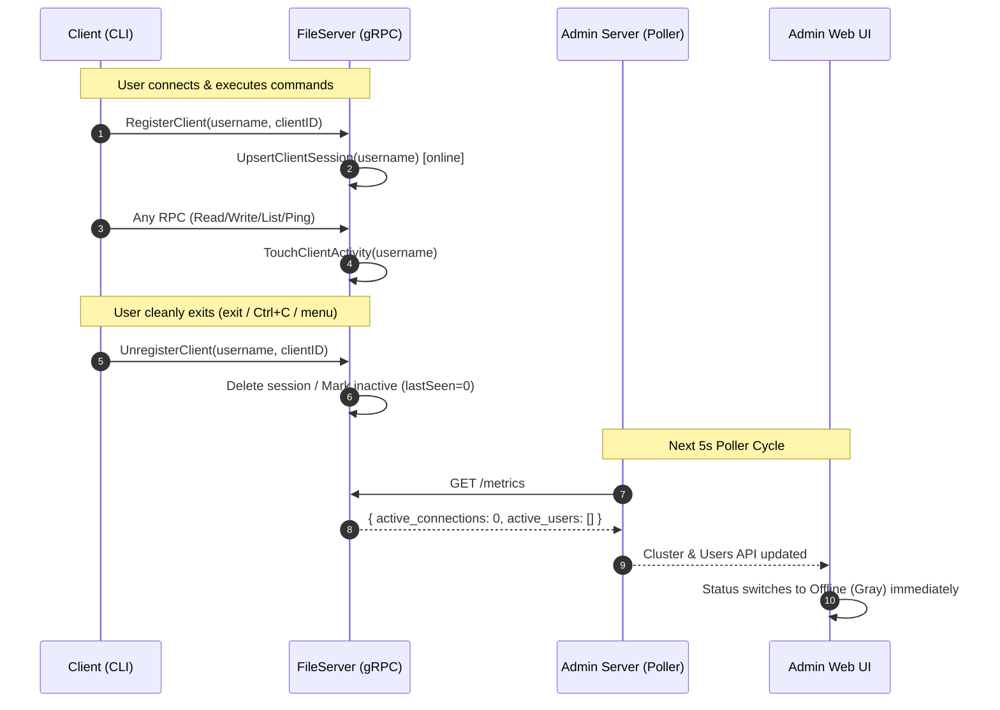
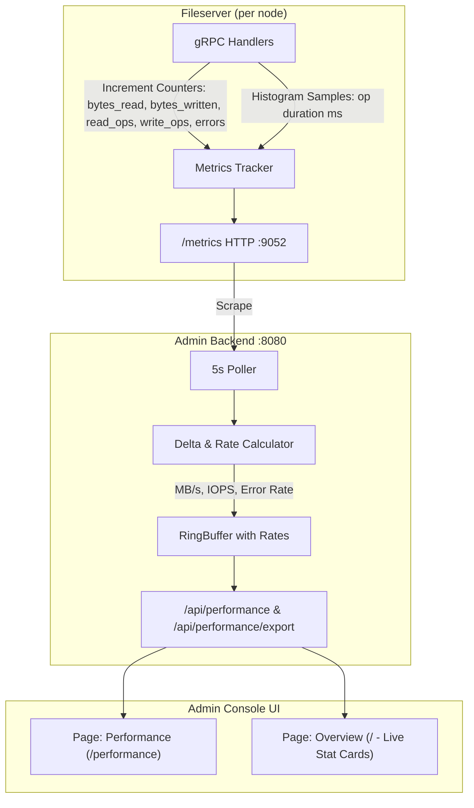

# Implementation Plan: Session Offline Fix, Commit Edge Case Analysis & Phase 4 Architecture

This document provides:
1. **Diagnosis & Fix for User Session / Active Connection Lifecycle**: Why users remain online after exiting and how to achieve instantaneous status updates.
2. **Deep Analysis of the Last 5 Commits (`8ef5a91`, `1ce128f`, `e4bb340`, `3247201`, `6ce0662`)**: Edge cases, potential failure modes, and bugs discovered in UI components and orchestration commands.
3. **Phase 4 Implementation Plan**: Complete architectural blueprint for Throughput & Latency Instrumentation, Admin Backend Metrics Deltas, Performance Page (`/performance`), and CSV Export per `Admin_Console_Plan.md`.

---

## Part 1: Diagnosis & Fix for User Online Status & Active Connections

### Problem Statement
When a user launches the DVFS client, they appear as **Online** with `1 active connection`. However, when the user exits the client (types `exit`, presses `Ctrl+C`, closes the terminal, or returns to the Metaserver menu), their status on the Admin Console remains **Online** and the active connections counter does not decrement.

### Root Cause Analysis
1. **Hardcoded 5-Minute TTL (`activeSessionTTL = 5 * time.Minute`)**:
   In [internal/fileserver/callback_server.go](file:///C:/Users/GSRAJA/Desktop/IIT%20GN/DVFS_project/Distributed-Virtual-File-System/internal/fileserver/callback_server.go#L26):
   ```go
   const activeSessionTTL = 5 * time.Minute
   func (fs *FileServer) isSessionActiveLocked(session *clientSession, now time.Time) bool {
       if session == nil || session.lastSeenAt.IsZero() {
           return false
       }
       return now.Sub(session.lastSeenAt) <= activeSessionTTL
   }
   ```
   When a client registers, `lastSeenAt` is set to `now`. Because the TTL is 5 minutes, `now.Sub(session.lastSeenAt) <= activeSessionTTL` evaluates to `true` for **300 seconds** after registration.
2. **No Unregister/Disconnect RPC**:
   In [api/fileserver/fileserver.proto](file:///C:/Users/GSRAJA/Desktop/IIT%20GN/DVFS_project/Distributed-Virtual-File-System/api/fileserver/fileserver.proto), there is a `RegisterClient` RPC, but **no** `UnregisterClient` or `Disconnect` RPC.
3. **Client Terminates Without Server Notification**:
   - In [internal/client/cobrahandler.go](file:///C:/Users/GSRAJA/Desktop/IIT%20GN/DVFS_project/Distributed-Virtual-File-System/internal/client/cobrahandler.go#L376-L380):
     ```go
     // exit
     h.rootCmd.AddCommand(&cobra.Command{
         Use:   "exit",
         Short: "Exit the client",
         Run: func(cmd *cobra.Command, args []string) {
             fmt.Println("Goodbye!")
             h.cacheHandler.ClearCache()
             os.Exit(0) // <--- Hard exit, zero notification to fileserver
         },
     })
     ```
   - In [cmd/client/main.go](file:///C:/Users/GSRAJA/Desktop/IIT%20GN/DVFS_project/Distributed-Virtual-File-System/cmd/client/main.go#L78-L80) and [L128-L131](file:///C:/Users/GSRAJA/Desktop/IIT%20GN/DVFS_project/Distributed-Virtual-File-System/cmd/client/main.go#L128-L131): when `choice == 0` or `shouldReturn` is false, it simply returns.
   - There is no signal handler trapping `SIGINT` (Ctrl+C) or `SIGTERM` to perform a graceful disconnect.
4. **TouchClientActivity Incompleteness**:
   In [internal/fileserver/handler.go](file:///C:/Users/GSRAJA/Desktop/IIT%20GN/DVFS_project/Distributed-Virtual-File-System/internal/fileserver/handler.go), `TouchClientActivity` is **only** called on `CreateFile` and `UploadFileChunk`. Read operations (`ReadFile`, `DownloadFile`, `ListDir`, `ChangeDir`, `GetAttr`) never touch activity. If a user spends 10 minutes reading files, their session can expire *while active*; conversely, when they leave, they remain active for 5 minutes.

### Proposed Fix



1. **Protocol Addition (`api/fileserver/fileserver.proto`)**:
   ```protobuf
   message UnregisterClientRequest {
     string client_id = 1;
     string username = 2;
   }

   message UnregisterClientResponse {
     bool success = 1;
     string error = 2;
   }

   service FileServer {
     ...
     rpc UnregisterClient(UnregisterClientRequest) returns (UnregisterClientResponse);
   }
   ```
2. **Fileserver Implementation (`internal/fileserver/`)**:
   - In `callback_server.go`, add `func (fs *FileServer) RemoveClientSession(username string)` which calls `delete(fs.sessions, username)`.
   - In `handler.go`, implement `UnregisterClient(ctx, req)` to call `RemoveClientSession(req.Username)`.
   - In `handler.go`, add a gRPC Unary Interceptor (or helper) that automatically calls `fs.TouchClientActivity(username)` on **all** incoming RPCs.
   - Reduce `const activeSessionTTL = 45 * time.Second` (down from 5 minutes) as fallback for unclean disconnects (e.g., killed process, network cable unplugged).
3. **Client Graceful Disconnect (`internal/client/`, `cmd/client/`)**:
   - Add `c.Disconnect()` in `Client` that calls `UnregisterClient` on `c.serverConn` and stops callback listener `c.stopCallback()`.
   - Update `cobrahandler.go`: `exit` command calls `h.cacheHandler.client.Disconnect()` before `os.Exit(0)`.
   - Update `cmd/client/main.go`: set up an OS signal channel (`signal.Notify(sigChan, os.Interrupt, syscall.SIGTERM)`) and `defer c.Disconnect()`.
   - In the client root switching loop, disconnect from the previous fileserver before connecting to the new fileserver.

---

## Part 2: Analysis of Last 5 Commits & Edge Cases in UI / Commands

The last 5 commits on branch `dev` are:
1. `8ef5a91`: UI bugfix for periodic refreshing, FS indexing, polling, show user activity on UI
2. `1ce128f`: Bug fix-indexing
3. `e4bb340`: Let fileserver fetch metaid from JSON
4. `3247201`: Update scripts to be user agnostic
5. `6ce0662`: Add always running services to be user agnostic

### Critical Edge Cases & Potential Failures Identified

#### Edge Case 1: Critical UI Crash on Offline Nodes (Null Pointer Exception)
- **Files**: [cmd/admin/ui/src/pages/Overview.tsx](file:///C:/Users/GSRAJA/Desktop/IIT%20GN/DVFS_project/Distributed-Virtual-File-System/cmd/admin/ui/src/pages/Overview.tsx#L56-L69) and [cmd/admin/ui/src/components/NodeCard.tsx](file:///C:/Users/GSRAJA/Desktop/IIT%20GN/DVFS_project/Distributed-Virtual-File-System/cmd/admin/ui/src/components/NodeCard.tsx#L10-L13)
- **Location**:
  ```tsx
  // Overview.tsx L58
  used: parseFloat((n.metrics.disk_used_bytes / (1024 ** 3)).toFixed(2)),
  // NodeCard.tsx L10
  const m = node.metrics;
  const storageLabel = `${formatBytes(m.disk_used_bytes)} / ...`;
  ```
- **Issue**: In [types.ts](file:///C:/Users/GSRAJA/Desktop/IIT%20GN/DVFS_project/Distributed-Virtual-File-System/cmd/admin/ui/src/types.ts#L34), `metrics?: NodeMetrics` is optional. When a node is offline or newly registered without scraping yet, `node.metrics` is `undefined` or `null`. Accessing `n.metrics.disk_used_bytes` throws an unhandled JavaScript `TypeError: Cannot read properties of undefined (reading 'disk_used_bytes')`, **crashing the entire React application with a blank screen**.
- **Remediation**: Add defensive null-coalescing and offline placeholder handling:
  ```tsx
  const used = n.metrics ? parseFloat((n.metrics.disk_used_bytes / (1024 ** 3)).toFixed(2)) : 0;
  ```
  In `NodeCard.tsx`, render an offline card variant when `!node.metrics`.

#### Edge Case 2: Action Orchestrator Ignores Form's Custom SSH User
- **Files**: [internal/admin/actions.go](file:///C:/Users/GSRAJA/Desktop/IIT%20GN/DVFS_project/Distributed-Virtual-File-System/internal/admin/actions.go#L387-L394)
- **Location**:
  ```go
  nodeUser := sshUser
  if params != nil && params.SSHUser != "" {
      nodeUser = params.SSHUser
  } else if sshUser == "" || strings.HasPrefix(sshUser, "dvfs") {
      if num, parseErr := strconv.Atoi(nID); parseErr == nil {
          nodeUser = fmt.Sprintf("dvfs%d", num+1)
      }
  }
  ```
- **Issue**: Because `presets` generated in `GetPresets()` **always** populates `params.SSHUser` (e.g. `dvfs1`, `dvfs2`), the check `params != nil && params.SSHUser != ""` is ALWAYS true. If an operator types an SSH user override in the UI (e.g. `ubuntu` or `root`) into the `req.SSHUser` field, it is **silently ignored and overridden**.
- **Remediation**: Explicit `req.SSHUser` must take precedence over default presets unless an explicit per-node override in `req.RestartParams` was provided:
  ```go
  nodeUser := sshUser
  if req.SSHUser != "" {
      nodeUser = req.SSHUser
  } else if params != nil && params.SSHUser != "" {
      nodeUser = params.SSHUser
  }
  ```

#### Edge Case 3: Default Git Branch Mismatch (`main` vs `dev`)
- **Files**: [cmd/admin/ui/src/pages/Actions.tsx](file:///C:/Users/GSRAJA/Desktop/IIT%20GN/DVFS_project/Distributed-Virtual-File-System/cmd/admin/ui/src/pages/Actions.tsx#L46)
- **Location**:
  ```tsx
  const [gitBranch, setGitBranch] = useState('main');
  ```
- **Issue**: The repository's active development branch is `dev`, but the UI default state is hardcoded to `'main'`. If an admin clicks "Pull Latest Code" without noticing the text input, the command executes:
  `git checkout main && git pull origin main`
  This fails if `main` does not exist or switches the cluster nodes away from `dev`.
- **Remediation**: Update default `gitBranch` state to `'dev'` (or auto-detect from current git branch).

#### Edge Case 4: Stale Closure in Actions WebSocket Stream Event Handler
- **Files**: [cmd/admin/ui/src/pages/Actions.tsx](file:///C:/Users/GSRAJA/Desktop/IIT%20GN/DVFS_project/Distributed-Virtual-File-System/cmd/admin/ui/src/pages/Actions.tsx#L126-L130)
- **Location**:
  ```tsx
  const connectWebSocket = useCallback(() => { ... }, []);
  ```
- **Issue**: `connectWebSocket` is memoized with `[]` dependency array on component mount. Inside `ws.onmessage`, it invokes `handleStreamEvent(ev)` which closes over `selectedNodeIDs`. On initial mount, `selectedNodeIDs` is `[]`. When `action_started` arrives from the WebSocket, the live status matrix map is populated with `selectedNodeIDs` from the stale closure, causing the status matrix to appear empty or desynchronized.
- **Remediation**: Back `selectedNodeIDs` with a `selectedNodeIDsRef = useRef(selectedNodeIDs)` or use `selectedNodeIDsRef.current` inside `handleStreamEvent`.

#### Edge Case 5: Default State File Path Inconsistency
- **Files**: [cmd/admin/main.go](file:///C:/Users/GSRAJA/Desktop/IIT%20GN/DVFS_project/Distributed-Virtual-File-System/cmd/admin/main.go#L11), [internal/admin/state.go](file:///C:/Users/GSRAJA/Desktop/IIT%20GN/DVFS_project/Distributed-Virtual-File-System/internal/admin/state.go#L25)
- **Issue**: Commit `1ce128f` changed `cmd/admin/main.go` default flag to `-state_file=./bin/metaserver_state.json`, whereas `cmd/metaserver/main.go` defaults to `./metaserver_state.json`. Running `./bin/admin` from the root directory without CLI flags fails to discover nodes because `./bin/metaserver_state.json` does not exist.
- **Remediation**: In `internal/admin/state.go`, if the configured file does not exist, check fallback paths (`./metaserver_state.json` and `./bin/metaserver_state.json`).

#### Edge Case 6: Broad Prefix Matching in SSH Username Detection
- **Files**: [internal/admin/actions.go](file:///C:/Users/GSRAJA/Desktop/IIT%20GN/DVFS_project/Distributed-Virtual-File-System/internal/admin/actions.go#L119)
- **Issue**: `strings.HasPrefix(nodeSSHUser, "dvfs")` matches valid usernames such as `dvfs_admin`, `dvfs-prod`, or `dvfsk8s`, erroneously replacing them with `dvfs1`, `dvfs2`, etc.
- **Remediation**: Match specifically `dvfs` or `dvfs[0-9]+` using exact equality or regexp.

---

## Part 3: Phase 4 Implementation Plan (Throughput & Latency Instrumentation)

As specified in [docs/project/Admin_Console_Plan.md Section 7](file:///C:/Users/GSRAJA/Desktop/IIT%20GN/DVFS_project/Distributed-Virtual-File-System/docs/project/Admin_Console_Plan.md#L308-L313):

> ### Phase 4 — Throughput & Latency Instrumentation
> - [ ] Add I/O counters (`bytes_written_total`, `read_ops_total`, etc.) to the fileserver gRPC handlers.
> - [ ] Add latency histogram tracking (wrap handlers with timing).
> - [ ] Admin backend: compute derived rates (throughput bps, IOPS) from counter deltas.
> - [ ] Frontend: Performance page with per-node throughput grids, latency tables, IOPS charts.



### Component 1: Fileserver Instrumentation (`internal/fileserver/`)

#### 1.1 Atomic I/O & Error Counters
In `internal/fileserver/metrics.go`, define a thread-safe `OperationMetrics` tracker:
```go
type OperationMetrics struct {
    BytesWrittenTotal  uint64
    BytesReadTotal     uint64
    WriteOpsTotal      uint64
    ReadOpsTotal       uint64
    ErrorsTotal        uint64
    FailedWritesTotal  uint64
    FailedReadsTotal   uint64

    // Latency trackers (sliding-window reservoir of recent durations)
    writeLatencyReservoir *LatencyReservoir
    readLatencyReservoir  *LatencyReservoir
}
```
Using `sync/atomic` for zero-lock counter incrementing.

#### 1.2 Latency Percentile Tracker (Sliding-Window Reservoir)
A lock-free or lightweight mutex circular buffer of recent operation durations (e.g. 1024 samples) computing:
- `OpLatencyWriteMsP50`, `OpLatencyWriteMsP95`, `OpLatencyWriteMsP99`
- `OpLatencyReadMsP50`, `OpLatencyReadMsP95`, `OpLatencyReadMsP99`

#### 1.3 Handler Wrappers in `internal/fileserver/handler.go`
Wrap key gRPC endpoints:
- `UploadFile`: Track bytes written, write ops, write latency, write errors.
- `DownloadFile`: Track bytes read, read ops, read latency, read errors.
- `CreateFile`, `WriteFile`, `DeleteFile`, `TrashFile`, `RestoreFile`: Counted as write ops with timing.
- `ReadFile`, `ListDir`, `GetAttr`, `Lookup`, `Path`: Counted as read ops with timing.
- Any error returned from these methods increments `ErrorsTotal` and `FailedWritesTotal` / `FailedReadsTotal`.

#### 1.4 Expose in `Metrics` JSON
Update `internal/fileserver/metrics.go` `Metrics` struct:
```go
BytesWrittenTotal    uint64  `json:"bytes_written_total"`
BytesReadTotal       uint64  `json:"bytes_read_total"`
WriteOpsTotal        uint64  `json:"write_ops_total"`
ReadOpsTotal         uint64  `json:"read_ops_total"`
ErrorsTotal          uint64  `json:"errors_total"`
FailedWritesTotal    uint64  `json:"failed_writes_total"`
FailedReadsTotal     uint64  `json:"failed_reads_total"`
OpLatencyWriteMsP50  float64 `json:"op_latency_write_ms_p50"`
OpLatencyWriteMsP95  float64 `json:"op_latency_write_ms_p95"`
OpLatencyWriteMsP99  float64 `json:"op_latency_write_ms_p99"`
OpLatencyReadMsP50   float64 `json:"op_latency_read_ms_p50"`
OpLatencyReadMsP95   float64 `json:"op_latency_read_ms_p95"`
OpLatencyReadMsP99   float64 `json:"op_latency_read_ms_p99"`
```

---

### Component 2: Admin Backend Rate Computation & Endpoints (`internal/admin/`)

#### 2.1 Delta Calculations in Poller
When scraping `/metrics` every 5 seconds, compare with the previous snapshot:
$$\Delta t = \text{timestamp}_{\text{curr}} - \text{timestamp}_{\text{prev}}$$
$$\text{write\_throughput\_bps} = \frac{\Delta \text{bytes\_written}}{\Delta t}$$
$$\text{read\_throughput\_bps} = \frac{\Delta \text{bytes\_read}}{\Delta t}$$
$$\text{write\_iops} = \frac{\Delta \text{write\_ops}}{\Delta t}$$
$$\text{read\_iops} = \frac{\Delta \text{read\_ops}}{\Delta t}$$
$$\text{error\_rate} = \frac{\Delta \text{errors}}{\Delta \text{total\_ops}}$$

Store computed rates alongside raw telemetry in each `Snapshot` in the ring buffer.

#### 2.2 New REST Endpoints
1. `GET /api/performance`:
   Returns cluster-wide throughput, IOPS, latency comparisons, and per-node breakdowns:
   ```json
   {
     "cluster_write_mbps": 12.4,
     "cluster_read_mbps": 45.1,
     "cluster_write_iops": 150.2,
     "cluster_read_iops": 620.8,
     "cluster_error_rate_pct": 0.02,
     "nodes": [
       {
         "fsID": "0",
         "display_name": "FS-1",
         "machine_name": "dvfs1",
         "write_mbps": 5.2,
         "read_mbps": 22.0,
         "write_iops": 80.0,
         "read_iops": 310.0,
         "latency_write_p50": 1.2,
         "latency_write_p95": 4.5,
         "latency_write_p99": 12.1,
         "latency_read_p50": 0.4,
         "latency_read_p95": 1.1,
         "latency_read_p99": 3.8
       }
     ]
   }
   ```
2. `GET /api/performance/export`:
   Streams a CSV file containing timestamped historical telemetry (Time, Node, Read MB/s, Write MB/s, Read IOPS, Write IOPS, Write p95, Read p95, Errors).

---

### Component 3: Frontend Performance Dashboard (`cmd/admin/ui/`)

#### 3.1 New Route & Navigation
- Add `/performance` route in [App.tsx](file:///C:/Users/GSRAJA/Desktop/IIT%20GN/DVFS_project/Distributed-Virtual-File-System/cmd/admin/ui/src/App.tsx).
- Add **Performance** tab (`<i className="bi bi-speedometer"></i> Performance`) to [Navbar.tsx](file:///C:/Users/GSRAJA/Desktop/IIT%20GN/DVFS_project/Distributed-Virtual-File-System/cmd/admin/ui/src/components/Navbar.tsx).

#### 3.2 Performance Page (`cmd/admin/ui/src/pages/Performance.tsx`)
1. **Cluster Throughput Banner**:
   - Live cluster read/write throughput (MB/s) and IOPS indicators.
   - **Export CSV** button triggering download from `/api/performance/export`.
2. **Throughput Comparison Line Charts**:
   - Multi-line chart comparing read MB/s across all nodes over the last 60 minutes.
   - Multi-line chart comparing write MB/s across all nodes.
3. **Latency Matrix Panel**:
   - Formatted table comparing p50, p95, and p99 read/write latency across nodes.
   - Bar chart highlighting latency skew between nodes.
4. **IOPS & Active Connections Timelines**:
   - Stacked area chart showing total and per-node active connections over time.
   - Read vs Write IOPS timeline.

#### 3.3 Overview Page Integration (`Overview.tsx`)
- Connect the 3 placeholder cards on the Overview page:
  - **Write Throughput**: Cluster total write MB/s (replaces placeholder text).
  - **Read Throughput**: Cluster total read MB/s.
  - **Error Rate**: Cluster total error rate %.

---

## Step-by-Step Execution Plan

### Step 1: Fix User Session Offline & Active Connections
- Update `api/fileserver/fileserver.proto` to add `UnregisterClient`.
- Regenerate protobuf code via `protoc` / `make proto`.
- Implement `UnregisterClient` on fileserver and add gRPC activity interceptor.
- Update `internal/client/client.go` and `cmd/client/main.go` to call `Disconnect()` on exit and trap OS signals.
- Lower `activeSessionTTL` from 5m to 45s.

### Step 2: Fix Edge Cases in UI & Commands
- Fix null pointer safety in `Overview.tsx` and `NodeCard.tsx` when `node.metrics` is undefined/offline.
- Fix SSH user precedence in `internal/admin/actions.go` so `req.SSHUser` is not overwritten by presets.
- Update default `gitBranch` state in `Actions.tsx` from `'main'` to `'dev'`.
- Fix WebSocket stale closure in `Actions.tsx` using `selectedNodeIDsRef`.
- Add fallback paths in `state.go` for `metaserver_state.json`.

### Step 3: Phase 4 Backend Instrumentation & Telemetry
- Add atomic counters and latency reservoir in `internal/fileserver/metrics.go`.
- Wrap gRPC read/write handlers in `internal/fileserver/handler.go`.
- Compute rates in `internal/admin/poller.go` and store in `Snapshot`.
- Implement `/api/performance` and `/api/performance/export` in `internal/admin/handlers.go`.

### Step 4: Phase 4 Frontend Performance Page
- Add types in `cmd/admin/ui/src/types.ts`.
- Add API functions in `cmd/admin/ui/src/api.ts`.
- Create `cmd/admin/ui/src/pages/Performance.tsx`.
- Register route in `App.tsx` and tab in `Navbar.tsx`.
- Update `Overview.tsx` with live cluster throughput and error rate.

---

## Verification Plan

### Automated Tests
1. **Session Lifecycle Unit Test**:
   - Register client $\rightarrow$ verify session active $\rightarrow$ call `UnregisterClient` $\rightarrow$ verify session deleted and active connections = 0 immediately.
2. **Quota & Handlers Test**:
   - Run `go test -v ./internal/fileserver/...`
   - Run `go test -v ./internal/admin/...`
3. **Phase 4 Rate & Delta Tests**:
   - Unit tests validating rate derivation: mock two consecutive snapshots 5 seconds apart with 10MB byte delta $\rightarrow$ rate should equal 2 MB/s.

### Manual Verification
1. Start fileserver and metaserver.
2. Launch client as user `alice` $\rightarrow$ verify Admin UI Users page shows `alice` **Online** with `1` active session.
3. Type `exit` in client $\rightarrow$ verify Admin UI reflects **Offline** and `0` active sessions within the next 5-second polling cycle.
4. Navigate to `/performance` $\rightarrow$ verify throughput, IOPS, and latency charts render without console errors.
5. Download CSV via Export button $\rightarrow$ verify CSV file contains valid time-series rows.
