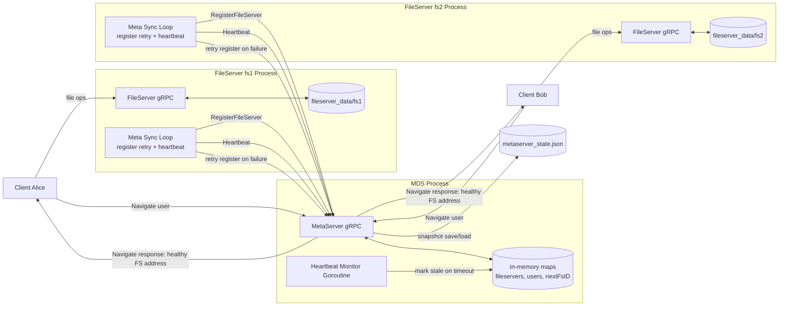
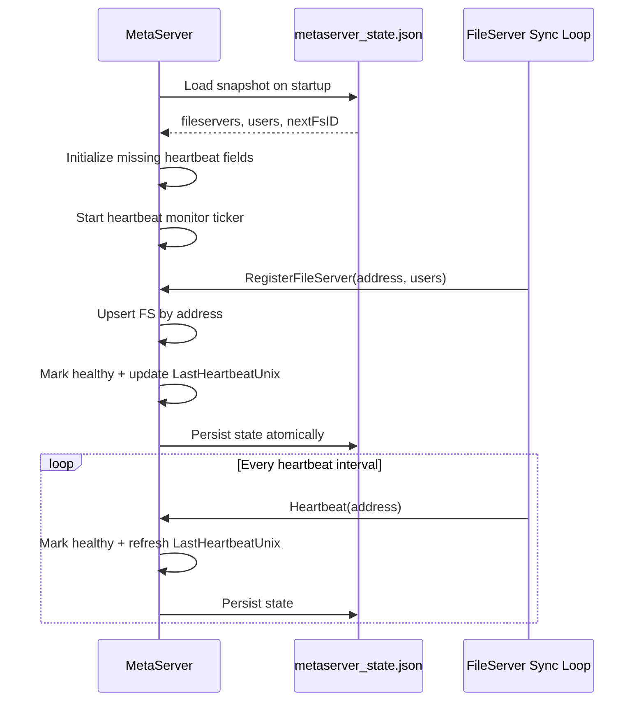
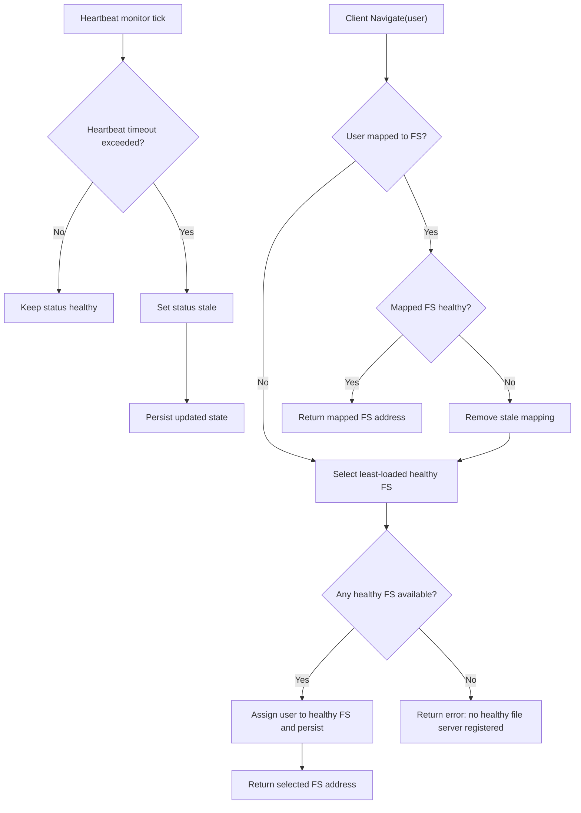

# MDS and Heartbeat System Diagram

This document visualizes the current metadata server (MDS) crash-recovery and heartbeat architecture.

## 1) System Topology

## 2) Startup and Crash Recovery Flow

## 3) Liveness, Stale Transition, and Routing Behavior

## 4) Operational Notes

- MDS persists metadata changes after registration, heartbeat updates, stale transitions, and user remapping.
- File server liveness uses a two-layer strategy:
  - Frequent heartbeat RPC for low-overhead health signals.
  - Registration retry whenever registration or heartbeat fails.
- On MDS restart, previously known file servers are trusted initially from snapshot, then corrected by heartbeat timeout logic.
